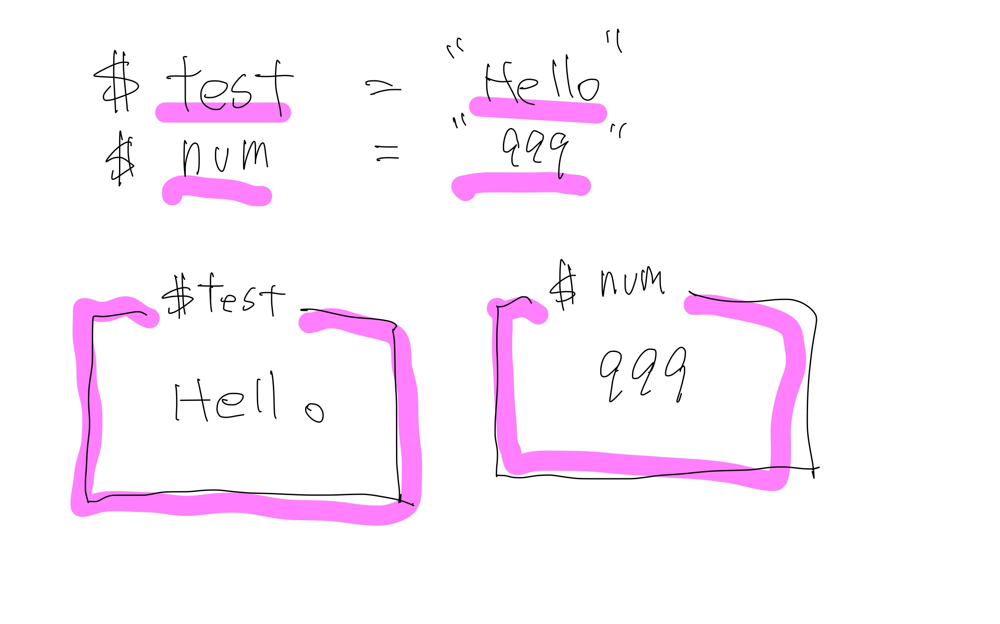
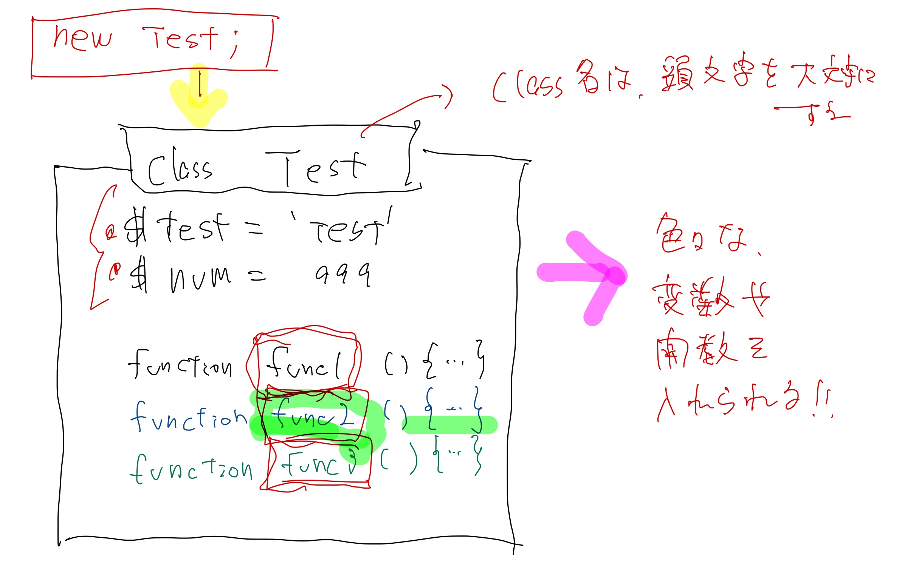
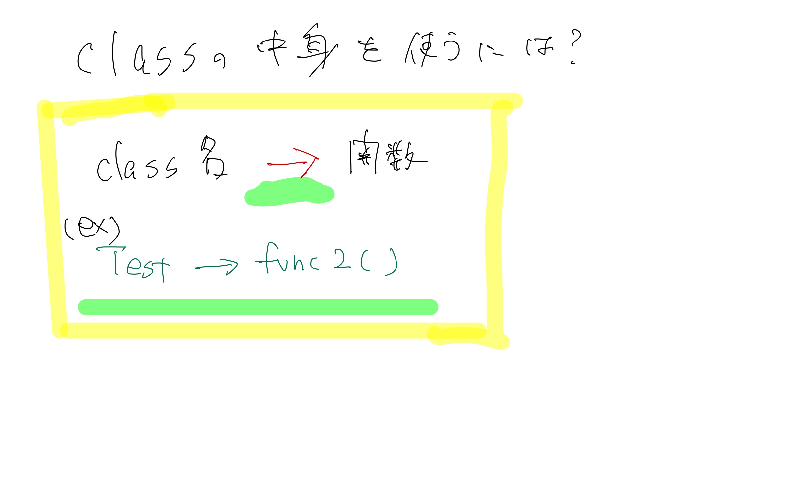
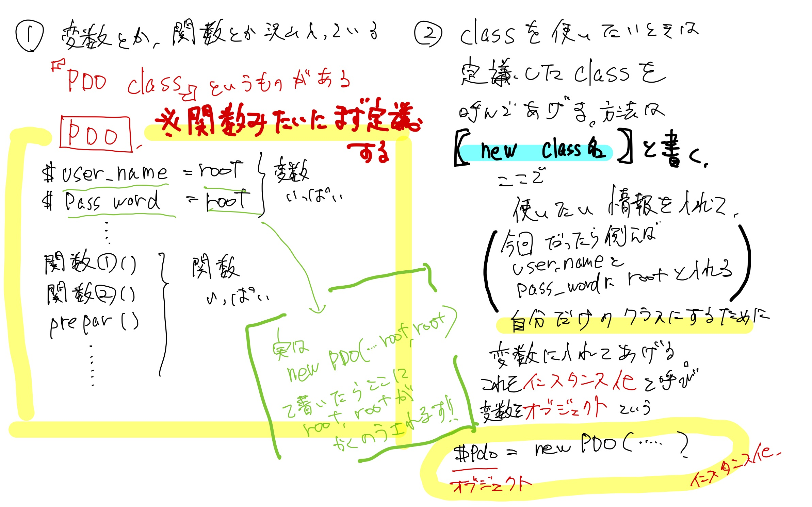
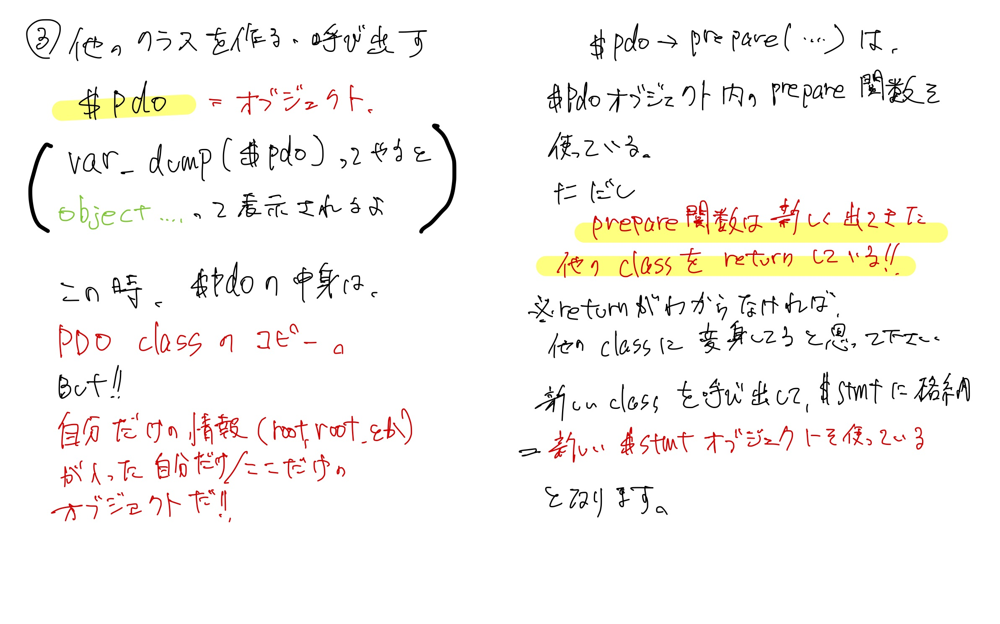

# 🏫 about Class

Classを小学生でもわかるようにする試みです。 はっきり言って、説明としては足らないない内容ですので、 あくまでも「雰囲気を捉える」だけにとどめてください。

詳細は公式サイトとか見てください！

## 変数とは？

そもそも変数とは？

* 文字列や数字を格納する箱。

けど、基本的に中身は一つだけしか格納できません。

`$test = 'test'`

ってしたら、$testの中身はtestです。けれど、

`$test = '999'`

ッテしたら、$testの中身は999に入れ替わります。

変数という箱の中に入れられるものは\[一つだけです]



## Class？

とある人が思いました。 変数って便利だけど、もっと中に格納したいな〜。そうだ、そういう箱作るか！ ということでできたのがClassです。

Classの中には、複数の情報や、関数も格納できちゃいます！



## `->`???

このClassの中の関数などを使う際に「どのClassの、どの関数使うか」ということを明示するため、 `Class->function()`として表示します。




\->の前後に空白入れるの禁止です。(エラーになります）


## 具体的に見てみる

たとえば以下のコードを見てみましょう。

```php
try {
    // 1, new Class名とすることで、Classを用意します。
    // () の中に書くことで、Class内の変数を宣言しています
    // これで$pdoの中に、Classが格納されました。
    $pdo = new PDO('mysql:dbname=gs_db; charset=utf8; host=localhost', 'root', 'root');
} catch (PDOException $e) {
    exit('DBConnectError:' . $e->getMessage());
}

// $pdo->prepareとすることで、$pdoクラスの中にあるprepare()関数を実行しています。
// prepare()の中で、ほかのclassをreturnしているので、$stmtに入れてあげます。
// 関数の中身は私も知りません！
$stmt = $pdo->prepare("INSERT INTO gs_an_table(id, name, email, content, date)
                        VALUES(NULL, :name, :email, :content, sysdate())");
$stmt->bindValue(':name', $name, PDO::PARAM_STR);  //Integer（数値の場合 PDO::PARAM_INT)
$stmt->bindValue(':email', $email, PDO::PARAM_STR);  //Integer（数値の場合 PDO::PARAM_INT)
$stmt->bindValue(':content', $content, PDO::PARAM_STR);  //Integer（数値の場合 PDO::PARAM_INT)
$status = $stmt->execute();
```




