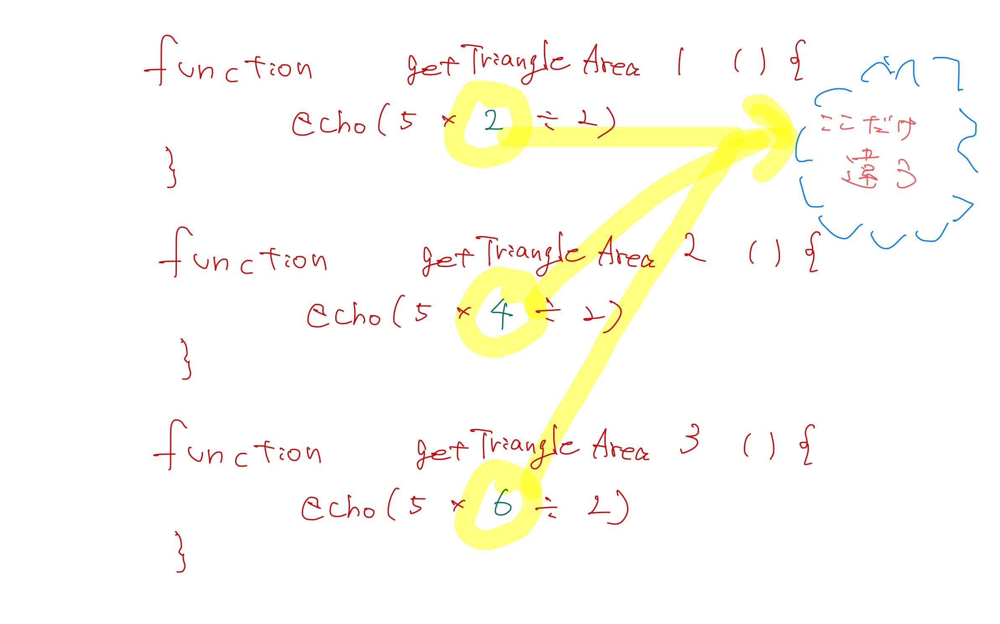
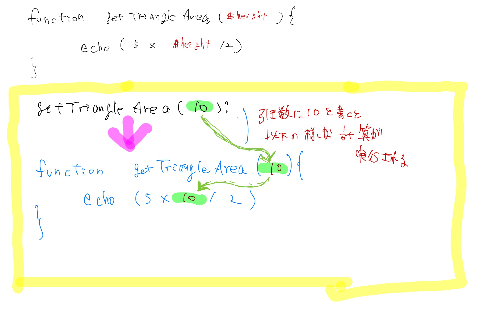
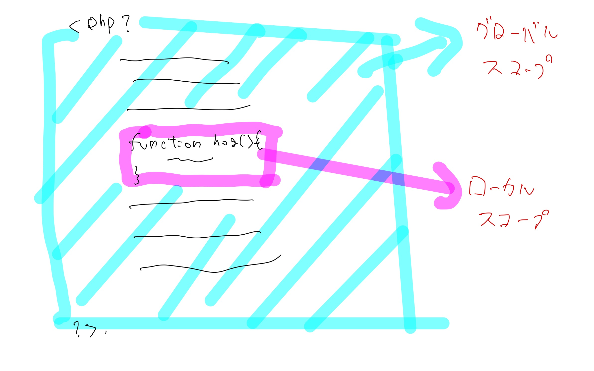
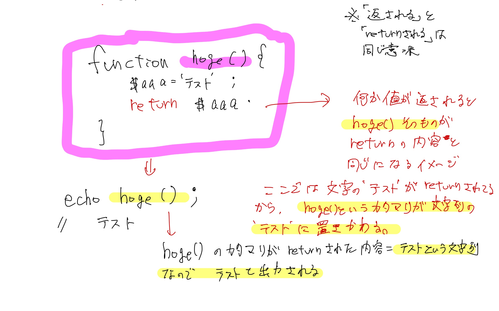
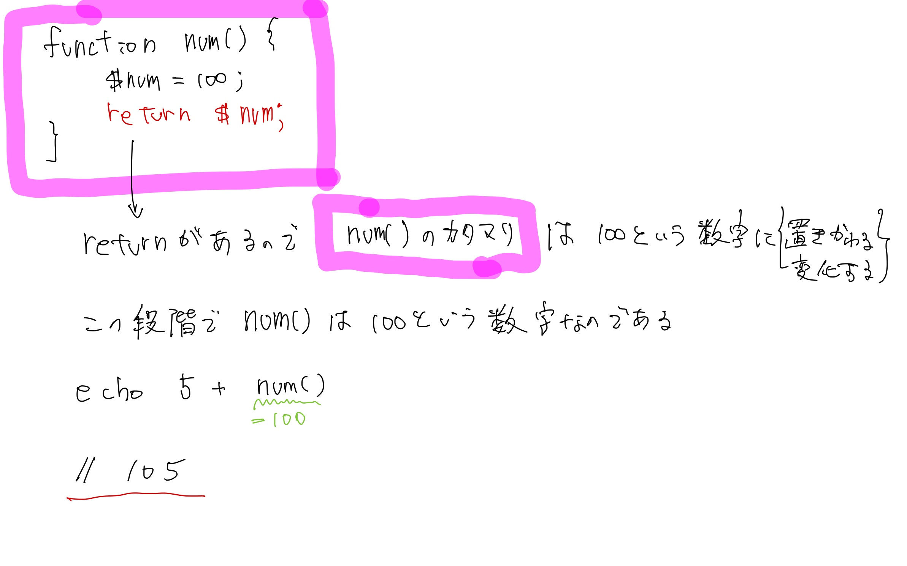

# 😇 about functionほぼ完成

### 関数が無い場合

例えば、以下のような内容を考えます。

```php
// 以下の３行を１０回繰り返す。
echo 'hello';
echo 'world';
echo "I'm from japan";
```

この場合、

1. この３行をコピペして、
2. １０回貼り付ける

という方法が考えられます。 ただし、ちょっとめんどくさいです。

```php
// イメージ
echo 'hello';
echo 'world';
echo "I'm from japan";

echo 'hello';
echo 'world';
echo "I'm from japan";

echo 'hello';
echo 'world';
echo "I'm from japan";

// ...以下省略
```

こういった、`複数行の処理`を、何かしらの理由で`複数回記述する必要が有る`場合、関数が便利です。

### 関数の基本

まず、関数は以下の順番で処理をします。

1. 関数を用意する。
2. 関数を実行する。

時々、関数を用意しただけで関数を実行した気になってしまう方がいますが、ちゃんと「用意→実行」が関数の基本です。

#### 関数の書き方

基本フォーマットは以下のとおりです。 `func_test`という名前の関数を用意してみます。

そしてそれを実行します。

```php
// (1)まずは関数を用意。
function func_test() {
    // 処理を書く
}

// (2)用意した関数を実行する。
// 実行するときは、関数名とカッコを付ける。
func_test();
```


#### 関数の書き方(具体例)

それでは、例題で具体的にやってみましょう。

1. 関数の作成
   * 関数名の命名
   * 処理を記述
2. 関数の実行

の順番で対応します。

今回の関数は、`greeting`という名前にしましょう

```php
// (1)まずは関数を用意。
function greeting() {
    // 処理を書く
    echo 'hello';
    echo 'world';
    echo "I'm from japan";
}

// (2)用意した関数を実行する。
greeting();
```

これで、`greeting()`と書くたびに、処理の中身３行が実行されます。

```php
function greeting() {
    echo 'hello';
    echo 'world';
    echo "I'm from japan";
}
greeting();
greeting();
greeting();
greeting();
greeting();
greeting();
greeting();
greeting();
greeting();
greeting();
```

関数を利用すると行数をぐっと減らすことができます。 実際、１５行になりました。

#### 余談

単純に連続するだけなら、あまり恩恵を感じ取りづらいかもしれませんが、 離れたところで同じ処理をする場合に関数はとても便利です。

```php
function greeting() {
    echo 'hello';
    echo 'world';
    echo "I'm from japan";
}
// ここに100行くらいコードが有ると思ってください
greeting();
// ここに100行くらいコードが有ると思ってください
greeting();
// ここに100行くらいコードが有ると思ってください
greeting();
```

こんな感じで、離れたところで複数回処理をする場合、 関数が有るともっと便利です。 しかも、自分がつけた名前から、この関数がどのような処理をするかがなんとなくわかるのです。 ※よって、命名する際の名前は超重要になってきます。

### 関数の基本(引数編)

同じ処理をする場合「似た処理なんだけど若干違う処理」をしたい場合があります。

例えば、以下の処理を考えて見ましょう。

* ３つ有る三角形の面積を求めましょう。どの三角形も底辺は5cmで、高さがそれぞれ2cm,4cm, 6cmです。

さて、ご存知の通り三角形は、 `底辺 * 高さ / 2`で求めることが可能です。

今回は底辺は一緒ですが、高さだけが異なります。

さて、まずは上記で学んだとおり、それぞれの面積を求める関数を作って見ましょう。

```php
//１つ目
function getTriangleArea1() {
    echo (5 * 2 / 2);
}

//2つ目
function getTriangleArea2() {
    echo (5 * 4 / 2);
}

//3つ目
function getTriangleArea3() {
    echo (5 * 6 / 2);
}

getTriangleArea1();
getTriangleArea2();
getTriangleArea3();
```

なんだか微妙ですね。。。。 なぜなら、めちゃくちゃ似ている内容が、複数書かれているからです。 「どの関数も内容がめちゃくちゃ似てる」のです。

逆に、

* 関数名
* 掛け算の部分 以外は同じです。



少し抽象化すると以下のように表せると思います。

```php
function getTriangleArea() {
    echo (5 * 高さ / 2);
}
```

このように、高さの部分だけを変えれば３つの三角形の面積がわかります。

その際に役立つのが`引数`です。

上記例でいうと、高さの部分に入れたい数字をgetTriangleAreaの右側にある()の中に書いてあげることで、数字を渡すことができます。。

1. まず漢字で書くとこうです。

```php
function getTriangleArea(高さ) {
    echo (5 * 高さ / 2);
}
```

1. 漢字のままだとエラーになるので、関数定義の引数は変数に変更します。

```php
function getTriangleArea($hight) {
    echo (5 * $hight / 2);
}
```

※変数名はなんでもいいです。 `$hight`じゃなくて、`$h`とか`$aaaa`とかでも良いです。 ただし、何を表すのかわかりやすいように変数名を書いてください。 今回は三角形の「高さ」なのでhightとしました。

1. 実行するときは、高さを書いて実行してあげてください。

```php
// ↓例えば、下の場合は高さを10にした場合です。
getTriangleArea(10);
```

結果として、`25`という値が表示されます。



例えば、以下のようにしたらどのような数字が出てくるでしょうか？

```php
function num($num) {
    echo (5 * $num * $num * $num / 2);
}

num(10);
```

こうすると、`$num`の部分は10に置き換わるので、 `5 * 10 * 10 * 10 / 2`という計算がされます。

#### 複数の引数を与える

上記の`getTriangleArea()`では、底辺の長さは固定されており、高さは引数で与えるというものでした。

では、底辺の長さも固定されておらず与えられた場合はどうすればいいでしょうか。

その場合、引数を複数与えれば良いです。

1. まず、底辺（=5）が固定されている場合は以下の通りでした。

```php
function getTriangleArea(高さ) {
    echo (5 * 高さ / 2);
}
```

1. 底辺も引数で与える場合は以下のとおりです。コンマつけて羅列してあげてください。

```php
function getTriangleArea(高さ, 底辺) {
    echo (底辺 * 高さ / 2);
}
```

1. 漢字を変数にしてあげましょう。

```php
function getTriangleArea($hight, $bottom) {
    echo ($bottom * $hight / 2);
}
```

1. 実際に関数を利用しましょう。

```php
getTriangleArea(2, 3);

// 3
```

※ 引数の順番が違っても問題ないです。 例えば以下でもokです。 というか、左が底辺・右が高さで統一されているので、こっちのほうがきれいかも。

```php
function getTriangleArea($bottom, $hight) {
    echo ($bottom * $hight / 2);
}
```

**例題-1**

以下のような関数を作って、実行してください。

* 四角形の面積を求める関数を作りましょう。
* 関数名は`calcSquares`
* 縦の長さは10cm
* よこの長さは引数で渡してあげる。
* よこの長さを5cm、10cmにした場合の面積を求めてください。

<details>

<summary>答え</summary>

```php
// $widthは別の変数名でも良いです。

function calcSquares($width) {
    // echo $width * 10;とかでも良いです。
    echo 10 * $width;
}

calcSquares(5);
calcSquares(10);
```

</details>

**例題-2**

以下のような関数を作って、実行してください。

* 関数（関数名は自分で決めてください。）を作成し、引数を利用して「私の名前は`名字` `名前` です」と`echo`されるようにしてください。
* 実際に引数に自分の名前を与えて出力してみてください。

<details>

<summary>答え</summary>

```php
// 以下、書き方等は任せます。引数使って出力できればok

$myouji = '福島';
$namae = 'はやと';


function aisatsu($myouji, $namae) {
    echo '私の名前は' . $myouji . $namae 'です';
}

aisatsu($myouji, $namae);
```

</details>

### スコープについて

さて、一旦関数の特別な動きについてお伝えします。

スコープという考えです。（どの言語にもたいてい有り。）

定義した変数等がどこまで影響を及ぼすのか？ということです。

例えば、以下のようなコードを実行してみてください。

```php
$name = '福島';
$name = 'はやと';
echo $name;
```

こうすると、出力は`はやと`と出てきます。 最初「福島」を変数に代入しましたが、次に「はやと」と上書きしたためです。

では以下はどうでしょうか？

```php
$name = '福島';

function change() {
    $name = 'はやと';
}

change();

echo $name;
// 福島と出力される。
```

上から順番の流れはこんな感じです。

1. `$name`に「福島」と代入
2. 関数`change()`を定義
3. 関数を実行
4. `$name`を出力

最初に`$name`に「福島」を代入したあと、次に「はやと」を代入する関数を実行したから「はやと」と出力されても良いような気もしますが、実際にはそうなりません。

※実際にご自身でも確かめてみてください。

これはなぜなら、**関数内は関数の外の影響を受けないためです。**

この独自の世界 = 有効範囲のことを`スコープ`といいます。 functionの中は外界とは違う閉ざされた世界なので、`ローカルスコープ(ローカル)`といったリします。

.jpg>)

一方ローカルスコープの外 = functionの中以外 = ほぼすべての箇所は`グローバルスコープ(グローバル)`と言います。



function内は、`ローカル`なので、`functionの外の$name`と`functionの中の$name`は違います。 だから、echo $nameしても、中身が変わっていないのです。

```php
// ここはグローバル
$name = '福島';

function change() {
    // ここはローカル
    // この中で変数を定義しても外の世界に影響なし。
    $name = 'はやと';
}
change();

// ここでechoしているのは、グローバル = '福島'が代入されている$name
echo $name;
```

**このように、functionの中と外は世界が違うので互いに影響し合いません**

#### スコープについて - 2

スコープという内容はなんとなくつかめましたか。

もう少しスコープの詳細を見てみます。 まずは以下のコードを実行してみてください。

```php
$num = 123;

function hoge() {
    echo $num;
}
hoge();
```

おそらくエラーになったと思います。 ※環境によっては出ないかも。

これはすでにお伝えしている通り、グローバルスコープに有る`$num`とfunction内のローカルスコープに有る`$num`は別ものだからです。

function内の`$num`は未定義なので、エラーとなってしまったのです。

よって、以下の通りすればエラーが解消されます。

```php
$num = 123;

function hoge() {
    $num = '定義しました。';
    echo $num;
}
hoge();

// 定義しました。
```

もしくは、すでに上記で習った方法で解決することもできます。 引数でグローバルな変数を`function`の中に入れて上げる方法です。

```php
$num = 123;

function hoge($num) {
    echo $num;
}
hoge($num);
// 123
```

このように、外から中へ入れてあげるには、引数を使えばokです。

### returnについて

では、ローカルからグローバル、つまりfunctionの中から外へ情報を出せないのでしょうか。

まずは確認してみます。

```php
function hoge() {
    $aaaa = 'ここはローカル';
}
hoge();
echo $aaaa;
```

これだとエラーになります。 `$aaaa`の変数が未定義のためエラーと表示されます。

これは、何度も出てきている通りfunctionの中と外は別世界なので、

いくらfunctionの中で`$aaaa = 'ここはローカル';`と定義してもfunctionの外 = グローバル空間では未定義状態になります。

こんなとき、中身を外に出す方法の一つに`return(返り値)`があります。

まずは例文を見てみましょう。

```php
function hoge() {
    $aaaa = 'ここはローカル';
    return $aaaa;
}
echo hoge();
```

こうすると、「ここはローカル」と出力されました。

さて、この`return`とは何でしょうか。 `retrun`と聞くと、純Japaneseな私は、「何かがどこかに返っている」と想像してしまいます。

_**そうでありません。retrunという英語の意味を一旦忘れてください。**_

私の個人的な言葉で表すと`return`は

_**「この関数\*\*\*\*****`hoge()`****そのものが****`return`****\*\*\*\*された値に変化する」**_

というようなイメージです。

上の行から順に処理を追って説明します。

1. まず`hoge()`という関数を定義
2. `hoge()`の中で、`$aaaa`に「ここはローカル」という文字を代入。この段階で`$aaaa`の中には、「ここはローカル」という文字が入っています。
3. `return $aaaa;`と書くことで`hoge()`そのものが`$aaaa`と同じ意味(=「ここはローカル」という文字列)になる。
4. だから`echo hoge();`と書くと、「ここはローカル」という文字列が出力される という流れです。



もう一つ例文を見ます。

```php
function num() {
    $num = 100;
    return $num;
}
echo 5 + num();

// 105
```

この場合は以下のイメージです。

* `num()関数`の中で、`$num = 100;`と定義。その`$num`が`return`されている。
* この段階で、「`num()`という関数の塊」そのものが`return`されている`$num` = 「数字の100に」置き換わる。
* `num()`という塊は100という数字になっているので、`echo 5 + num();`すると、5 + 100 = 105が出力される。



なお、イメージしやすいように上記例のように書きましたが、function内で`$num = 100`とか書かずに、以下のように書いても問題無いです。

※むしろ、`$num = 100`と書いても、代入している意味がないので下のほうが良い。

```php
function num() {
    return 100;
}
echo 5 + num();

// 105
```

これらのように`return`と書くと、**何かがどこかに戻っている**というイメージが湧いてしまいますが個人的には

**`return`されたら関数そのものが`return`された内容そのものに変化する。**

と認識しています。

**例題-1**

以下の処理をした場合どのような内容が出力されますか？

```php
function test () {
    $num = 1 + 2;
    $sum = $num + 5;
    return $num;
}

echo '数字は' . 5 + test() . 'です'; 
```

<details>

<summary>答え</summary>

数字の 8 が出力される。 function内では、計算結果として `$num`に3, `$sum`に8 が格納されています。

ただし、`return`サれているのは`$num`なので、 `test()`の塊は`$num`の内容に変化します。

_**$sum = $num + 5; の結果はどこにもなにも影響しません。ただ足し算が行われて終了です**_

よって 3 + 5 の結果のが出力されます。

</details>

**例題-2**

以下の処理をした場合どのような内容が出力されますか？

```php
function test () {
    $num = 10;
    if ($num > 5) {
        return true;
    } else {
        return false;
    }
}

if (test() === true) {
    echo '数字は5より大きい';
} else {
    echo '数字は5より小さい';
}
```

<details>

<summary>答え</summary>

「数字は5より大きい」と出力される。 `test()`関数の中にif文があります。 `$num`の数字の大きさによって、分岐されます。

今回は、`$num`は10のため、5より大きいので `return true`が返されます。

_**if文はここで終了するので、****`return false;`****は処理されません**_

この段階で、`test()`の塊は`true`という情報を保持します。 次に、またif文で、`if (test() === true)`という内容が処理されます。 `test()`の塊は`true`なので、`test() === true`は`true`となります。 よって、`echo '数字は5より大きい';`が出力されます。

</details>

### 引数とreturnを併せて使ってみる

では、これまで確認した`引数`と`return`を併せて使ってみましょう。

例えば、以下のような条件を考えてみましょう。

```
ここはとある遊園地です。
お客さん１人あたり、500円を入園料でもらいます。
もし、団体で10人以上来た場合は、合計から10％割引します。
お客さんの数を引数で与えたら、入園料を計算して、
「お客さんの数は{XX}人で、合計入園料は{XX}円です」
と出力される関数を作りましょう。
```

もし、できそうであれば、下を見る前に自分で関数を考えて見てくださいね。

まず、

> お客さん１人あたり、500円

なので、通常の入園料は

_お客さんの人数 \*_ 500

で計算できると思います。

> 団体で10人以上来た場合は、合計から10％割引

ということで、もし10人以上の場合は、

_お客さんの人数 \*_ 500  \* _0.9_

となります。

お客さんの人数部分を`$num`として考えると、

```
もし $numが10より小さければ、
$num * 500
そうでなければ
$num *500 * 0.9
```

と、なりそうです。

まず単純に関数でまとめると

```php
function getSum() {
    if ($num < 10) {
        $num * 500;
    } else {
        $num *500 * 0.9
    }
}
```


あとから気づいたけど、関数名微妙かも。
入園料を計算する関数だから、
`calcEntranceFee()`とかのほうが良いかも。


ただし、`$num`は入園者の人数によって変化する数字です。&#x20;

`$num`は外から関数に与える = 引数で与えましょう。

なお、ここでは適当に$numを10としました。

```php
// 例えば、$numをform等で受け取る。
$num = 10;

function getSum($num) {
    if ($num < 10) {
        $num * 500;
    } else {
        $num *500 * 0.9
    }
}
```

更に、今回は金額を出力する必要があります。 よって、関数内の計算結果を使いたいので、外に出す = returnする必要があります。

```php
$num = 10;

function getSum($num) {
    if ($num < 10) {
        return $num * 500;
    } else {
        return $num *500 * 0.9;
    }
}
```

さて、ここでまず`getSum()`関数を単独で使ってみましょう。

例えば、人数が2人なら、`echo getSum(2)`

例えば、人数が100人なら、`echo getSum(100)`

例えば、人数が`$num`人なら、`echo getSum($num)`

となります。

今回は、人数を`$num`に格納しているので、`echo getSum($num)`で良さそうです。

さいごに、必要な文章を`echo`してみましょう。

```php
$num = 10;

function getSum($num) {
    if ($num < 10) {
        return $num * 500;
    } else {
        return $num *500 * 0.9;
    }
}

echo 'お客さんの数は'. $num . '人で、合計入園料は' . getSum($num) . '円です';
```

このようにすれば、実行するたびに入場者に併せた入園料の合計が出力されると思います

練習問題（後で書く
