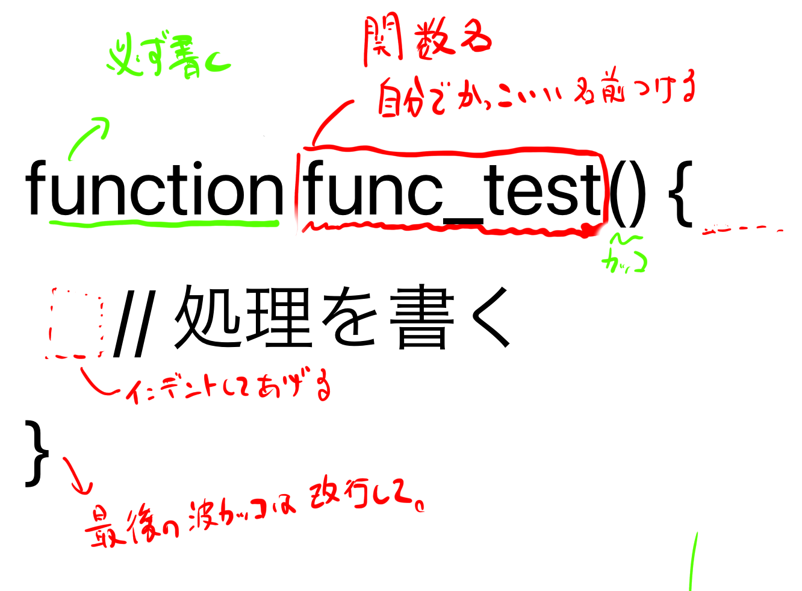

# 😇 about function

### 関数が無い場合

例えば、以下のような内容を考えます。

```php
// 以下の３行を１０回繰り返す。
echo 'hello';
echo 'world';
echo "I'm from japan";
```

この場合、

1. この３行をコピペして、
2. １０回貼り付ける

という方法が考えられます。 ただし、ちょっとめんどくさいです。

こういった、`複数行の処理`を、何かしらの理由で`複数回記述する必要が有る`場合、関数が便利です。

### 関数の基本

まず、関数は以下の順番で処理をします。

1. 関数を用意する。
2. 関数を実行する。

時々、関数を用意しただけで関数を実行した気になってしまう方がいますが、ちゃんと「用意→実行」が関数の基本です。

#### 関数の書き方

基本フォーマットは以下のとおりです。 `func_test`という名前の関数を用意してみます。

そしてそれを実行します。

```php
// (1)まずは関数を用意。
function func_test() {
    // 処理を書く
}

// (2)用意した関数を実行する。
// 実行するときは、関数名とカッコを付ける。
func_test();
```



#### 関数の書き方(具体例)

それでは、例題で具体的にやってみましょう。

1. 関数の作成
   * 関数名の命名
   * 処理を記述
2. 関数の実行

の順番で対応します。

今回の関数は、`greeting`という名前にしましょう

```php
// (1)まずは関数を用意。
function greeting() {
    // 処理を書く
    echo 'hello';
    echo 'world';
    echo "I'm from japan";
}

// (2)用意した関数を実行する。
greeting();
```

これで、`greeting()`と書くたびに、処理の中身３行が実行されます。

この処理を１０回繰り返す行為を関数使わない場合は30行くらい必要になります。

```php
// イメージ
echo 'hello';
echo 'world';
echo "I'm from japan";

echo 'hello';
echo 'world';
echo "I'm from japan";

echo 'hello';
echo 'world';
echo "I'm from japan";

// ...以下省略
```

関数を利用すると行数をぐっと減らすことができます。 実際、１５行になりました。

```php
function greeting() {
    echo 'hello';
    echo 'world';
    echo "I'm from japan";
}
greeting();
greeting();
greeting();
greeting();
greeting();
greeting();
greeting();
greeting();
greeting();
greeting();
```

#### 余談

単純に連続するだけなら、あまり恩恵を感じ取りづらいかもしれませんが、 離れたところで同じ処理をする場合に関数はとても便利です。

```php
function greeting() {
    echo 'hello';
    echo 'world';
    echo "I'm from japan";
}
// ここに100行くらいコードが有ると思ってください
greeting();
// ここに100行くらいコードが有ると思ってください
greeting();
// ここに100行くらいコードが有ると思ってください
greeting();
```

こんな感じで、離れたところで複数回処理をする場合、 関数が有るともっと便利です。 しかも、自分がつけた名前から、この関数がどのような処理をするかがなんとなくわかるのです。 ※よって、命名する際の名前は超重要になってきます。

### 関数の基本(引数編)

さて、同じ処理をする場合「似た処理なんだけど若干違う処理」をしたい場合があります。
