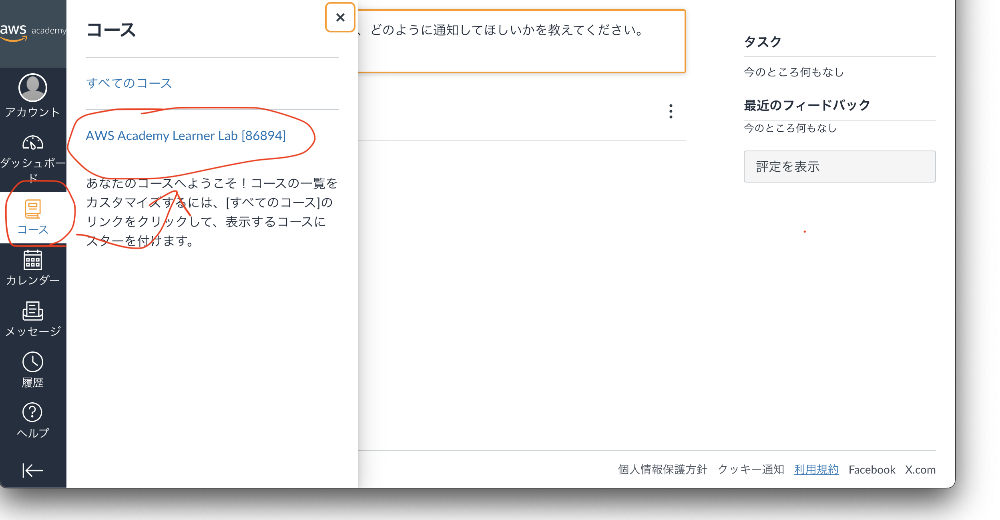

# 🍖 021\_gs\_laravel_\Laravel導入

## 今回やること

- AWS Cloud9にLaravelを入れて、開発の準備をする。

## Laravel導入

1. ここからファイルダウンロード
2. `File`からkara`Upload Local Files`をクリック

<figure></figure>

3. uploadが完了すると、左のファイルに`setup.sh`が追加（= uploadが完了）される。（`setup.sh`ダブルクリックすると、中身が表示されるぞ）
   `setup.sh`のアップロードが確認できたら、下の`terminal`に

   ```bash
   sh setup.sh
   ```
   
   と記入して`Enter`を押す。処理が開始されるので数分待機。
   ※`sh setup.sh`をコピペして`terminal`に貼り付けてエンターでもok
   
4. 最後に、,`\n 017. セットアップファイルの削除`と表示されたら完了。
- ファイルから、`setup.sh`が削除されていること
- cmsというフォルダが追加されていることを確認しましょう。

## Laravel導入

