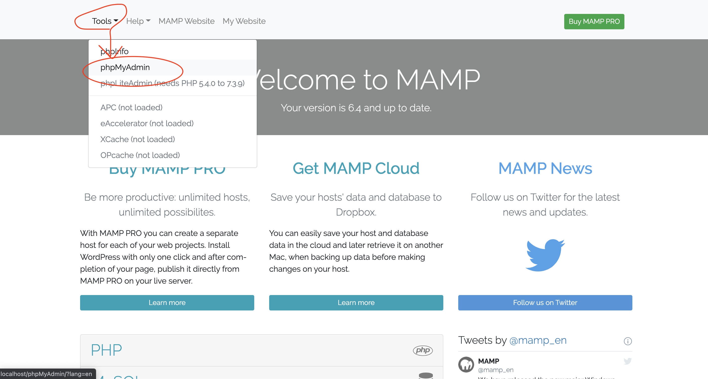

# 🐘 001\_gs\_php\_day0(MAMP)

## MAMP導入について

### 以下動画の注意 Windows

* Windows編のyoutube内、9:25秒あたりの箇所で、htdocsフォルダの中にhtmlファイルを作り、それを右クリックして「Open with Brackets」で開く箇所があると思いますが、本講座では「VScode」を利用しますのでそちらの認識でお願いいたします。
* VS Codeの拡張昨日として `Intellisense`の説明が出てきますが、本授業では、`PHP Intelephense`を検索してこれを導入してください。

### 以下動画の注意 Mac

* mac版、4:40くらいから始まるtest.phpに書く内容は以下の通りです

```php
<?php

echo 'hello world';

?>
```

### 動画

* Windows https://www.youtube.com/watch?v=9XhbU7qAbeA
* Mac https://youtu.be/g90ywmPl24c

## エクスポート方法

***もし、個人情報がDB内にある場合はGitHubにUpしないでください！***

*GitHubにUpしたい場合は、一旦個人情報削除するか、Tutor・先生に相談してね*

### PHPMyAdminへ移動



### 作成 / 利用したDBを選択して、エクスポート


### エクスポート方法　>　簡易で、特にいじらずにそのまま実行


### 出来たファイルを共有してください。中身はいじらないでください。


このファイルを、課題と一緒に提出してください。