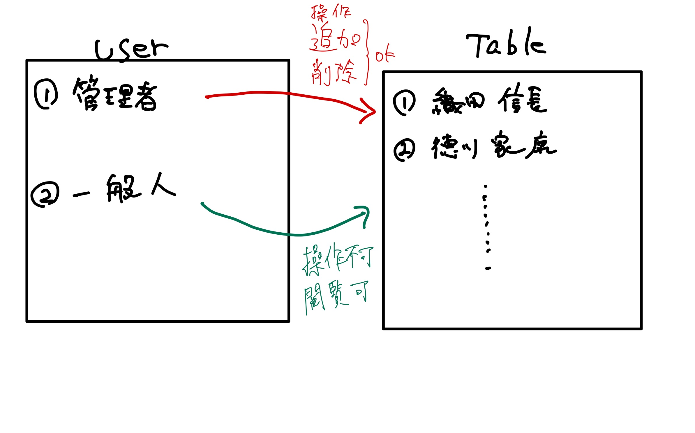
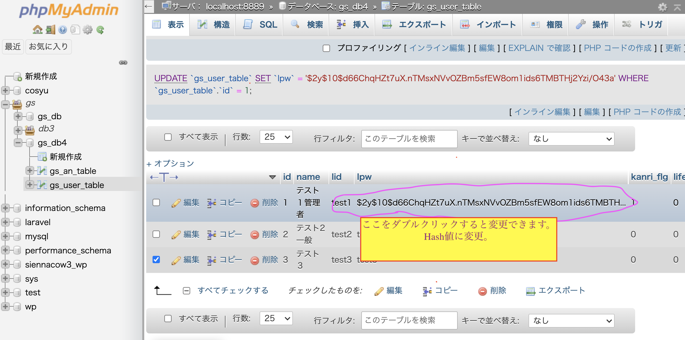

# 🤩 014\_gs\_php\_day4

ユーザー側にデータを授業資料

[https://gitlab.com/gs\_hayato/gs-php-01/-/blob/master/PHP04\_haifu.zip](https://gitlab.com/gs\_hayato/gs-php-01/-/blob/master/PHP04\_haifu.zip)

## 前回のおさらい

* `SQL`の`UPDATE`を書いた
* `SQL`の`DELETE`を書いた
* CRUDのC,R,U,D全部触った

## 今回やること

前回は、CRUD機能の`Updata（編集）`、`Delete（削除）`を行いました。

今日は、`SESSION`をやっていきます。

* `CRUD`とは？ [https://wa3.i-3-i.info/word123.html](https://wa3.i-3-i.info/word123.html)

## MAMPの起動、DB準備

1. MAMPを起動
2. WebStartボタンから起動トップページを表示
3. ページの真ん中MySQLのタブからphpMyAdminのリンクをクリック
4. 起動した画面がMySQLを管理するphpMyAdminの画面が表示されます。
5. データベースタブをクリック
6. データベースを作成から以下の名前で作成

```
データベース名：gs_db4
照合順序：utf8_unicode_ci
```

1. 作成ボタンをクリック 左側に`gs_db4`というデータベースができていると思います。 現在は空っぽです。

## SQLファイルからインポート

〇〇.sqlというSQLファイルをインポートしてデータを作成します。

1. 念の為、左側のメニューから`gs_db4`をクリック
2. `gs_db4`を選択した状態でインポートタブをクリック
3. ファイルを選択をクリックして配布した資料内のSQLフォルダ内の`gs_an_table.sql`を選択
4. 実行してみる
5. ファイルを選択をクリックして配布した資料内のSQLフォルダ内の`gs_user_table.sql`を選択 **今日のテーブルは2つあります。**
6. 実行してみる
7. 授業用のDBと中身を確認

今日のプロダクトのイメージ

<figure><figcaption></figcaption></figure>

## 今日のゴール

ログイン機能を作成する。

### `SESSION`の確認

`SESSION`そのものは概念……お互いが誰かを認識した状態でやりとりすること・やりとりを管理すること。 インターネットの仕組み……ステートレス。 これだと買い物等しずらい。そのためsessionを利用する。

`session`を利用するために...`session_start();`を利用する。

### `session_start();`でできること　その１

* ファイルを超えてデータを共有できる。

#### （例）普通の変数

```php
// test01.php

$name = 'yamada';
echo $name;
// yamadaと出力される
```

```php
// test02.php
echo $name;
// エラー。test02.phpの中には変数定義されていない。
```

#### `session01.php`を作成

1. `session01.php`を作成
2. 以下記述
3. ★記述後、`session01.php`をブラウザで開く★

```php
<?php
// SESSIONスタート
// ★この１行は必須★
// この１行で、新しいセッションを開始しセッションIDが割り当てられて、ファイルが作成される。
session_start();

```

#### `session01.php`の`session_id()`の下に以下処理を追加

```php

$name = 'jone';
$age = 30;

echo $name . $age;

// SESSION変数にデータを登録
$_SESSION['name'] = $name;
$_SESSION['age'] = $age;
```


上記保存したら、ブラウザで`session01.php`をもう一度開いて（更新して）ください。

ブラウザで開くことで、`session01.php`が処理されます。


#### `session02.php`を作成して以下記述

```php
<?php
// SESSIONスタート
session_start();

// SESSION変数を取得
$name = $_SESSION['name'];
$age = $_SESSION['age'];

echo $name;
echo $age;
?>
```


`$_SESSION`はサーバー内ならどこでも（＝htdocsの中にあるファイルであればどのファイルからでも）呼び出すことができます。


### `session_start();`でできること　その2

IDをサーバー / クライアントで共有する。

`session01.php`をブラウザで開く★

```php
<?php
session_start();

// 適当な箇所に以下追加、SESSIONのidを取得
$sid = session_id();
echo $sid;
```


`session_start()` で新しいセッションを開始(最初のセッションIDを作成する)、あるいは既存のセッションを再開します。

`session_id()` は現在のセッションのセッションIDを返します。 `session_id()`単体での利用は、あくまでもIDを確認するだけです。 https://www.php.net/manual/ja/function.session-id.php


ブラウザには、id(セッションID)が表示されているはずです。

このidは**ブラウザ / サーバー の両方に同じIDが保存されています。**

_確認場所_

* ブラウザ `developer tools`の`検証 ＞ Application ＞ Cookies ＞ localhost`に`PHPSESSID`
* サーバー
  * XAMPP / Macは、`XAMPP/xamppfiiles/temp`
  * XAMPP / Windowsは、`C/xampp/tmp/`
  * MAMPは、`MAMP` > `tmp` > `php` > `sess_XXXXXXXXXXXXXXXXXXX`
    * XAMPPの場合は、ファイルの拡張子を`.txt`に変えてあげると中身が見られる。

このidが**鍵のような役割を行います。**

## 今日のイメージ


このように「ログイン機能」を作成するために`SESSION`を利用する。

### `session ID`の更新・変更方法

例えば、家の鍵が盗まれたら鍵を新しくする必要があるように`session ID`もセキュリティの観点から頻繁に変更します。

**セキュリティー上、session idは変更する必要があります。**


セッション情報を鍵のように利用してログイン機能を実装します。

セッションIDを盗まれることを[`セッション・ハイジャック`](https://www.ipa.go.jp/security/vuln/websecurity-HTML-1\_4.html)と呼びます。

万が一盗まれても良いように、セッションIDを変更(鍵を変更)する必要が有るわけです


### session\_regenerate\_id.php に以下記述を追加

```php
<?php
//必ずsession_startは最初に記述
session_start();

//現在のセッションIDを取得
$old_session_id = session_id();

// 以下追加
//　新しいセッションIDを発行（前のSESSION IDは無効）
session_regenerate_id(true);

//新しいセッションIDを取得
$new_session_id = session_id();

//旧セッションIDと新セッションIDを表示
echo '古いセッション:' . $old_session_id . '<br />';
echo '新しいセッション:' . $new_session_id . '<br />';
```

***

## ログイン処理の実装

#### ログイン処理のイメージ

流れは、

* ログイン処理
* DBの`UserId`と`UserPw`と合致した場合、
* `SESSION ID`を発行してサーバーとブラウザにブラウザに同じ値の一意のIDを発行
* もしブラウザがそのIDを持っていたら、サーバーは、「そのユーザー」と認識する。

1. login.phpのコードを確認。どのようなformになって確認してみてください。
2. login\_act.phpに以下の記述を追加

```php
session_start();

//POST値
$lid = $_POST['lid'];
$lpw = $_POST['lpw'];
```

1. データ登録SQL作成

```php
$stmt = $pdo->prepare('SELECT * FROM gs_user_table WHERE lid = :lid AND lpw=:lpw');
$stmt->bindValue(':lid', $lid, PDO::PARAM_STR);
$stmt->bindValue(':lpw', $lpw, PDO::PARAM_STR); //* Hash化する場合はコメントする
$status = $stmt->execute();
```

1. 処理後のリダイレクト先を設定

```php
//5. 該当レコードがあればSESSIONに値を代入
//* if(password_verify($lpw, $val['lpw'])){
if( $val['id'] != '' ){
  //Login成功時
  $_SESSION['chk_ssid']  = session_id();
  $_SESSION['kanri_flg'] = $val['kanri_flg'];
  $_SESSION['name']      = $val['name'];
  redirect('select.php');
}else{
  //Login失敗時(Logout経由)
  redirect('login.php');
}
```

これで、ログインのような動きはできましたが、実際には機能していません。 ログインしようとしまいと、`select.php`にアクセスできてしまうからです。

よって、`select.php`などは、_ログインしていないとみられないページ_に修正する必要があります。

1. select.phpにログインチェック処理を追加

```php
//SESSIONスタート
session_start();

// ログイン処理の時に代入した$_SESSION['chk_ssid']を持っているか？
// もしくはサーバーのSESSION IDと一緒か？
if (!isset($_SESSION['chk_ssid']) || $_SESSION['chk_ssid'] != session_id()) {
    exit('LOGIN ERROR');
}else{
session_regenerate_id(true);
    $_SESSION['chk_ssid'] = session_id();
}
//以下ログインユーザーのみ処理が行われる。
// (以下略)
```


もし、ログインを経由せずに`select.php`に来た場合、 `$_SESSION['chk_ssid']`には、何も代入されていません。

何も代入されてない状態で、`$_SESSION['chk_ssid']`を書くと `Undefined array key "chk_ssid"` のエラーが出ます。

よって、丁寧に`if (!isset($_SESSION['chk_ssid']...)` と書いています。


1. ログイン処理を関数化。`funcs.php`にログインチェック関数を作成

```php
//ログインチェック
function loginCheck(){
  if (!isset($_SESSION['chk_ssid']) || $_SESSION['chk_ssid'] != session_id()) {
    exit('LOGIN ERROR');
  }else{
    session_regenerate_id(true);
    $_SESSION['chk_ssid'] = session_id();
  }
}
```

1. `select.php`のログインチェック処理をリファクタリング

```php
//SESSIONスタート
session_start();

//関数を呼び出す
require_once('funcs.php');

//ログインチェック
loginCheck();
//以下ログインユーザーのみ
```


`loginCheck();`は、`session_start();`、`require_once('funcs.php');`の下に記述するようにしましょう。


#### ログイン・ログアウトの確認

* `index.php`

1. index.phpで、まずログアウトしましょう。(※ログアウト処理は後述)
2. selectに戻って、一覧を確認してみてください。 → 多分見られない
3. ログインしましょう。
4. 一覧を見てみましょう。

## ログインが必要なページに以下記述

* `detail.php`
* `delete.php`

```php
session_start();
require_once('funcs.php');
loginCheck();
// 以下省略
```

## パスワードのハッシュ化

_**万が一パスワードが盗まれた場合に備えて、パスワードをハッシュ化**_

* `ハッシュ化` ... 不可逆的
* `暗号化` ... 可逆的 = 復元可能

1. `hash.php`を作成
2. `hash.php`内にパスワードのハッシュ化の処理を記述

```php
// hash.php

<?php

$password = 'test';

$hashed_pw = password_hash($password, PASSWORD_DEFAULT);
echo $hashed_pw;

// 表示された内容が 'test1' を hash化したもの
?>
```

1. パスワードの書き換え

* ↑で表示されたハッシュ値をコピー
* `phpMyAdmin`にて、`lpw`の`test1`をコピーしたハッシュ値に書き換える。



1. `login_act.php`の中の処理を一部変更

```php
// ↓ここをlidだけに変更
$stmt = $pdo->prepare('SELECT * FROM gs_user_table WHERE lid = :lid;');
$stmt->bindValue(':lid',$lid, PDO::PARAM_STR);

// *Hash化する場合はコメントする
// $stmt->bindValue(':lpw',$lpw, PDO::PARAM_STR);
$status = $stmt->execute();
```

```php
//5. 該当レコードがあればSESSIONに値を代入この部分のif文をpassword_verifyに変更
if ($val['id'] != '' && password_verify($lpw, $val['lpw'])) {
  // Login成功時
  // 省略
}else{
  // 省略
}
```


`password_verify('ハッシュ化前の値', 'ハッシュ化された値')`

で、`ハッシュ化前の値`と `ハッシュ化された値`が一致するか確認できる。

一致したら、ture, ダメならfalseが戻る。


今後ユーザー登録する際にパスワードはハッシュ化してあげる。

## 【課題】 ブックマークアプリ その3

1. まず、以下の通りDBとテーブルを作成

* DB名:自由 ※授業のDB名とかぶらないようにしてください。
* table名:自由

1.ログインが不要なページとログインが必要なページを含む内容で作成してください。

* ログインが不要なページ 例；一覧ページ
* ログインが必要なページ 例；詳細画面、編集画面

1. 課題を提出するときは、必ずsqlファイルも提出。 ファイルの用意の仕方は[ここを参照](https://gitlab.com/gs\_hayato/gs-php-01/-/blob/master/%E3%81%9D%E3%81%AE%E4%BB%96/howToExportSql.md)
