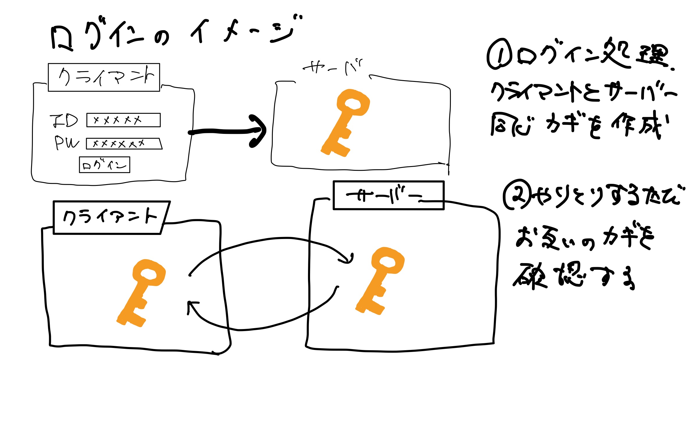

# 🤩 gs\_php\_day4

### 授業資料 <a href="#shou-ye-zi-liao" id="shou-ye-zi-liao"></a>

[https://gitlab.com/gs\_hayato/gs-php-01/-/blob/master/PHP04\_haifu.zip](https://gitlab.com/gs\_hayato/gs-php-01/-/blob/master/PHP04\_haifu.zip)

## 前回のおさらい

- `SQL`の`UPDATE`を書いた
- `SQL`の`DELETE`を書いた
- CRUDのC,R,U,D全部触った

## 今回やること
前回は、CRUD機能の`Updata（編集）`、`Delete（削除）`を行いました。

今日は、`update（更新）`、`Delete（削除）`をやっていきます。

- `CRUD`とは？ https://wa3.i-3-i.info/word123.html

## MAMPの起動、DB準備

1. MAMPを起動
2. WebStartボタンから起動トップページを表示
3. ページの真ん中MySQLのタブからphpMyAdminのリンクをクリック
4. 起動した画面がMySQLを管理するphpMyAdminの画面が表示されます。
5. データベースタブをクリック
6. データベースを作成から以下の名前で作成

```text
データベース名：gs_db4
照合順序：utf8_unicode_ci
```

7. 作成ボタンをクリック
左側に`gs_db4`というデータベースができていると思います。
現在は空っぽです。


## SQLファイルからインポート
〇〇.sqlというSQLファイルをインポートしてデータを作成します。

1. 念の為、左側のメニューから`gs_db4`をクリック
2. gs_db3を選択した状態でインポートタブをクリック
3. ファイルを選択をクリックして配布した資料内のSQLフォルダ内の`gs_an_table.sql`を選択
4. 実行してみる
5. ファイルを選択をクリックして配布した資料内のSQLフォルダ内の`gs_user_table.sql`を選択 **今日のテーブルは2つあります。**
6. 実行してみる
7. 授業用のDBと中身を確認


## 今日のイメージ



この鍵に、`SESSION`を利用する。
## SESSIONとは。

今日はSESSIONを学びます。

- SESSION変数 ... 「サーバー側に変数を保持」できる。
  - ※普通の変数は、サーバーに保存できない。

#### （例）普通の変数

```php
// test01.php

$name = 'yamada';
echo $name;
// yamadaと出力される
```

```php
// test02.php
echo $name;
// エラー。test02.phpの中には変数定義されていない。
```

### `SESSION`の確認

#### `session01.php`を作成

1. `session01.php`を作成
2. 以下記述

```php
<?php
// SESSIONスタート
session_start();

// SESSIONのidを取得
$sid = session_id();
echo $sid;

?>
```

#### `session01.php`をブラウザでチェック

idが表示されているはずです。
このデータは
- ブラウザ
- サーバー
の両方に同じデーターが保存されています。

- ブラウザ
`developer tools`の`検証 ＞ Application ＞ Cookies ＞ localhost`に`PHPSESSID`

- サーバー
`MAMP` > `tmp` > `php` > `sess_XXXXXXXXXXXXXXXXXXX`

#### `session01.php`の`session_id()`の下に以下処理を追加

```php

// SESSION変数にデータを登録
$_SESSION['name'] = 'john';
$_SESSION['age'] = 30;
```
#### `session02.php`を作成して以下記述

```php
<?php
// SESSIONスタート
session_start();

// SESSION変数を取得
$name = $_SESSION['name'];
$age = $_SESSION['age'];

echo $name;
echo $age;
?>
```


### `session ID`の変更方法

```php
<?php
//必ずsession_startは最初に記述
session_start();

//現在のセッションIDを取得
$old_sessionid = session_id();

//新しいセッションIDを発行（前のSESSION IDは無効）
session_regenerate_id(true);

//新しいセッションIDを取得
$new_sessionid = session_id();

//旧セッションIDと新セッションIDを表示
echo '古いセッション: $old_sessionid<br />';
echo '新しいセッション: $new_sessionid<br />';

```

## ログイン処理の実装

#### ログイン処理のイメージ
流れは、
- ログイン処理
- DBの`UserId`と`UserPw`と合致した場合、
- `SESSION ID`を発行してサーバーとブラウザにブラウザに同じ値の一意のIDを発行
- もしブラウザがそのIDを持っていたら、サーバーは、「そのユーザー」と認識する。

1. login_act.phpに以下の記述を追加

```php
session_start();

//POST値
$lid = $_POST['lid'];
$lpw = $_POST['lpw'];
```

2. データ登録SQL作成

```php
$stmt = $pdo->prepare('SELECT * FROM gs_user_table WHERE lid = :lid AND lpw=:lpw');
$stmt->bindValue(':lid', $lid, PDO::PARAM_STR);
$stmt->bindValue(':lpw', $lpw, PDO::PARAM_STR); //* Hash化する場合はコメントする
$status = $stmt->execute();
```

3. 処理後のリダイレクト先を設定

```php
//5. 該当レコードがあればSESSIONに値を代入
//* if(password_verify($lpw, $val['lpw'])){
if( $val['id'] != '' ){
  //Login成功時
  $_SESSION['chk_ssid']  = session_id();
  $_SESSION['kanri_flg'] = $val['kanri_flg'];
  $_SESSION['name']      = $val['name'];
  redirect('selsect.php');
}else{
  //Login失敗時(Logout経由)
  redirect('login.php');
}
```

4. select.phpにログインチェック処理を追加

```php
//SESSIONスタート
session_start();

// ログイン処理の時に代入した$_SESSION['chk_ssid']を持っているか？加えてサーバーのSESSION IDと一緒か？
if( $_SESSION['chk_ssid'] != session_id() ){
    exit('LOGIN ERROR');
}else{
session_regenerate_id(true);
    $_SESSION['chk_ssid'] = session_id();
}
//以下ログインユーザーのみ処理が行われる。
// (以下略)
```

5. ログイン処理を関数化。`funcs.php`にログインチェック関数を作成

```php
//ログインチェック
function loginCheck(){
  if( $_SESSION['chk_ssid'] != session_id() ){
    exit('LOGIN ERROR');
  }else{
    session_regenerate_id(true);
    $_SESSION['chk_ssid'] = session_id();
  }
}
```


6. `select.php`のログインチェック処理をリファクタリング

```php
//SESSIONスタート
session_start();

//関数を呼び出す
require_once('funcs.php');

//ログインチェック
loginCheck();
//以下ログインユーザーのみ
```

#### ログイン・ログアウトの確認

- `index.php`
1. index.phpで、まずログアウトしましょう。(※ログアウト処理は後述)
2. selectに戻って、一覧を確認してみてください。 → 多分見られない
3. ログインしましょう。
4. 一覧を見てみましょう。

## ログインが必要なページに以下記述

- `detail.php`
- `delete.php`

```php
session_start();
require_once('funcs.php');
loginCheck();
// 以下省略
```


## パスワードのハッシュ化

***万が一パスワードが盗まれた場合に備えて、パスワードをハッシュ化***

`ハッシュ化` ... 不可逆的
`暗号化` ... 可逆的 = 復元可能

1. `hash.php`を作成

2. `hash.php`内にパスワードのハッシュ化の処理を記述

```php
<?php

$pw = password_hash('test1',PASSWORD_DEFAULT);
echo $pw;

// 表示された内容が 'test1' を hash化したもの
?>
```
3.　パスワードの書き換え

- ↑で表示されたハッシュ値をコピー
- `phpMyAdmin`にて、`lpw`の`test1`をコピーしたハッシュ値に書き換える。


4. `login_act.php`の中の処理を一部変更

```php
// ↓ここをlidだけに変更
$stmt = $pdo->prepare('SELECT * FROM gs_user_table WHERE lid = :lid;');
$stmt->bindValue(':lid',$lid, PDO::PARAM_STR);

// *Hash化する場合はコメントする
// $stmt->bindValue(':lpw',$lpw, PDO::PARAM_STR); 
$status = $stmt->execute();

```

```php
//5. 該当レコードがあればSESSIONに値を代入この部分のif文をpassword_verifyに変更
if( password_verify($lpw, $val['lpw']) ){
  // Login成功時
  // 省略
}else{
  // 省略
}
```

今後ユーザー登録する際にパスワードはハッシュ化してあげる。