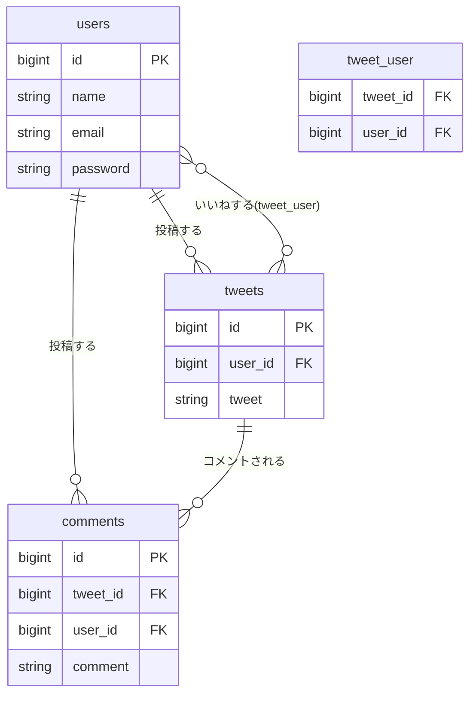

# laratterの完成形（仕様書）（仮）


**このページは仮ページです** 内容は今後変更される可能性があります。


このページは、この後の001以降で実際に手を動かして作っていく**`laratter`が最終的にどんなアプリになるか**をまとめたものです。まずは全体像を掴んでから、各章の実装に進みましょう。

## このアプリについて

`laratter`は、この講座で作る**Twitter風のSNSアプリ**です。ユーザー登録・ログインをした上で、つぶやき（Tweet）の投稿・いいね・コメントができます。

## 技術スタック

* Laravel 13
* Livewire Starter Kit（認証はFortifyが担当）
* Laravel Sail（Docker）
* MySQL

## 機能一覧

### 認証（Fortify + Livewire Starter Kit）

* 会員登録・ログイン・ログアウト
* パスワードリセット
* メールアドレス確認
* 2要素認証（2FA）
* パスキー認証
* プロフィール編集・パスワード変更（設定画面）


認証機能は002で扱う通り、プロジェクト作成の時点で一式用意されているため、自分で実装する箇所ではありません。


### Tweet機能（003〜007）

* 投稿一覧表示
* 投稿作成
* 投稿詳細表示
* 投稿編集（投稿者本人のみ）
* 投稿削除（投稿者本人のみ）

### Like機能（008〜009）

* いいね／いいね解除
* いいね数の表示

### Comment機能（010〜012）

* コメント投稿
* コメント一覧表示（Tweet詳細画面内）
* コメント詳細表示
* コメント編集（投稿者本人のみ）
* コメント削除（投稿者本人のみ）

## 画面一覧

| 画面 | 主なURL | 説明 |
| --- | --- | --- |
| ログイン | `/login` | Fortify提供 |
| 会員登録 | `/register` | Fortify提供 |
| ダッシュボード | `/dashboard` | ログイン後のトップ画面 |
| Tweet一覧 | `/tweets` | 投稿の一覧、いいねボタン付き |
| Tweet作成 | `/tweets/create` | 投稿フォーム |
| Tweet詳細 | `/tweets/{tweet}` | 本文・いいね・コメント一覧 |
| Tweet編集 | `/tweets/{tweet}/edit` | 投稿者のみアクセス可 |
| コメント作成 | `/tweets/{tweet}/comments/create` | |
| コメント詳細 | `/tweets/{tweet}/comments/{comment}` | |
| コメント編集 | `/tweets/{tweet}/comments/{comment}/edit` | コメント投稿者のみアクセス可 |
| 設定 | `/settings/profile` など | プロフィール・パスワード・2FA・パスキー管理 |

## DBスキーマ


**図の記号の意味**
* `||--o{`：**1対多**の関係。線の`||`側が「1」、`o{`側が「多」を表します
* `}o--o{`：**多対多**の関係。中間テーブルを介してつながります


**このアプリでの関係（文章での説明）**

* **users と tweets**（1対多）：1人のユーザーは複数のツイートを投稿できるが、1つのツイートは必ず1人のユーザーにしか属さない
* **users と comments**（1対多）：1人のユーザーは複数のコメントを投稿できるが、1つのコメントは必ず1人のユーザーにしか属さない
* **tweets と comments**（1対多）：1つのツイートには複数のコメントが付けられるが、1つのコメントは必ず1つのツイートにしか属さない
* **users と tweets**（多対多・いいね）：複数のユーザーが複数のツイートに「いいね」できる。この関係だけは中間テーブル`tweet_user`で管理する（詳しくは008・009で扱います）


`users`テーブルには上記の他に、Fortifyが使う2要素認証・パスキー関連のカラム（`two_factor_secret`など）や、別途`passkeys`テーブルも存在します。


## 主要ルート一覧

| メソッド | URI | 名前 | 用途 | Controller@Method | モデル | View |
| --- | --- | --- | --- | --- | --- | --- |
| GET | `/tweets` | `tweets.index` | 一覧表示 | `TweetController@index` | `Tweet` | `tweets.index` |
| GET | `/tweets/create` | `tweets.create` | 作成画面表示 | `TweetController@create` | `Tweet` | `tweets.create` |
| POST | `/tweets` | `tweets.store` | 作成処理 | `TweetController@store` | `Tweet` | `tweets.index`へredirect |
| GET | `/tweets/{tweet}` | `tweets.show` | 詳細表示 | `TweetController@show` | `Tweet` | `tweets.show` |
| GET | `/tweets/{tweet}/edit` | `tweets.edit` | 編集画面表示 | `TweetController@edit` | `Tweet` | `tweets.edit` |
| PUT | `/tweets/{tweet}` | `tweets.update` | 更新処理 | `TweetController@update` | `Tweet` | `tweets.show`へredirect |
| DELETE | `/tweets/{tweet}` | `tweets.destroy` | 削除処理 | `TweetController@destroy` | `Tweet` | `tweets.index`へredirect |
| POST | `/tweets/{tweet}/like` | `tweets.like` | いいね | `TweetLikeController@store` | `Tweet`（`tweet_user`） | 元画面へback() |
| DELETE | `/tweets/{tweet}/like` | `tweets.dislike` | いいね解除 | `TweetLikeController@destroy` | `Tweet`（`tweet_user`） | 元画面へback() |
| GET | `/tweets/{tweet}/comments` | `tweets.comments.index` | コメント一覧 | `CommentController@index` | `Comment` | `tweets.show`内で表示 |
| GET | `/tweets/{tweet}/comments/create` | `tweets.comments.create` | コメント作成画面表示 | `CommentController@create` | `Comment` | `tweets.comments.create` |
| POST | `/tweets/{tweet}/comments` | `tweets.comments.store` | コメント作成処理 | `CommentController@store` | `Comment` | `tweets.show`へredirect |
| GET | `/tweets/{tweet}/comments/{comment}` | `tweets.comments.show` | コメント詳細表示 | `CommentController@show` | `Comment` | `tweets.comments.show` |
| GET | `/tweets/{tweet}/comments/{comment}/edit` | `tweets.comments.edit` | コメント編集画面表示 | `CommentController@edit` | `Comment` | `tweets.comments.edit` |
| PUT | `/tweets/{tweet}/comments/{comment}` | `tweets.comments.update` | コメント更新処理 | `CommentController@update` | `Comment` | `tweets.comments.show`へredirect |
| DELETE | `/tweets/{tweet}/comments/{comment}` | `tweets.comments.destroy` | コメント削除処理 | `CommentController@destroy` | `Comment` | `tweets.show`へredirect |
