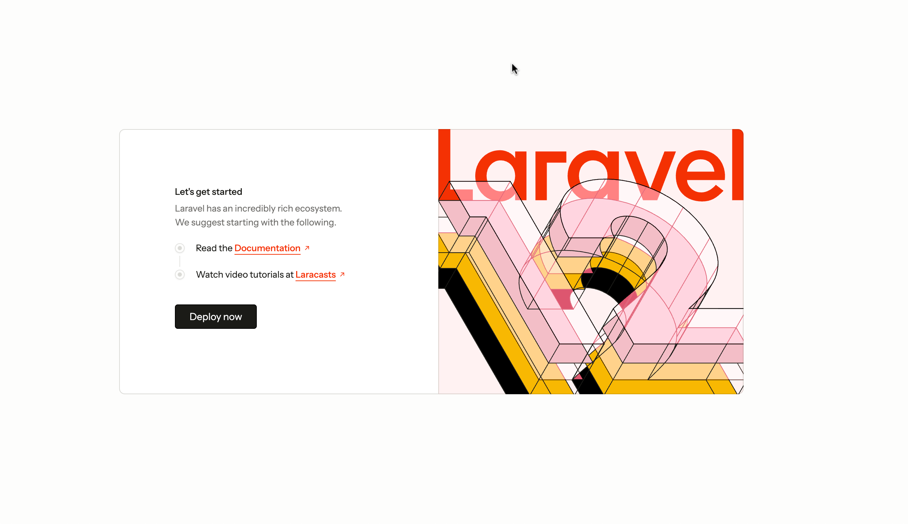
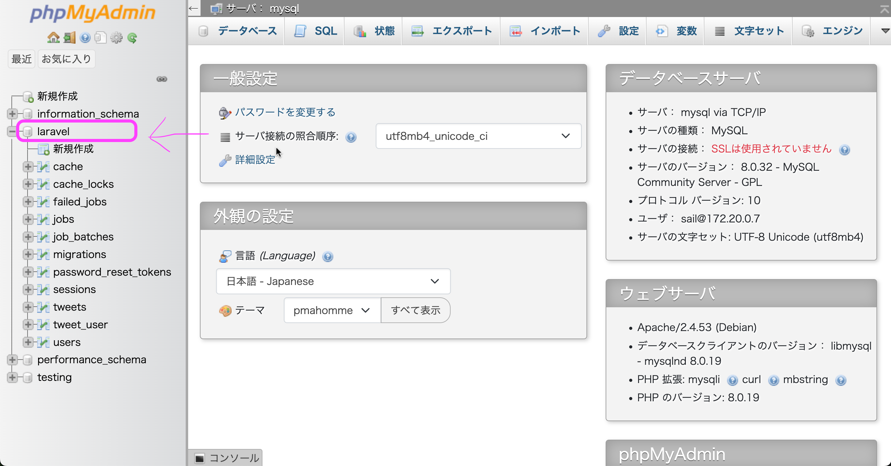

# 001\_0\_Laravelプロジェクトの作成とSail起動

***

## 目次

1. [Dockerとは？](001_0_gs_laravel_project_setup.md#dockerとは)
2. [Laravel Sailの導入](001_0_gs_laravel_project_setup.md#laravel-sailの導入)
3. [プロジェクトの起動と確認](001_0_gs_laravel_project_setup.md#プロジェクトの起動と確認)
4. [phpMyAdminの設定](001_0_gs_laravel_project_setup.md#phpmyadminの設定)

***


**事前準備は完了している前提です**
Docker Desktopのインストール・（Windowsの場合はWSL/Ubuntuのセットアップも含む）・`docker -v`での動作確認は、別紙の環境構築資料で完了している前提でここから進めます。まだの場合は先にそちらを済ませてください。



**XAMPP/MAMPは停止しておいてください**
XAMPPやMAMPでローカルのMySQLを起動したままだと、この後Sailが使うポート3306が競合してコンテナが起動できません。作業前に、XAMPP Control Panel（またはMAMP）でMySQLを止めておいてください。



**備考：ポートが被っていないか確認する方法**
XAMPP/MAMP以外にも、Homebrewなどでインストールした別のMySQLサーバーが裏で動いていると、同じくポート3306が競合します。心当たりがなくても、念のため以下で確認できます。

**何がポートを使っているか確認**
```bash
# Mac/WSL(Ubuntu)共通
lsof -nP -iTCP:3306 -sTCP:LISTEN

# 何かプロセスが見つかったら、詳細を確認
ps aux | grep mysqld
```

**止め方の例**
* XAMPP: Control Panelの「Stop」ボタン、またはターミナルで `sudo /Applications/XAMPP/xamppfiles/xampp stopmysql`
* Homebrewのmysql: `brew services stop mysql@5.7`（バージョン名は環境に合わせて読み替え）
* 原因のプロセスが分かれば `sudo kill <PID>` で直接終了することもできます

**それでも解決しない／原因がよくわからない場合**
プロジェクト作成後、`.env`に以下を追記すると、Sail側のMySQLが使うホスト側ポートを3306からずらせるので、競合そのものを回避できます。
```env
FORWARD_DB_PORT=3307
```
追記したら `sail down` → `sail up -d` で再起動してください（`DB_HOST=mysql`など、Laravelアプリ内部からの接続設定は変更不要です）。


***

## Dockerとは？


**Docker（ドッカー）とは？** アプリケーションを「コンテナ」という仮想環境で動かすためのツールです。

**XAMPPとの違い:**

* **XAMPP**: PCに直接PHP、MySQL、Apacheをインストール
* **Docker**: 仮想的な箱（コンテナ）の中にPHP、MySQL、Apacheを用意

**メリット:**

* 環境の違いによるトラブルが少ない
* 複数のプロジェクトで異なるバージョンを使い分けられる
* 開発チーム全員が同じ環境で作業できる


Laravelを導入するにあたり、今回はDockerというものを使います。

PHPを学ぶときに、仮のサーバーとしてXAMPP（or MAMP）を利用しましたよね？

Laravelも同じように大きな器を用意してその中で環境構築をします。

その器がDockerです。

***

## Laravel Sailの導入


**Laravel Sail とは？** LaravelがDockerを簡単に使えるようにしてくれるツールです。複雑なDocker設定を自動で行ってくれます。


### 手順1: Laravelプロジェクトの作成


**Windowsの方へ** ここから先のコマンドは、WindowsのPowerShellではなく**WSL（Ubuntu）のターミナル**で実行してください。Windowsスタートメニューから「Ubuntu」を検索して起動するか、PowerShellで`wsl`と実行するとUbuntuターミナルに入れます。
**Macの方**はそのまま通常のターミナルを使用してください。


以下のコマンドを実行します：

```bash
docker run --rm --pull=always \
  -v "$(pwd)":/opt \
  -w /opt \
  laravelsail/php84-composer:latest \
  bash -lc "composer global require laravel/installer --quiet && export PATH=\"\$HOME/.composer/vendor/bin:\$PATH\" && laravel new laratter --livewire --database=mysql --pest --no-node --no-interaction && cd laratter && php artisan sail:install --with=mysql,mailpit"
```


**このコマンドの意味:**

* `laravelsail/php84-composer` イメージを使い、PCに直接PHPやComposerをインストールせずにLaravelプロジェクトを作成
* `composer global require laravel/installer`：イメージに入っているLaravelインストーラーが古いことがあるため、最新版に更新（`--livewire`オプションを使うために必要）
* `laravel new laratter --livewire --database=mysql --pest --no-node --no-interaction`：`laratter` という名前で、**Livewire Starter Kit（認証にFortifyを使用）・MySQL・Pest**構成のプロジェクトを作成。`--no-node`はこの段階ではnpmビルドを行わない設定（あとでSailコンテナ内から実行します）
* `php artisan sail:install --with=mysql,mailpit`：Sailの `compose.yaml`（Docker設定ファイル）を、MySQLとメール確認用のMailpitを含む構成で生成


**ファイルの所有者を修正**

Dockerコンテナ内（root権限）でファイルが作成されるため、所有者を自分に戻します：

```bash
sudo chown -R $USER: laratter
```


**パスワード入力について** `Password for XXX:` と表示され、**パソコンのログインパスワード**の入力を求められます。

* **注意**: パスワードを入力しても画面には文字が表示されません（セキュリティのため）
* 見た目は何も入力されていないように見えますが、正しく入力されています
* パスワードを入力後、Enterキーを押してください


### 手順2: プロジェクトディレクトリに移動

```bash
cd laratter
```


**注意**: プロジェクト名を `laratter` としたので、`cd laratter` で移動します。


***

## プロジェクトの起動と確認

### 手順3: Dockerコンテナの起動

```bash
./vendor/bin/sail up -d
```


**このコマンドの意味:**

* `sail up`: Dockerコンテナを起動
* `-d`: バックグラウンドで実行（ターミナルが占有されない）


### 手順4: データベースのセットアップとフロントエンドのビルド

```bash
./vendor/bin/sail artisan migrate
./vendor/bin/sail npm install
./vendor/bin/sail npm run dev
```


**このコマンドの意味:**

* `artisan migrate`：Laravelのデータベーステーブルを作成（ユーザー認証などの基本テーブルが準備される）
* `npm install` / `npm run dev`：Livewire Starter Kit（Flux UI）のCSS/JSをビルド。プロジェクト作成時に `--no-node` を指定したため、ここで初めてビルドします



**`npm run dev` はターミナルを占有します** 開発中はこのまま起動したままにしておき、別のタブ/ウィンドウで他の作業を行ってください。停止する場合は `Ctrl + C` です。


### 手順5: 動作確認

ブラウザで以下のURLにアクセス：

* **Laravel アプリケーション**: http://localhost
* **成功**: Laravelのウェルカムページが表示される

<figure><figcaption></figcaption></figure>

### 手順6: 開発終了時（コンテナの停止）

作業を終了する際は以下のコマンドでコンテナを停止：

```bash
./vendor/bin/sail down
```

***

## phpMyAdminの設定

データベースを視覚的に管理するため、phpMyAdminを追加します。

### compose.yamlファイルの編集


**compose.yamlファイルの場所** `compose.yaml` ファイルは、先ほど作成した `laratter` フォルダの中にあります。

**具体的な場所:**

* ターミナルで `cd laratter` を実行した場所
* VS Codeなどのエディタで `laratter` フォルダを開いた時に、フォルダの直下に表示されるファイル
* ファイル名は `compose.yaml`（拡張子は `.yml`）



**YAML形式の注意点** `.yml` ファイルは改行やインデント（スペース）が正確でないとエラーになります。

* **インデントはスペースを使用**（タブは使用不可）
* **改行位置や空白に注意**
* 気になる人は、生成AIと相談しながら記述することを推奨します


`laratter` フォルダ内の `compose.yaml` ファイルを開き、以下を追加：


**追加する場所に注意！** 以下のコードは、`compose.yaml` ファイルの **`networks:` より上の位置** に追加してください。 具体的には、既存のサービス（`laravel.test`, `mysql`, `redis` など）と同じレベルで追加します。


```yaml
phpmyadmin:
    image: phpmyadmin/phpmyadmin
    links:
        - mysql:mysql
    ports:
        - 8080:80
    environment:
        MYSQL_USERNAME: '${DB_USERNAME}'
        MYSQL_ROOT_PASSWORD: '${DB_PASSWORD}'
        PMA_HOST: mysql
    networks:
        - sail
```


**設定内容の確認** `compose.yaml` の内容を生成AIに見せて、インデントや改行が正しいか確認してください。YAMLファイルは記述ミスがあると動作しません。



**M1/M2 Macの場合** Apple Silicon Mac（M1/M2）を使用している場合は、「phpmyadmin The requested image's platform(linux/amd64) does not match the ....」が出る場合があります。その場合は、以下の行も追加してください：

```yaml
platform: linux/amd64
```


### phpMyAdminの利用方法

1.  上記設定を追加後、以下を1行ずつ実行してコンテナを再起動(シャットダウン + 起動)：

    ```bash
    ./vendor/bin/sail down
    ./vendor/bin/sail up -d
    ```
2. ブラウザで http://localhost:8080 にアクセス
3. ログイン情報：
   * **ユーザー名**: `sail`
   * **パスワード**: `password`
4. **phpMyAdmin動作確認**：
   * ログイン後、左側に `laratter` データベースが表示されることを確認
   * データベースをクリックして、テーブル一覧が表示されることを確認
   * もしテーブルが表示されない場合は、先ほどの `./vendor/bin/sail artisan migrate` が実行されているか確認

<figure><figcaption></figcaption></figure>


**完了！** これでLaravel開発環境の準備が完了しました。以下のURLが利用できます：

* **Laravel**: http://localhost
* **phpMyAdmin**: http://localhost:8080


***

## トラブルシューティング

### よくあるエラー

**「Docker is not running」エラー** → Docker Desktopが起動していることを確認

**「Port already in use」エラー** → XAMPP/MAMPなど、ポート3306（MySQL）や80番を使う他のサーバーが起動していないか確認。特にXAMPP/MAMPを使っていた人は要注意です

**コマンドが認識されない** → プロジェクトディレクトリ（`laratter`フォルダ）内で実行しているか確認。Windowsの場合はWSL（Ubuntu）ターミナルを使用しているか確認

**M1/M2 Macでの動作不具合** → compose.yaml に `platform: linux/amd64` を追加
