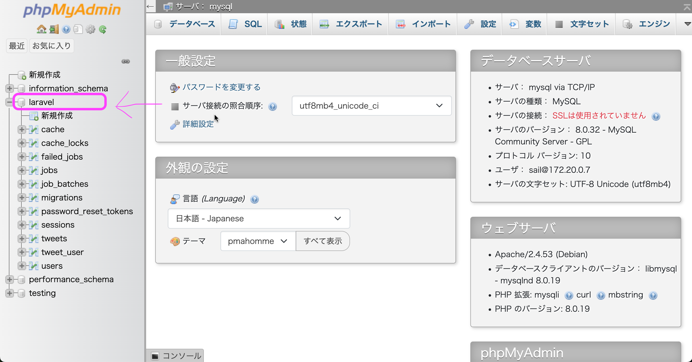

# 001\_1\_Docker導入\_WINDOWS

**WINDOWS向けの記事です！** **Macは次のページへ！**

***

## 📺 **メイン動画**


**🎥 この手順は動画で詳しく解説しています！**

**動画を見ながら進めることを強く推奨します。**

▶️ **動画はこちら**: https://youtu.be/PBzFkAERXNc

**動画で解説している内容:**

1. Docker Desktop for Windows のインストール手順
2. Docker Desktop の Disk image location を `Docker\wsl` に設定確認
3. PowerShell で `wsl --list --verbose` を実行してUbuntu確認
4. WSL Ubuntu の起動
5. Ubuntu ターミナルで `curl -s "https://laravel.build/laratter" | bash` を実行
6. docker-compose.yml への phpMyAdmin 設定追加
7. `./vendor/bin/sail up -d` でのコンテナ起動

※ 動画内の一部コマンドと下記テキストで差異がある場合は、**下記テキストを正**として進めてください。

※ 動画で使用しているLaravelは少し古いバージョンのため、**現在のLaravelとUIが異なって見える場合があります**が、基本的な操作は同じです。


***

## 目次

1. [事前準備](gs_laravel_docker_for_windows.md#事前準備)
2. [Dockerとは？](gs_laravel_docker_for_windows.md#dockerとは)
3. [Laravel Sailの導入](gs_laravel_docker_for_windows.md#laravel-sailの導入)
4. [プロジェクトの起動と確認](gs_laravel_docker_for_windows.md#プロジェクトの起動と確認)
5. [phpMyAdminの設定](gs_laravel_docker_for_windows.md#phpmyadminの設定)

***

## 事前準備


**🎥 動画で詳しく解説** Docker Desktop のインストール手順が詳しく解説されています。


### 必要なソフトウェア

1. **Docker Desktop for Windows** のインストール
   * [公式サイト](https://docs.docker.com/desktop/)からダウンロード
   * ダウンロードした `.exe` ファイルを右クリック
   * **「管理者として実行」** を選択してインストール
   * インストール後、必ず起動させておく
   * Docker Desktop の **Settings** から設定を確認
   * **Disk image location** が `... Docker\wsl` に設定されていることを確認
2.  **WSL（Windows Subsystem for Linux）の確認**

    * PowerShellを **管理者として実行**
    * 以下のコマンドを実行してUbuntuが利用可能か確認：

    ```powershell
    wsl --list --verbose
    ```

    * Ubuntuが表示されることを確認
3. **既存サーバーの停止** もしXAMPPやMAMPを起動している場合は、それらを終了させてから以下を行ってください。


**重要**:

* Docker DesktopがPCにインストールされ、起動していることを確認してください
* WSLのUbuntuが利用可能であることを確認してください


***

## Dockerとは？


**Docker（ドッカー）とは？** アプリケーションを「コンテナ」という仮想環境で動かすためのツールです。

**XAMPPとの違い:**

* **XAMPP**: PCに直接PHP、MySQL、Apacheをインストール
* **Docker**: 仮想的な箱（コンテナ）の中にPHP、MySQL、Apacheを用意

**メリット:**

* 環境の違いによるトラブルが少ない
* 複数のプロジェクトで異なるバージョンを使い分けられる
* 開発チーム全員が同じ環境で作業できる


Laravelを導入するにあたり、今回はDockerというものを使います。

PHPを学ぶときに、仮のサーバーとしてXAMPP（or MAMP）を利用しましたよね？

Laravelも同じように大きな器を用意してその中で環境構築をします。

その器がDockerです。

***

## Laravel Sailの導入


**Laravel Sail とは？** LaravelがDockerを簡単に使えるようにしてくれるツールです。複雑なDocker設定を自動で行ってくれます。



**🎥 動画で詳しく解説** この手順は動画で詳しく解説されています。画面を見ながら進めてください。


### 手順1: Laravelプロジェクトの作成


**WSL Ubuntuを使用します** この手順では、WindowsのPowerShellではなく、WSL（Windows Subsystem for Linux）のUbuntuターミナルを使用します。


**Step 1-1: WSL Ubuntuの起動**

1. Windowsスタートメニューから「Ubuntu」を検索して起動
2.  または、PowerShellで以下のコマンドを実行：

    ```powershell
    wsl
    ```

**Step 1-2: Laravelプロジェクトの作成** Ubuntuターミナルで以下のコマンドを実行します：

```bash
curl -s "https://laravel.build/laratter" | bash
```


**パスワード入力について** コマンド実行の最後に `Password for XXX:` と表示され、**パソコンのログインパスワード**の入力を求められます。

* **注意**: パスワードを入力しても画面には文字が表示されません（セキュリティのため）
* 見た目は何も入力されていないように見えますが、正しく入力されています
* パスワードを入力後、Enterキーを押してください



**このコマンドの意味:**

* `laratter` という名前でLaravelプロジェクトを作成
* 必要なDockerファイルも自動生成
* データベース（MySQL）、Redis、メールサーバーなども含まれる


### 手順2: プロジェクトディレクトリに移動

Ubuntuターミナルで以下のコマンドを実行：

```bash
cd laratter
```


**注意**:

* プロジェクト名を `laratter` に変更したので、`cd laratter` で移動します
* 引き続きUbuntuターミナルで作業を行います


***

## プロジェクトの起動と確認


**🎥 動画で詳しく解説** `./vendor/bin/sail up -d` でのコンテナ起動手順を動画で確認できます。


### 手順3: Dockerコンテナの起動

Ubuntuターミナルで以下のコマンドを実行：

```bash
./vendor/bin/sail up -d
```


**このコマンドの意味:**

* `sail up`: Dockerコンテナを起動
* `-d`: バックグラウンドで実行（ターミナルが占有されない）


### 手順4: データベースのセットアップ

初回 `./vendor/bin/sail up -d` 実行後、ブラウザで http://localhost にアクセスしてみてください。


**SQLSTATEエラーが表示された場合** もし「SQLSTATE...」というエラー画面が表示された場合は、データベースの初期設定が必要です。 以下のコマンドを実行してください。


同じくUbuntuターミナルで以下のコマンドを実行：

```bash
./vendor/bin/sail artisan migrate
```


**このコマンドの意味:**

* Laravelのデータベーステーブルを作成
* ユーザー認証などの基本テーブルが準備される


### 手順5: 動作確認

ブラウザで以下のURLにアクセス：

* **Laravel アプリケーション**: http://localhost
* **成功**: Laravelのウェルカムページが表示される


**UIの違いについて** 動画で使用しているLaravelは少し古いバージョンのため、現在のLaravelウェルカムページとはデザインが異なって見える場合があります。しかし、基本的な機能や操作方法は同じです。


<figure><figcaption></figcaption></figure>

### 手順6: 開発終了時（コンテナの停止）

作業を終了する際は、Ubuntuターミナルで以下のコマンドでコンテナを停止：

```bash
./vendor/bin/sail down
```

***

## phpMyAdminの設定


**🎥 動画で詳しく解説** docker-compose.yml への phpMyAdmin 設定追加が詳しく説明されています。


データベースを視覚的に管理するため、phpMyAdminを追加します。

### docker-compose.ymlファイルの編集


**docker-compose.ymlファイルの場所** `docker-compose.yml` ファイルは、先ほど作成した `laratter` フォルダの中にあります。

**具体的な場所:**

* WSL Ubuntuターミナルで `cd laratter` を実行した場所
* VS Codeなどのエディタで `laratter` フォルダを開いた時に、フォルダの直下に表示されるファイル
* ファイル名は `docker-compose.yml`（拡張子は `.yml`）



**YAML形式の注意点** `.yml` ファイルは改行やインデント（スペース）が正確でないとエラーになります。

* **インデントはスペースを使用**（タブは使用不可）
* **改行位置や空白に注意**
* 気になる人は、生成AIと相談しながら記述することを推奨します


`laratter` フォルダ内の `docker-compose.yml` ファイルを開き、以下を追加：


**追加する場所に注意！** 以下のコードは、`docker-compose.yml` ファイルの **`networks:` より上の位置** に追加してください。 具体的には、既存のサービス（`laravel.test`, `mysql`, `redis` など）と同じレベルで追加します。


```bash
phpmyadmin:
    image: phpmyadmin/phpmyadmin
    links:
        - mysql:mysql
    ports:
        - 8080:80
    environment:
        MYSQL_USERNAME: '${DB_USERNAME}'
        MYSQL_ROOT_PASSWORD: '${DB_PASSWORD}'
        PMA_HOST: mysql
    networks:
        - sail
```


**設定内容の確認** `docker-compose.yml` の内容を生成AIに見せて、インデントや改行が正しいか確認してください。YAMLファイルは記述ミスがあると動作しません。


### phpMyAdminの利用方法

1.  上記設定を追加後、Ubuntuターミナルでコンテナを再起動：

    ```bash
    ./vendor/bin/sail down
    ./vendor/bin/sail up -d
    ```
2. ブラウザで http://localhost:8080 にアクセス
3. ログイン情報：
   * **ユーザー名**: `sail`
   * **パスワード**: `password`
4. **phpMyAdmin動作確認**：
   * ログイン後、左側に `laratter` データベースが表示されることを確認
   * データベースをクリックして、テーブル一覧が表示されることを確認
   * もしテーブルが表示されない場合は、先ほどの `./vendor/bin/sail artisan migrate` が実行されているか確認

<figure><figcaption></figcaption></figure>


**完了！** これでLaravel開発環境の準備が完了しました。以下のURLが利用できます：

* **Laravel**: http://localhost
* **phpMyAdmin**: http://localhost:8080


***

## トラブルシューティング


**🎥 困ったときは動画をチェック！** エラーが発生した場合は、まず動画を確認してください: https://youtu.be/PBzFkAERXNc


### よくあるエラー

**「Docker is not running」エラー** → Docker Desktopが起動していることを確認

**「Port already in use」エラー** → XAMPP/MAMPが起動していないか確認

**コマンドが認識されない** → プロジェクトディレクトリ（`laratter`フォルダ）内で実行しているか確認 → WSL Ubuntuターミナルを使用しているか確認

**WSL関連のエラー** → PowerShellで `wsl --list --verbose` を実行してUbuntuが利用可能か確認

***

## 📺 **動画で学習しよう！**


**🎥 メイン解説動画**

▶️ **https://youtu.be/PBzFkAERXNc**

**動画で実際に解説している内容:**

1. **Docker Desktop のインストール方法**
2. **Docker Desktop の設定確認**（Disk image location を `Docker\wsl` に設定）
3. **PowerShell で WSL の確認**（`wsl --list --verbose` コマンド実行）
4. **WSL Ubuntu の起動と Laravel プロジェクト作成**
5. **docker-compose.yml への phpMyAdmin 設定追加**
6. **`./vendor/bin/sail up -d` でのコンテナ起動**

**推奨**: テキストと合わせて動画を視聴することで、より確実に環境構築ができます。



**重要な注意点:**

* 動画内の一部コマンドとこのテキストで差異がある場合は、**このテキストの内容を正**として進めてください
* **動画で使用しているLaravelは少し古いバージョン**のため、現在のLaravelとUIが異なって見える場合がありますが、基本的な操作は同じです

