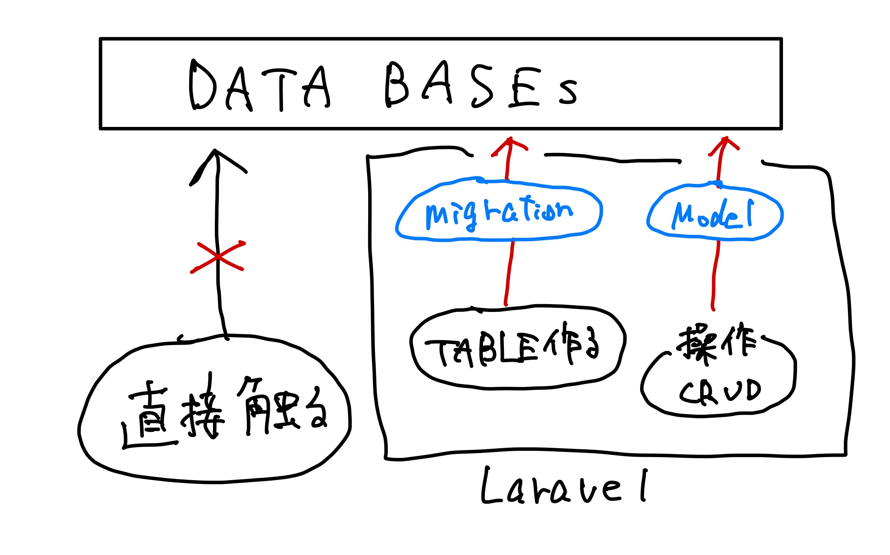
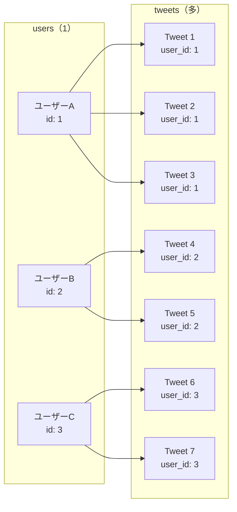

# 003_Modelとテーブルの用意

## 今回やること

* 実際にコードを書き、動くものを作る
* Tweetデータを扱うためのモデルとテーブルを作成する

## なぜTweetモデルを用意するのか？

### アプリケーションの要件

今回作成するlaratterアプリケーションでは、以下の機能が必要です：

- **ユーザー**がログインできる
- **ユーザー**がつぶやき（Tweet）を投稿できる
- 投稿されたつぶやきを一覧表示できる

### データベース設計の考え方

この機能を実現するためには、以下のデータが必要です：

1. **ユーザー情報**：既にusersテーブルが存在している
2. **つぶやき情報**：新たにtweetsテーブルが必要

そして、これら2つのテーブルは**リレーション**（関係性）を持ちます：
- 1人のユーザーは複数のつぶやきを投稿できる（1対多の関係）
- 1つのつぶやきは必ず1人のユーザーに属する

### Laravelでのデータベース操作

Laravelでは、**データベースのテーブルを直接操作するのではなく、モデルを介してデータを操作**します。

これにより以下のメリットがあります：
- データの整合性を保ちやすい
- リレーション（関係性）を簡単に扱える
- セキュリティが向上する（SQLインジェクション対策など）


**モデルとは？**
モデルは、データベースのテーブルとPHPコードを繋ぐ橋渡し役です。例えば：
- `User`モデル → `users`テーブル
- `Tweet`モデル → `tweets`テーブル（これから作成）


## 事前準備

### Dockerコンテナが起動していることを確認

```bash
./vendor/bin/sail up -d
```

### プロジェクトディレクトリにいることを確認

```bash
cd laratter
```


**現在のディレクトリの確認方法**
`pwd` コマンドで現在のディレクトリを確認できます。表示されるパスの最後が `/laratter` になっていればOKです。


## Laravelにおけるモデルとテーブルの基本概念

### テーブルの作成方法

Laravelでテーブルを作成する場合は、以下の手順で行います：

1. **`マイグレーションファイル`を作成** - テーブルの設計図を作る
2. **コマンドでマイグレーションを実行** - 実際にデータベースにテーブルを作成

Laravel側からテーブルを操作（CRUD処理など）を行うためには**`モデル`**のファイルが必要となるため同時に作成します。

<figure><figcaption><p>Laravelでは、直接DBを触らない。</p></figcaption></figure>


**基本ルール**
- 基本的には`テーブルに対して一つのモデルファイル`を作成します
- マイグレーションファイルは `/database/migrations` の中に作成されます
- マイグレーションファイルは、DBにテーブルを作成するための設計図です
- 手動でテーブル作成せず、マイグレーションファイルを作成+実行でテーブル等作成しましょう


## Tweetモデルの作成

### 作成されるファイル

Tweetモデルとそれに関連する以下のファイルを一括で作成します：

* **`モデルファイル`** - データの操作を行うためのファイル
* **`マイグレーションファイル`** - モデルに対応するテーブル作成に使用
* **`コントローラファイル`** - TweetデータのCRUD処理に使用するメソッドを記述


**コマンドの便利さ**
モデルを作成時、コマンドにオプション（`-rm`）付加することで，これらを一括で生成できます。

Laravelではファイル名のルール等規則が多いです。**コマンドでまとめて作成すると自動的に規則に従ってくれるので便利です。** 無理に手動で作成せず、コマンドに任せましょう。


### コマンドの実行

以下のコマンドを`laratter`ディレクトリで実行してください：

```bash
./vendor/bin/sail artisan make:model Tweet -rm
```


**オプションの意味:**
- `-r` または `--resource`: リソースコントローラを作成
- `-m` または `--migration`: マイグレーションファイルを作成
- `Tweet`: モデル名（単数形で指定）


以下のような出力が表示されて、`Model`、`migrationsファイル`、`Controller`が作成されればOKです：

```bash
// laratter階層にいることを確認
pwd
/Users/fukushimahayato/laratter

./vendor/bin/sail artisan make:model Tweet -rm

   INFO  Model [app/Models/Tweet.php] created successfully.  

   INFO  Migration [database/migrations/2025_01_24_194104_create_tweets_table.php] created successfully.  

   INFO  Controller [app/Http/Controllers/TweetController.php] created successfully.  
```


**作成完了！**
3つのファイルが正常に作成されました。次の手順でマイグレーションファイルを編集していきます。


### マイグレーションファイルの編集


**マイグレーションファイルとは？**
マイグレーションファイルはテーブル作成等のための設計図です。テーブルに設定したい内容を、マイグレーションファイルに記載していきます。


今回作成するテーブルには以下のカラムが必要です：

- **`tweet`カラム**: ツイートの本文を格納
- **`user_id`カラム**: どのユーザーがツイートしたかを識別

**User**と**Tweet**の関係は**1対多**となるため、`tweets`テーブルに`user_id`カラムを追加します。


**リレーションのルール**
他のテーブルとリレーションをさせるためには，カラム名を「**モデル名小文字\_id**」とする必要があります。このようなルールがあるため、マイグレーションファイルを作成する時点で「1対多」「多対多」などリレーションを決めておきましょう。


生成されたマイグレーションファイル（`database/migrations/xxxx_xx_xx_xxxxxx_create_tweets_table.php`）を以下のように編集してください：

```php
// database/migrations/xxxx_xx_xx_xxxxxx_create_tweets_table.php

<?php

use Illuminate\Database\Migrations\Migration;
use Illuminate\Database\Schema\Blueprint;
use Illuminate\Support\Facades\Schema;

return new class extends Migration
{
    public function up(): void
    {
        Schema::create('tweets', function (Blueprint $table) {
            $table->id();
            
            // 🔽 2カラム追加
            $table->foreignId('user_id')->constrained()->cascadeOnDelete();
            $table->string('tweet');

            $table->timestamps();
        });
    }

    public function down(): void
    {
        Schema::dropIfExists('tweets');
    }
};
```


**各カラムの説明:**

**`foreignId('user_id')->constrained()`**
- `user_id`という名前で、`"テーブル名（単数）_id"`とすると、そのテーブルと連携することを認識
- `foreignId`は「外部キー」制約。`tweets`テーブルにレコード作成する際に、`users`テーブルに存在しないidを`user_id`に設定するとエラーになる
- `->constrained()`をつけると、連携してくれて、データを一発で取ってくれるようになる（この書き方はほぼテンプレ）

**`cascadeOnDelete()`**
- あるusersテーブルのレコードが削除されたら、関連するtweetsテーブルのレコードも自動的に削除する制約を設定
- userが削除されたときに関連するtweetを消さないと、例えばそのtweetを表示したときにuserがいないのでエラーになる

**`string('tweet')`**
- `string`型の`tweet`カラムを作成する

**`timestamps();`**
- 自動で`created_at`カラムと`updated_at`カラムの二つを作成してくれる
- 基本的にこの1行はほぼ必須


### マイグレーションの実行

マイグレーションファイルに記述して保存できたら、マイグレートを実行してテーブルを作成します：

```bash
./vendor/bin/sail artisan migrate
```

成功すると以下のような出力が表示されます：

```bash
./vendor/bin/sail artisan migrate             

   INFO  Running migrations.  

  2025_01_24_194104_create_tweets_table ................................................................................. 59.52ms DONE
```

### データベースの確認

phpMyAdmin（http://localhost:8080）にアクセスして、テーブル構造を確認しましょう。以下のような構造になっていればOKです：

| Field      | Type                | Null | Key | Default | Extra          |
|------------|---------------------|------|-----|---------|----------------|
| id         | bigint(20) unsigned | NO   | PRI | NULL    | auto_increment |
| user_id    | bigint(20) unsigned | NO   | MUL | NULL    |                |
| tweet      | varchar(255)        | NO   |     | NULL    |                |
| created_at | timestamp           | YES  |     | NULL    |                |
| updated_at | timestamp           | YES  |     | NULL    |                |


**テーブル作成完了！**
`tweets`テーブルが正常に作成されました。次の手順でモデルファイルの設定を行います。


### 動作確認：マイグレーション実行後

マイグレーションが正常に実行されたか確認してみましょう。

**1. データベース接続の確認**
```bash
./vendor/bin/sail artisan migrate:status
```

実行結果で`create_tweets_table`が`Ran`になっていればOKです：
```bash
+------+------------------------------------------------+-------+
| Ran? | Migration                                      | Batch |
+------+------------------------------------------------+-------+
| Yes  | 2014_10_12_000000_create_users_table           | 1     |
| Yes  | 2014_10_12_100000_create_password_reset_tokens_table | 1     |
| Yes  | 2019_08_19_000000_create_failed_jobs_table     | 1     |
| Yes  | 2019_12_14_000001_create_personal_access_tokens_table | 1     |
| Yes  | 2025_01_24_194104_create_tweets_table           | 2     |  ← これが追加されている
+------+------------------------------------------------+-------+
```

**2. テーブル構造の確認**
```bash
./vendor/bin/sail artisan tinker
```

tinkerで以下のコマンドを実行：
```php
DB::select('DESCRIBE tweets');
```

正しい結果が表示されたら`exit`で終了します。


**tinkerとは？**
Laravelアプリケーションと対話的にやり取りできるコマンドラインツールです。データベースの確認やモデルのテストに便利です。


## モデルファイルの設定

### リレーションシップとは？

モデルファイルには関連するデータとの連携を定義します。ここに連携を記述しておくことで、連携先のデータを容易に操作できるようになります。

例えば：
- あるユーザーが投稿したツイートを取得したり
- ツイートから誰が投稿したのかがすぐにわかるようになります

今回は**User**モデルと**Tweet**モデルを**1対多**で連携します。



1人の`user`（例：ユーザーA）は複数の`tweet`を持てる一方、1件の`tweet`は必ず1人の`user`（`user_id`）にしか属しません。この非対称な関係が「1対多」です。

### Userモデルの設定

`app/Models/User.php`にて`User`モデルに`Tweet`モデルとの関連を追記します。

`User`モデルから見ると，`Tweet`モデルとの関係は**1対多**となるため`tweets()`メソッドを作成します：

```php
// app/Models/User.php

<?php

namespace App\Models;

// ... other imports

class User extends Authenticatable implements PasskeyUser
{
    /** @use HasFactory<UserFactory> */
    use HasFactory, Notifiable, PasskeyAuthenticatable, TwoFactorAuthenticatable;

   // ⭐️省略⭐️

    /**
     * Get the user's initials
     */
    public function initials(): string
    {
        $initials = Str::initials($this->name, true);

        return Str::length($initials) > 1
            ? Str::substr($initials, 0, 1).Str::substr($initials, -1)
            : $initials;
    }

    public function tweets()
    {
        // $thisは、Userモデルそのものと思ってください
        return $this->hasMany(Tweet::class);
    }
}
```


**リレーションシップの説明**
- UserからみるとTweetを複数持っている1対多なので、`hasMany`を使用します
- `tweets()`はメソッドです



**tweets()を定義する理由**
- 直接SQLを書いてUserと紐づくTweetを取得することも可能ですが、毎回`Tweet::where('user_id', $user->id)->get()`と書くのは面倒です
- `tweets()`を定義しておくことで、`$user->tweets`と簡潔に書けるようになります
- また、N+1問題対策（`User::with('tweets')`）や、リレーション経由でのデータ作成（`$user->tweets()->create([...])`）など、便利な機能も使えるようになります


### Tweetモデルの設定

反対に、`Tweet`モデルにも関係を定義します。

`app/Models/Tweet.php`ファイルを開き`user`メソッドを追加します。`Tweet`と`User`の間に**多対1**の関係が定義されます。

また，`$fillable`に`tweet`を追加します。`$fillable`にはユーザからの入力を受け付けるカラムを指定します：

```php
// app/Models/Tweet.php

<?php

namespace App\Models;

use Illuminate\Database\Eloquent\Model;

class Tweet extends Model
{
    // ⭐️ここから下追加する
    // 追加：↓1行
    protected $fillable = ['tweet'];

    // 追加：userメソッド
    public function user()
    {
        return $this->belongsTo(User::class);
    }
}
```


**重要なポイント**
- モデルを作成した段階で、別モデルとの連携を記述しておくことで，連携先のデータを容易に操作できるようになります
- `$fillable`はアプリケーション側から変更できるカラムを指定する**ホワイトリスト**です
- 対して`$guarded`はアプリケーション側から変更できないカラムを指定する**ブラックリスト**です
- どちらかを使用する必要があります。基本的にはどちらかに統一することをお勧めします


## ルーティングの設定

### ルートファイルの編集

`routes/web.php`ファイルに，`Tweet`に関するルートを設定します。デフォルトの状態は以下のようになっています：

```php
// routes/web.php（デフォルトの状態）

<?php

use Illuminate\Support\Facades\Route;

Route::view('/', 'welcome')->name('home');

Route::middleware(['auth', 'verified'])->group(function () {
    Route::view('dashboard', 'dashboard')->name('dashboard');
});

require __DIR__.'/settings.php';
```


**Livewire Starter Kitでのルート構成**
ログイン・会員登録などのルートはFortifyが内部で自動登録するため、ここには出てきません。プロフィール設定などのルートは`routes/settings.php`にまとまっています（002で確認済み）。


ここに`TweetController`のインポートと、`Tweet`に関するCRUDルートを追加します。まずは**1つ1つのルートを省略せずに**書いてみましょう：

```php
// routes/web.php

<?php

// ⭐️1行追加⭐️
use App\Http\Controllers\TweetController;

use Illuminate\Support\Facades\Route;

Route::view('/', 'welcome')->name('home');

Route::middleware(['auth', 'verified'])->group(function () {
    Route::view('dashboard', 'dashboard')->name('dashboard');

    // ⭐️ 7行追加 ⭐️
    Route::get('/tweets', [TweetController::class, 'index'])->name('tweets.index');
    Route::get('/tweets/create', [TweetController::class, 'create'])->name('tweets.create');
    Route::post('/tweets', [TweetController::class, 'store'])->name('tweets.store');
    Route::get('/tweets/{tweet}', [TweetController::class, 'show'])->name('tweets.show');
    Route::get('/tweets/{tweet}/edit', [TweetController::class, 'edit'])->name('tweets.edit');
    Route::put('/tweets/{tweet}', [TweetController::class, 'update'])->name('tweets.update');
    Route::delete('/tweets/{tweet}', [TweetController::class, 'destroy'])->name('tweets.destroy');
});

require __DIR__.'/settings.php';
```


**各ルートの役割**

| メソッド | URL | 対応するControllerのメソッド | 用途 |
| --- | --- | --- | --- |
| GET | `/tweets` | `index` | 一覧表示 |
| GET | `/tweets/create` | `create` | 作成画面表示 |
| POST | `/tweets` | `store` | 作成処理 |
| GET | `/tweets/{tweet}` | `show` | 詳細表示 |
| GET | `/tweets/{tweet}/edit` | `edit` | 編集画面表示 |
| PUT | `/tweets/{tweet}` | `update` | 更新処理 |
| DELETE | `/tweets/{tweet}` | `destroy` | 削除処理 |

このような「一覧・作成・詳細・編集・更新・削除」の7つの処理をひとまとめにしたものを**CRUD（Create・Read・Update・Delete）**と呼びます。


### Route::resourceで圧縮する


**備考：`Route::resource()`という書き方もあります**
上に書いた7行は、実は以下の1行にまとめて書くことができます。**実務でもこちらの書き方が主流**です。今後の資料でも`Route::resource()`を使っていきます。

```php
Route::resource('tweets', TweetController::class);
```

この1行だけで、上記7つのルート（URL・HTTPメソッド・ルート名すべて）が自動的に登録されます。まずは省略しない書き方で仕組みを理解してから、この短縮形に置き換える、という流れで覚えていきましょう。


7行のルートを、`Route::resource()`を使った1行に書き換えてください：

```php
// routes/web.php

<?php

use App\Http\Controllers\TweetController;

use Illuminate\Support\Facades\Route;

Route::view('/', 'welcome')->name('home');

Route::middleware(['auth', 'verified'])->group(function () {
    Route::view('dashboard', 'dashboard')->name('dashboard');

    // ⭐️ 7行 → 1行に置き換え ⭐️
    Route::resource('tweets', TweetController::class);
});

require __DIR__.'/settings.php';
```


**認証ミドルウェアについて**
`Route::middleware(['auth', 'verified'])->group(function () { ... });`に囲まれているルートは、ユーザーが認証済み（ログイン済み・メール確認済み）でないとアクセスできないことを表しています。

今回はモデル作成時に`-r`オプション（`--resource`）を指定しており`Tweet`に関する**CRUD処理のルートが自動的に追加**されています。


### ルーティングの確認

`Route::resource()`に置き換えても、さきほど手書きした7行とルートが変わっていないことを確認しましょう。以下のコマンドで確認できます：

```bash
./vendor/bin/sail artisan route:list --path=tweets
```

実行すると以下のような出力が表示されます：

```bash
  GET|HEAD        tweets ...................... tweets.index  › TweetController@index
  POST            tweets ...................... tweets.store  › TweetController@store
  GET|HEAD        tweets/create ............. tweets.create   › TweetController@create
  GET|HEAD        tweets/{tweet} ................ tweets.show › TweetController@show
  PUT|PATCH       tweets/{tweet} ............ tweets.update   › TweetController@update
  DELETE          tweets/{tweet} .......... tweets.destroy    › TweetController@destroy
  GET|HEAD        tweets/{tweet}/edit ........... tweets.edit › TweetController@edit
                                                                                               
Showing [7] routes                                                                                              
```


**ルート設定完了！**
7つのCRUDルートが自動的に作成されました。これでTweetの基本的な操作（作成・読み取り・更新・削除）のためのURLが準備できました。

**次の手順**: 次の章では、これらのルートに対応するコントローラーとビューファイルを作成していきます。


## 003章完了時点での総合動作確認

003章で実装した内容が正しく動作するか確認してみましょう。

### 1. データベースの確認

**phpMyAdminでテーブル構造を確認**
- http://localhost:8080 にアクセス
- データベース：`laratter`を選択
- `tweets`テーブルが存在することを確認
- カラム構成が正しいことを確認：
  - `id` (bigint, PRIMARY KEY, AUTO_INCREMENT)
  - `user_id` (bigint, FOREIGN KEY)
  - `tweet` (varchar)
  - `created_at` (timestamp)
  - `updated_at` (timestamp)

### 2. モデルファイルのリレーション確認

**User.phpファイルの確認**
- `app/Models/User.php`を開く
- `tweets()`メソッドが追加されていることを確認
- `return $this->hasMany(Tweet::class);`が記述されていることを確認

**Tweet.phpファイルの確認**
- `app/Models/Tweet.php`を開く
- `user()`メソッドが追加されていることを確認
- `return $this->belongsTo(User::class);`が記述されていることを確認
- `protected $fillable = ['tweet'];`が記述されていることを確認

### 3. ルーティングの確認

**Tweet関連ルートの確認**
```bash
./vendor/bin/sail artisan route:list --path=tweets
```

以下の7行が出力されることを確認してください：
```bash
  GET|HEAD        tweets ...................... tweets.index  › TweetController@index
  POST            tweets ...................... tweets.store  › TweetController@store
  GET|HEAD        tweets/create ............. tweets.create   › TweetController@create
  GET|HEAD        tweets/{tweet} ................ tweets.show › TweetController@show
  PUT|PATCH       tweets/{tweet} ............ tweets.update   › TweetController@update
  DELETE          tweets/{tweet} .......... tweets.destroy    › TweetController@destroy
  GET|HEAD        tweets/{tweet}/edit ........... tweets.edit › TweetController@edit
```


**003章完了確認**
上記3項目がすべてOKであれば、003章の実装は完了です！次の章でBladeテンプレートの作成に進みましょう。

