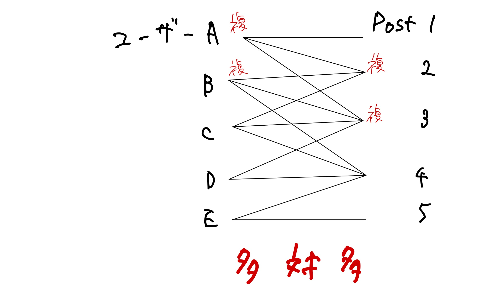

# 008_Like機能の実装（多対多のリレーション）

## 事前準備

以下の環境が整っていることを確認してください：
- Laravel Sailが起動していること（`./vendor/bin/sail up -d`）
- 前回までのTweetアプリケーションが動作していること

## やること

UserとTweetの関係が**多対多**となる`Like機能`の実装。

### なぜ多対多なのか？

Like機能では以下の関係が成り立ちます：

**ユーザー側から見ると：**
- 1人のユーザーは複数のツイートにいいねできる

**ツイート側から見ると：**
- 1つのツイートは複数のユーザーからいいねされる

この「1人のユーザー ↔ 複数のツイート」かつ「1つのツイート ↔ 複数のユーザー」の関係が**多対多（Many to Many）**です。

**具体例：**
- ユーザーA：ツイート1、ツイート3、ツイート5にいいね
- ユーザーB：ツイート1、ツイート2にいいね
- ユーザーC：ツイート3、ツイート4、ツイート5にいいね

この場合、ツイート1はユーザーAとBからいいねされ、ツイート3はユーザーAとCからいいねされています。

<figure><figcaption></figcaption></figure>

多対多の場合は以下の流れが基本です：

1. 中間テーブルを作成
2. モデルに多対多の連携を定義

## 多対多リレーションの概念

**1対多との違い**

これまで学習した「1対多」の関係（例：1人のユーザーが複数のツイートを投稿）とは異なり、Like機能では「多対多」の関係が必要です。

**1対多の例（ツイート投稿）：**
- 1人のユーザー → 複数のツイートを投稿
- 1つのツイート → 1人のユーザーが投稿

**多対多の例（いいね機能）：**
- 1人のユーザー → 複数のツイートにいいね
- 1つのツイート → 複数のユーザーからいいね

**中間テーブルの必要性**

多対多の場合は、中間テーブルを作成する必要があります。これは「どのユーザーが」「どのツイートに」いいねしたかを記録するためです。

中間テーブルに必要な情報：
- id
- tweet_id（どのツイートに）
- user_id（どのユーザーが）
- 日付（created_at, updated_at）

テーブル構造のイメージ：

| id | tweet\_id | user\_id | created\_at | updated\_at |
| -- | --------- | -------- | ----------- | ----------- |
| 1  | 1         | 1        | ...         | ...         |
| 2  | 2         | 1        | ...         | ...         |
| 3  | 1         | 2        | ...         | ...         |


**重要：重複防止**
同じユーザーが同じツイートに複数回いいねすることを防ぐため、以下のような重複レコードは登録できないようにします。

| id | tweet\_id | user\_id | created\_at | updated\_at |
| -- | --------- | -------- | ----------- | ----------- |
| 1  | 1         | 1        | ...         | ...         |
| 2  | 1         | 1        | ...         | ...         |


## Like機能実装の流れ

この章では以下の手順でLike機能を実装します：

1. **中間テーブルの作成と各モデルの連携** ← 今回実装
2. コントローラにLike機能の実装
3. ビューファイルにlikeボタンを設置

## 中間テーブルの作成と各モデルの連携

### マイグレーションファイルの作成

下記のコマンドを実行して中間テーブルを作成します。

```bash
./vendor/bin/sail artisan make:migration create_tweet_user_table --create=tweet_user
```


**中間テーブルの命名規則**
- テーブル名：`tweet_user`
- 命名ルール：「**アルファベット順に並べたテーブル名の単数形をアンダースコアでつなげる**」
- 今回は2つのテーブルをリレーションできればよいため、専用のモデルは作成しません

**例：**
- `tweets` と `users` テーブル → `tweet_user`（アルファベット順: t, u）
- `posts` と `tags` テーブル → `post_tag`（アルファベット順: p, t）


### マイグレーションファイルの編集

作成されたマイグレーションファイルを開きます。ファイル名は `database/migrations/` フォルダ内の `xxxx_xx_xx_xxxxxx_create_tweet_user_table.php` のような形式になります。

中間テーブルとなるため、カラムはid以外に`tweet_id`と`user_id`を追加します。

```php
// database/migrations/xxxx_xx_xx_000000_create_tweet_user_table.php

<?php

use Illuminate\Database\Migrations\Migration;
use Illuminate\Database\Schema\Blueprint;
use Illuminate\Support\Facades\Schema;

return new class extends Migration
{
    /**
     * Run the migrations.
     */
    public function up(): void
    {
        Schema::create('tweet_user', function (Blueprint $table) {
            $table->id();
            
            // 🔽 3行追加 🔽
            $table->foreignId('tweet_id')->constrained()->cascadeOnDelete();
            $table->foreignId('user_id')->constrained()->cascadeOnDelete();
            $table->unique(['tweet_id', 'user_id']);
            
            $table->timestamps();
        });
    }

    /**
     * Reverse the migrations.
     */
    public function down(): void
    {
        Schema::dropIfExists('tweet_user');
    }
};
```


**外部キー制約の説明**
- `$table->foreignId('tweet_id')->constrained()->cascadeOnDelete();`  
  tweetsテーブルからレコードが削除されると、そのtweet_idを持つtweet_userテーブルのすべてのレコードが自動的に削除

- `$table->foreignId('user_id')->constrained()->cascadeOnDelete();`  
  usersテーブルからレコードが削除されると、そのuser_idを持つtweet_userテーブルのすべてのレコードが自動的に削除

- `$table->unique(['tweet_id', 'user_id']);`  
  tweet_userテーブルのtweet_idカラムとuser_idカラムの組み合わせを一意にして重複を防止



**参考：constrainedを使わない書き方**
`constrained()`メソッドを使わない場合は以下のように記述します（より冗長になります）：

`$table->foreignId('user_id')->references('id')->on('users')->onDelete('cascade');`


### マイグレーションの実行

記述したらマイグレーションを実行します：

```bash
./vendor/bin/sail artisan migrate
```

## モデルの編集

中間テーブルの作成が完了したら、各モデルに中間テーブルとの関連を定義します。

今回の場合は、`User`モデルと`Tweet`モデルの両方に関連を定義する必要があります。

多対多の場合は`belongsToMany`を使用します。


**Laravelのリレーションメソッド一覧**

| リレーション | メソッド | 説明 | 使用例 |
|-------------|----------|------|--------|
| **1対1** | `hasOne()` | 1つのモデルが1つの関連モデルを持つ | User → Profile |
| **1対1** | `belongsTo()` | 1つのモデルが1つの親モデルに属する | Profile → User |
| **1対多** | `hasMany()` | 1つのモデルが複数の関連モデルを持つ | User → Tweets |
| **多対1** | `belongsTo()` | 複数のモデルが1つの親モデルに属する | Tweet → User |
| **多対多** | `belongsToMany()` | 複数のモデルが複数の関連モデルを持つ | User ↔ Tweet (Like) |

**覚え方のコツ：**
- `has系`：「持っている」関係（親側）
- `belongsTo系`：「属している」関係（子側）
- `Many`：複数の関係

**実際のコード例：**
```php
// 1対多：ユーザーは複数のツイートを持つ
class User extends Model {
    public function tweets() {
        return $this->hasMany(Tweet::class);
    }
}

// 多対1：ツイートは1人のユーザーに属する
class Tweet extends Model {
    public function user() {
        return $this->belongsTo(User::class);
    }
}

// 多対多：ユーザーは複数のツイートにいいねし、ツイートは複数のユーザーからいいねされる
class User extends Model {
    public function likes() {
        return $this->belongsToMany(Tweet::class);
    }
}
```


### Userモデルの編集

`app/Models/User.php` ファイルを開き、以下のリレーションメソッドを追加します：

```php
// app/Models/User.php

<?php

// ...

class User extends Authenticatable
{
    // ...

    // 🔽 追加 🔽 
    public function likes()
    {
        return $this->belongsToMany(Tweet::class)->withTimestamps();
    }
}
```

### Tweetモデルの編集

`app/Models/Tweet.php` ファイルを開き、以下のリレーションメソッドを追加します：

```php
// app/Models/Tweet.php

<?php

// ...

class Tweet extends Model
{
    // 省略

    // 🔽 追加 🔽 
    public function likedByUsers()
    {
        return $this->belongsToMany(User::class)->withTimestamps();
    }
}
```


**withTimestamps()について詳しく**

多対多の関係では、中間テーブル（今回は`tweet_user`テーブル）に`created_at`と`updated_at`カラムがあります。

**withTimestamps()の役割：**
- 中間テーブルのタイムスタンプを**自動更新**する
- いいねを追加・削除する際に、自動で日時を記録

**なぜ必要？**
```php
// withTimestamps()なしの場合
$user->likes()->attach($tweet->id);
// → tweet_userテーブルのcreated_at, updated_atは空のまま

// withTimestamps()ありの場合
$user->likes()->attach($tweet->id);
// → tweet_userテーブルのcreated_at, updated_atに現在日時が自動で記録される
```

**実際のデータベースの違い：**

❌ **withTimestamps()なしの場合**
| id | tweet_id | user_id | created_at | updated_at |
|----|----------|---------|------------|------------|
| 1  | 1        | 1       | NULL       | NULL       |

✅ **withTimestamps()ありの場合**
| id | tweet_id | user_id | created_at          | updated_at          |
|----|----------|---------|---------------------|---------------------|
| 1  | 1        | 1       | 2023-12-01 10:30:00| 2023-12-01 10:30:00|

**活用例：**
```php
// いつユーザーがいいねしたか知りたい場合
$user = User::find(1);
$likedTweets = $user->likes()->get();

foreach ($likedTweets as $tweet) {
    echo "ツイート「{$tweet->content}」にいいねした日時: {$tweet->pivot->created_at}";
}
```

**省略した場合：**
- エラーにはならないが、いいねした日時が記録されない
- 後で「いつユーザーがいいねしたか」を知ることができない



**Point**

【テーブル名とカラム名の命名規則】

データをリレーションさせる場合のテーブル名及びカラム名には命名規則が存在します。

* 1 対多のカラム名は「単数形のテーブル名の末尾に \_id をつける」
* 多対多の中間テーブル名は「アルファベット順に並べたテーブル名の単数形をアンダースコアでつなげる」

命名規則を守らなくてもモデルの設定でカスタマイズできますが、命名規則に従っておくと，モデルの設定を省略できます。

Laravel では**可能な限り命名規則に従うことを強く推奨します。**


## 動作確認

実装が正しく行われているかを確認しましょう。

### マイグレーションの確認

まず、マイグレーションが正常に実行されているか確認します：

```bash
./vendor/bin/sail artisan migrate:status
```

**実行済みの場合の出力例：**
```
  Migration name .................................................................................................................... Batch / Status  
  0001_01_01_000000_create_users_table ..................................................................................................... [1] Ran  
  0001_01_01_000001_create_cache_table ..................................................................................................... [1] Ran  
  0001_01_01_000002_create_jobs_table ...................................................................................................... [1] Ran  
  2025_08_02_012141_create_tweets_table .................................................................................................... [2] Ran  
  2025_08_08_153537_create_tweet_user_table ................................................................................................ [3] Ran  
```

**未実行の場合の出力例：**
```
  Migration name .................................................................................................................... Batch / Status  
  0001_01_01_000000_create_users_table ..................................................................................................... [1] Ran  
  0001_01_01_000001_create_cache_table ..................................................................................................... [1] Ran  
  0001_01_01_000002_create_jobs_table ...................................................................................................... [1] Ran  
  2025_08_02_012141_create_tweets_table .................................................................................................... [2] Ran  
  2025_08_08_153537_create_tweet_user_table ................................................................................................ [  ] Pending  
```

`create_tweet_user_table`が「Pending」となっている場合は、マイグレーションが未実行です。

### データベースの確認

phpMyAdminで以下を確認：

1. `tweet_user`テーブルが作成されていること
2. カラム構成が正しいこと：
   - `id`
   - `tweet_id`
   - `user_id` 
   - `created_at`
   - `updated_at`
3. 外部キー制約が設定されていること

## よくあるエラーと対処法

### エラー1: テーブルが存在しない
```
SQLSTATE[42S02]: Base table or view not found: 1146 Table 'laravel.tweet_user' doesn't exist
```

**対処法：**
```bash
# マイグレーションが実行されているか確認
./vendor/bin/sail artisan migrate:status

# 未実行の場合はマイグレーションを実行
./vendor/bin/sail artisan migrate
```

### エラー2: 外部キー制約エラー
```
SQLSTATE[23000]: Integrity constraint violation
```

**対処法：**
- 存在しないtweet_idやuser_idを指定していないか確認
- 削除されたレコードを参照していないか確認

### エラー3: 重複エラー
```
SQLSTATE[23000]: Integrity constraint violation: 1062 Duplicate entry
```

**対処法：**
```php
// 既にいいねしているかチェックしてから追加
if (!$user->likes()->where('tweet_id', $tweet->id)->exists()) {
    $user->likes()->attach($tweet->id);
}
```

## 次のステップ

中間テーブルとモデルの設定が完了したら、次は以下を実装します：

1. **コントローラーの作成**：Like機能のロジック実装
2. **ルーティングの設定**：いいね/いいね解除のエンドポイント作成
3. **ビューの実装**：いいねボタンの表示と操作
4. **いいね数の表示**：各ツイートのいいね数カウント機能
