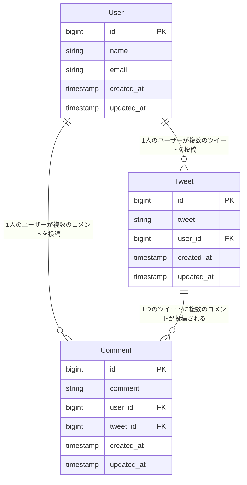

# 010\_Comment機能の実装（ファイルの準備と設定）

### ここでやりたいこと

* 各tweetに対してコメントを投稿できるようにする。
* tweetとコメントは一対多の関係にする。更にuserとコメントは一対多の関係にする。
* コメントはtweet詳細画面からコメント投稿画面に移動して投稿する。
* コメントはtweet詳細画面に一覧表示される。
* 各コメントをクリックするとコメント詳細画面に移動できて、編集や削除ができる。



**Comment の リレーション関係図**

Comment は **Tweet** と **User** の両方と関係を持ちます：

**関係性の説明：**

* **1つのUser** → **複数のComment** を投稿可能
* **1つのTweet** → **複数のComment** を受け取り可能
* **1つのComment** → **1つのUser** が投稿（belongsTo）
* **1つのComment** → **1つのTweet** に属する（belongsTo）

**実際のテーブル構造：**




| comment\_id | user\_id | tweet\_id  | comment | created\_at         |
| ----------- | -------- | ---------- | ------- | ------------------- |
| 1           | 2 (山田花子) | 1 (快晴ツイート) | 本当ですね！  | 2023-12-01 10:30:00 |
| 2           | 3 (佐藤次郎) | 1 (快晴ツイート) | 散歩したい   | 2023-12-01 11:00:00 |
| 3           | 1 (田中太郎) | 2 (雨ツイート)  | 家にいよう   | 2023-12-01 12:00:00 |


この設計により：

* **ツイート詳細画面**でそのツイートの全コメントを表示
* **ユーザープロフィール**でそのユーザーの全コメントを表示
* **コメント権限管理**（編集・削除は投稿者のみ） が可能になります。


### 必要なファイルの作成 <a href="#nafairuno" id="nafairuno"></a>

モデル、リソースコントローラ、マイグレーションファイルを作成する。

Tweet に関するファイルを作成するときと同様の流れ。

```
./vendor/bin/sail artisan make:model Comment -rm
```


**`-rm`オプションについて**

`-rm`は複数のオプションを組み合わせたものです：

* **`-r`** : リソースコントローラ（`CommentController`）を同時に作成
* **`-m`** : マイグレーションファイルを同時に作成

**個別に実行する場合：**

```bash
./vendor/bin/sail artisan make:model Comment
./vendor/bin/sail artisan make:controller CommentController --resource
./vendor/bin/sail artisan make:migration create_comments_table
```

**他の便利なオプション：**

* `-f` : ファクトリファイルも作成
* `-s` : シーダーファイルも作成
* `-a` : 全て作成（`-rmfs`と同じ）

複数のファイルを一度に作成できるため、開発効率が向上します。


下記のファイルが作成されます。

* `app/Models/Comment.php`
* `database/migrations/xxxx_xx_xx_xxxxxx_create_comments_table.php`
* `app/Http/Controllers/CommentController.php`

### マイグレーションファイルの編集 <a href="#maigurshonfairuno" id="maigurshonfairuno"></a>

commentsテーブルを作成するため（テーブルの設計書となる）のマイグレーションファイルを記述します。

`comment` カラムに加えて `tweet_id` と `user_id` を設定します。\
「どの Tweet に対する」「どのユーザの」という情報を保存します。

* Tweet と Comment の関係は `1 対多`
* User と Comment の関係は `1 対多`

```php
// database/migrations/xxxx_xx_xx_xxxxxx_create_comments_table.php

// 省略

public function up(): void
{
  Schema::create('comments', function (Blueprint $table) {
    $table->id();
    // 🔽 3カラム追加
    $table->foreignId('tweet_id')->constrained()->cascadeOnDelete();
    $table->foreignId('user_id')->constrained()->cascadeOnDelete();
    $table->string('comment');

    $table->timestamps();
  });
}

// 省略

```

作成したら下記コマンドを実行してマイグレーションを実行しましょう。

```
./vendor/bin/sail artisan migrate
```

実行後、commentsテーブルが作成されていることと、その中身を確認しましょう。．

```txt
+-------------+-----------------+------+-----+---------+----------------+
| Field       | Type            | Null | Key | Default | Extra          |
+-------------+-----------------+------+-----+---------+----------------+
| id          | bigint unsigned | NO   | PRI | NULL    | auto_increment |
| tweet_id    | bigint unsigned | NO   | MUL | NULL    |                |
| user_id     | bigint unsigned | NO   | MUL | NULL    |                |
| comment     | varchar(255)    | NO   |     | NULL    |                |
| created_at  | timestamp       | YES  |     | NULL    |                |
| updated_at  | timestamp       | YES  |     | NULL    |                |
+-------------+-----------------+------+-----+---------+----------------+
```

### モデルファイルの設定 <a href="#moderufairuno" id="moderufairuno"></a>

モデルファイルには，テーブルとの関連を記載します。

* Tweet と Comment が 1 対多．
* User と Comment が 1 対多．


**なぜCommentは2つのリレーションが必要？**

Commentは以下の2つの情報を持つ必要があります：

1. **どのTweetに対するコメントか** → `tweet_id`（Tweet との関係）
2. **誰が投稿したコメントか** → `user_id`（User との関係）

**具体例：**

```
Comment ID: 1
├── tweet_id: 5 (ツイートID 5「今日はいい天気！」に対するコメント)
├── user_id: 3 (ユーザーID 3「田中太郎」が投稿)
└── comment: "本当にいい天気ですね！"
```

**テーブル設計での表現：**


| id | tweet\_id | user\_id | comment     | created\_at         |
| -- | --------- | -------- | ----------- | ------------------- |
| 1  | 5         | 3        | 本当にいい天気ですね！ | 2023-12-01 10:30:00 |


この1つのコメントレコードによって：

* 「ツイート5に紐づくコメント」として表示できる
* 「ユーザー3が投稿したコメント」として管理できる

**リレーションの方向：**

* **Tweet → Comments**: 1対多（1つのツイートに複数のコメント）
* **User → Comments**: 1対多（1人のユーザーが複数のコメントを投稿）
* **Comment → Tweet**: 多対1（1つのコメントは1つのツイートに属する）
* **Comment → User**: 多対1（1つのコメントは1人のユーザーが投稿）


これら３つの関係者のモデルファイルに設定を書きます。 つまり、

* `app/Models/Comment.php`
* `app/Models/Tweet.php`
* `app/Models/User.php` それぞれに連携を設定しましょう。

なお、`Comment.php` に対してはコメントが登録できるように`$fillable` も設定しましょう。

```php
// app/Models/Comment.php

// 省略

class Comment extends Model
{
  // 🔽 設定できるカラムを追加
  protected $fillable = ['comment', 'tweet_id', 'user_id'];

  // 🔽 多対1の関係
  public function tweet()
  {
    return $this->belongsTo(Tweet::class);
  }

  // 🔽 多対1の関係
  public function user()
  {
    return $this->belongsTo(User::class);
  }
}

```

```php
// app/Models/User.php

// 省略

class User extends Authenticatable
{
  // 省略

  // 🔽 1対多の関係（ユーザーとツイート）
  public function tweets()
  {
    return $this->hasMany(Tweet::class);
  }

  // 🔽 多対多の関係（いいね機能）
  public function likes()
  {
    return $this->belongsToMany(Tweet::class)->withTimestamps();
  }

  // 🔽 1対多の関係（ユーザーとコメント）
  public function comments()
  {
    return $this->hasMany(Comment::class);
  }
}
```

```php
// app/Models/Tweet.php

// 省略

class Tweet extends Model
{
  protected $fillable = ['tweet'];

  // 🔽 1対多の関係（ユーザーとツイート）
  public function user()
  {
    return $this->belongsTo(User::class);
  }

  // 🔽 多対多の関係（いいね機能）
  public function likedByUsers()
  {
    return $this->belongsToMany(User::class)->withTimestamps();
  }

  // 🔽 1対多の関係（ツイートとコメント）
  public function comments()
  {
    return $this->hasMany(Comment::class)->orderBy('created_at', 'desc');
  }
}
```

### ビューファイルの作成

コメント機能で使用するビューファイルを作成しましょう。 TweetのCRUD処理とほとんど同じだが、コメント一覧は `tweets.show` に追加するため `index.blade.php` は作成しなくて OK．

```bash
./vendor/bin/sail artisan make:view tweets.comments.create
./vendor/bin/sail artisan make:view tweets.comments.show
./vendor/bin/sail artisan make:view tweets.comments.edit
```

### ルーティングの設定

リソースコントローラを使用しているのでルーティングは1行書くだけでok

ただし、CommentはTweetに従うためルーティングは`tweets.comments` となります。 このような記述を行う理由として、Comment に対する処理（表示，編集，削除）を行う場合に Comment の元の Tweet の情報が必要となるためです。

ルーティングを上記のように記述すると Tweet の情報も合わせて得ることができます（後述）。


**ネストリソースルーティング `tweets.comments` について**

`Route::resource('tweets.comments', CommentController::class);` と記述すると、以下のような**ネストした URL構造**が自動生成されます：

**通常のリソースルーティングとの比較：**

**❌ 通常の場合（`Route::resource('comments', CommentController::class)`）:**

```
GET    /comments          → index
POST   /comments          → store
GET    /comments/create   → create
GET    /comments/{id}     → show
GET    /comments/{id}/edit → edit
PUT    /comments/{id}     → update
DELETE /comments/{id}     → destroy
```

**✅ ネストした場合（`Route::resource('tweets.comments', CommentController::class)`）:**

```
GET    /tweets/{tweet}/comments          → index
POST   /tweets/{tweet}/comments          → store
GET    /tweets/{tweet}/comments/create   → create
GET    /tweets/{tweet}/comments/{comment} → show
GET    /tweets/{tweet}/comments/{comment}/edit → edit
PUT    /tweets/{tweet}/comments/{comment} → update
DELETE /tweets/{tweet}/comments/{comment} → destroy
```

**メリット：**

* URLから「どのツイートに対するコメントか」が明確
* コントローラーで`$tweet`パラメータが自動で取得可能
* RESTfulな設計に従った分かりやすいURL構造
* ルートモデル結合により、`Tweet`モデルのインスタンスが自動注入される

**実際の使用例：**

* ツイートID 5 のコメント一覧: `/tweets/5/comments`
* ツイートID 5 のコメント作成: `/tweets/5/comments/create`
* ツイートID 5 のコメントID 3 の詳細: `/tweets/5/comments/3`


```php
// routes/web.php

<?php

use App\Http\Controllers\TweetController;
use App\Http\Controllers\TweetLikeController;
// 🔽 追加
use App\Http\Controllers\CommentController;
use Illuminate\Support\Facades\Route;

Route::view('/', 'welcome')->name('home');

Route::middleware(['auth', 'verified'])->group(function () {
    Route::view('dashboard', 'dashboard')->name('dashboard');

    Route::resource('tweets', TweetController::class);
    Route::post('/tweets/{tweet}/like', [TweetLikeController::class, 'store'])->name('tweets.like');
    Route::delete('/tweets/{tweet}/like', [TweetLikeController::class, 'destroy'])->name('tweets.dislike');
    // 🔽 追加
    Route::resource('tweets.comments', CommentController::class);
});

require __DIR__.'/settings.php';
```


**Livewire Starter Kitでのルート構成**
ログイン・会員登録・プロフィール編集などのルートはFortify/`routes/settings.php`側で管理されているため、`routes/web.php`にはアプリ独自のルート（Tweet/Comment関連）のみを記述します。詳しくは002・003を参照してください。


### ルーティングの確認

Comment に関する CRUD 処理のルートが自動的に追加されていることを確認しましょう。

```bash
./vendor/bin/sail artisan route:list --path=comments

# 実行結果（ユーザ操作などのルーティングは省略）
+--------+-----------+------------------------------------------+-------------------------+-------------------------------------------------------+-----------------+
| Domain | Method    | URI                                      | Name                    | Action                                                | Middleware      |
+--------+-----------+------------------------------------------+-------------------------+-------------------------------------------------------+-----------------+
|        | GET|HEAD  | tweets/{tweet}/comments                  | tweets.comments.index   | App\Http\Controllers\CommentController@index          | web             |
|        | POST      | tweets/{tweet}/comments                  | tweets.comments.store   | App\Http\Controllers\CommentController@store          | web             |
|        | GET|HEAD  | tweets/{tweet}/comments/create           | tweets.comments.create  | App\Http\Controllers\CommentController@create         | web             |
|        | GET|HEAD  | tweets/{tweet}/comments/{comment}        | tweets.comments.show    | App\Http\Controllers\CommentController@show           | web             |
|        | PUT|PATCH | tweets/{tweet}/comments/{comment}        | tweets.comments.update  | App\Http\Controllers\CommentController@update         | web             |
|        | DELETE    | tweets/{tweet}/comments/{comment}        | tweets.comments.destroy | App\Http\Controllers\CommentController@destroy        | web             |
|        | GET|HEAD  | tweets/{tweet}/comments/{comment}/edit   | tweets.comments.edit    | App\Http\Controllers\CommentController@edit           | web             |
+--------+-----------+------------------------------------------+-------------------------+-------------------------------------------------------+-----------------+
```

