# 🍥 001\_Cloud9用意

## 今回やること

* AWS Cloud9を利用して、Lalavelをインストールするための環境を構築する。

## AWS Cloud9の準備


登録はスタッフにお声かけください


1.  ダッシュボードに遷移

    まずは[ログイン画面](https://awsacademy.instructure.com/login/canvas)からダッシュボードに遷移&#x20;
2. 左のメニューから、「コース」を選択後、「`AWS Academy Learner Lab [XXXXXX]`」をクリック

<figure><figcaption></figcaption></figure>

3. モジュールをクリック

<figure>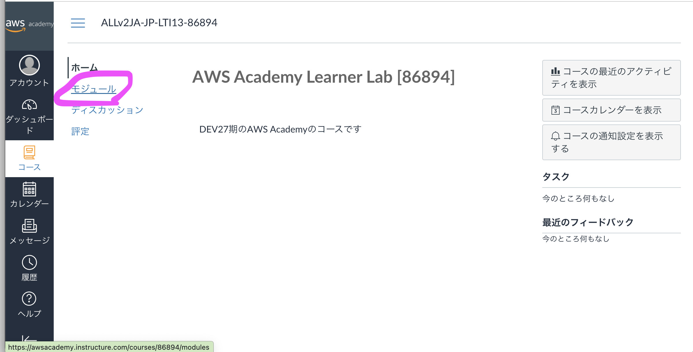<figcaption></figcaption></figure>

4. `AWS Academy Learner Lab を起動する`をクリック

<figure>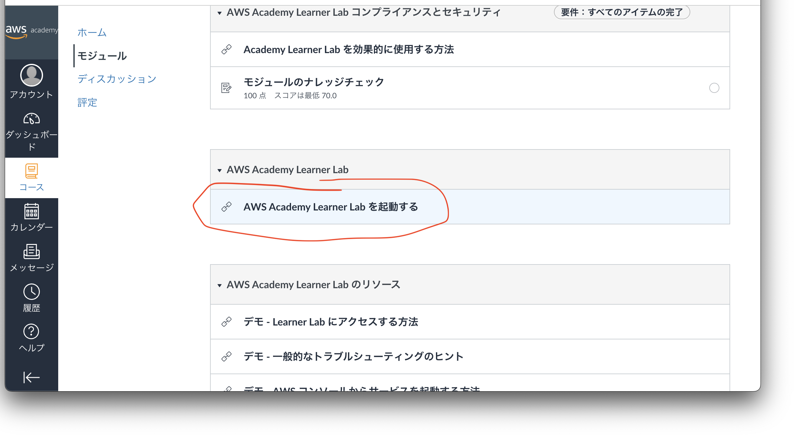<figcaption></figcaption></figure>

5. `Start Lab`をクリック

<figure>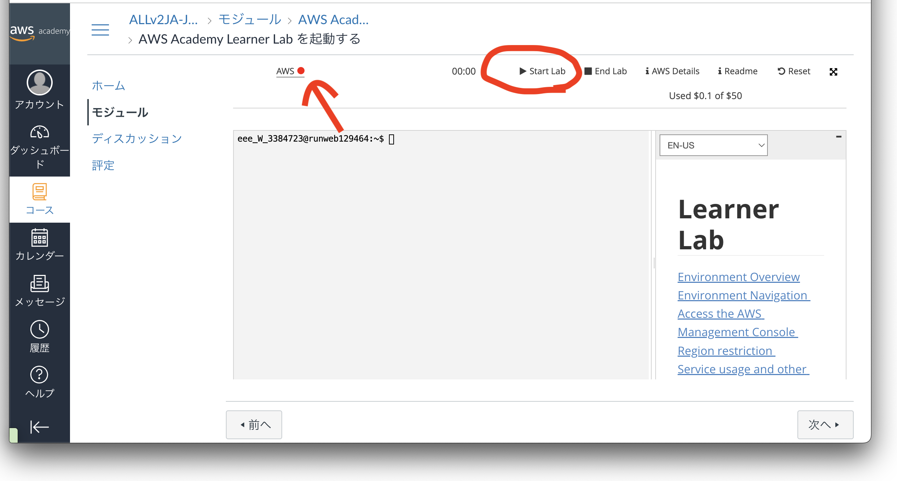<figcaption></figcaption></figure>


* 初回起動時は時間がかかるようです。&#x20;
* 左上の「AWS」の表記の🔴が🟢になれば準備完了です。



作業が終了したら、**「End Lab」**をクリックして、すべての処理をストップしてください。


6. 「AWS 🟢」をクリック
7. 「コンソールのホーム」画面で、「`cloud9`」を検索。サービスの中から「cloud9」をクリックしてください。

<figure>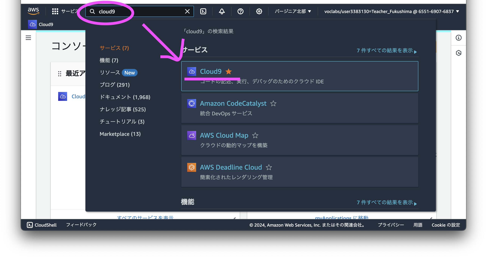<figcaption></figcaption></figure>

8. バージニア北部になっていることを確認しつつ、「環境を作成」をクリック

<figure>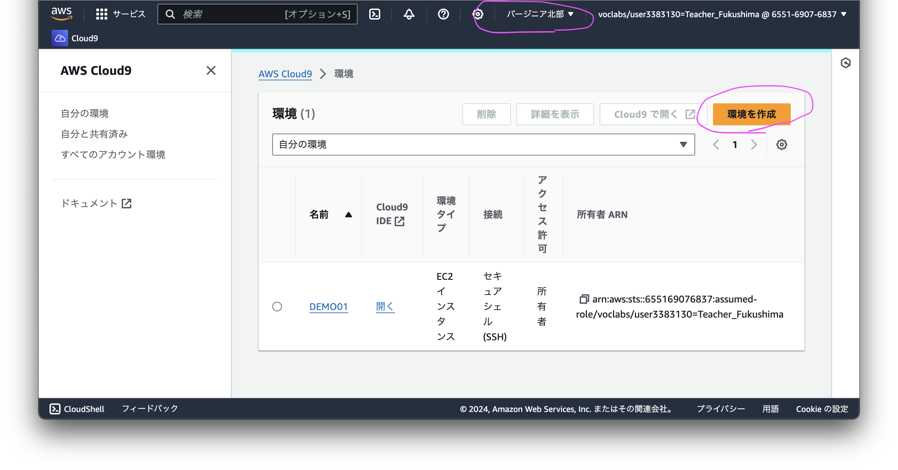<figcaption></figcaption></figure>

9. 「環境を作成」画面での操作

* 名前...授業では `devXX_laravel`とします。しかし、自分の好きな名前で大丈夫です。
* 説明 - オプション ... 未記入でも問題ないです。慣れてきたらメモを記載してください。
* 環境タイプ ... 触らない。
* インスタンスタイプ ... 触らない。`t2.micro(1 Gib Ram + 1 vCPU)`を利用してください。
* プラットフォーム ... 触らない。`Amazon Linux 2023`を利用。
* タイムアウト ... 触らない。30分で。
* ネットワーク設定 ... **変更してください。** 「`セキュアシェル(SSH)`」に変更。

右下の作成を押下。

<figure>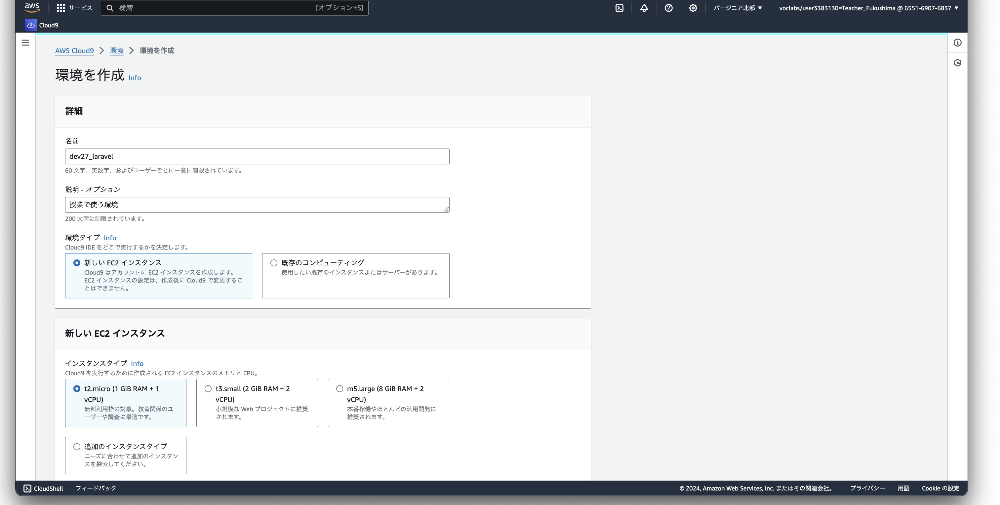<figcaption></figcaption></figure>

<figure>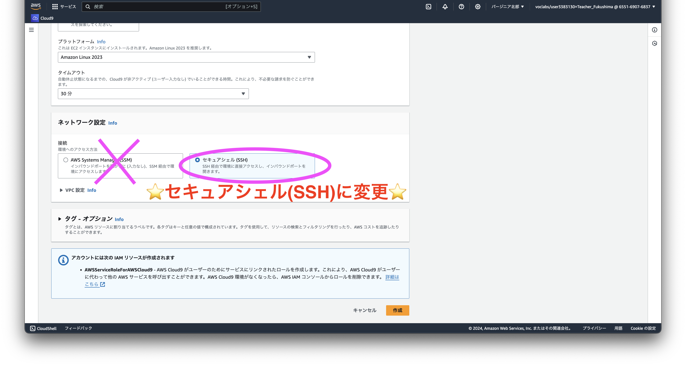<figcaption></figcaption></figure>

10. 環境ページで待機。

ページ遷移先で待機。上のメッセージが青から緑に変わるまで待つ。

<figure>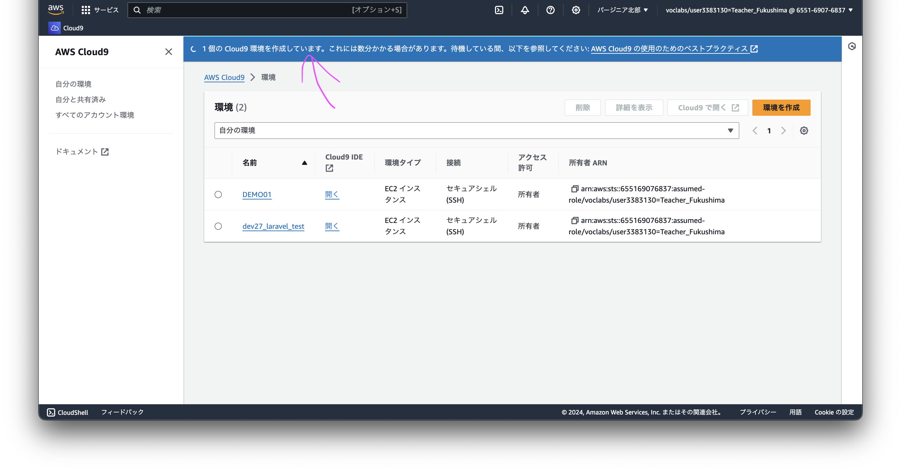<figcaption></figcaption></figure>

緑になって「正常に作成されました」とコメントされたら作成した環境の名前のCloud9を開く。

<figure>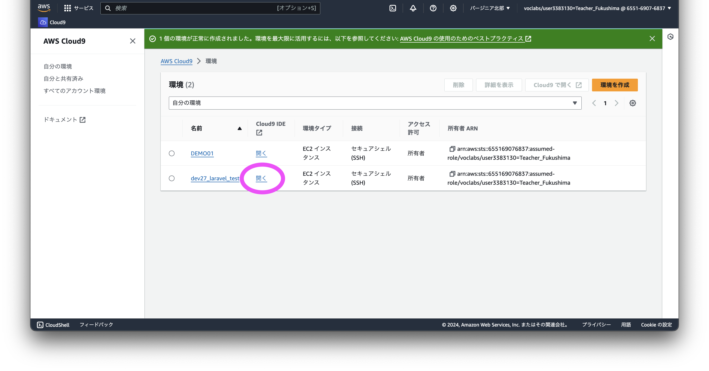<figcaption></figcaption></figure>

11. 事前準備

* 左のメニューの歯車⚙️から`Show Hidden Files`にチェックを**⭐️入れる⭐️**&#x20;

<figure>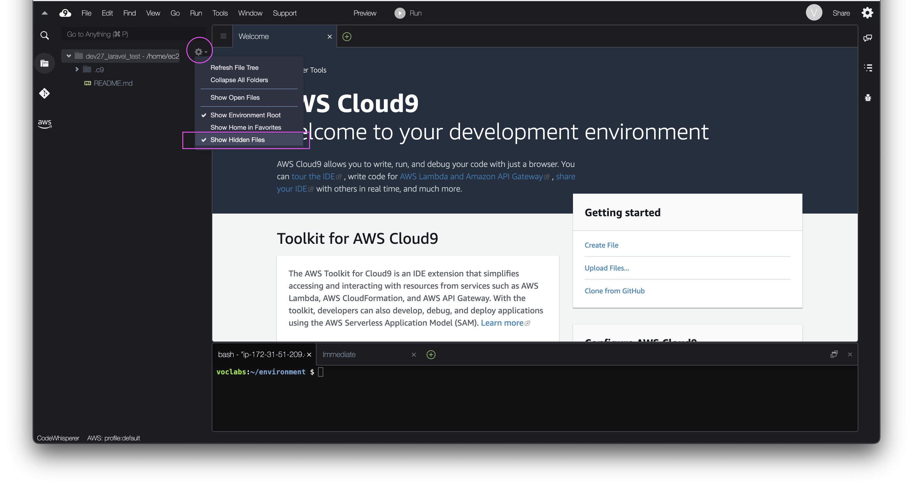<figcaption></figcaption></figure>

* 右上の歯車をクリックして下にスクロール

<figure>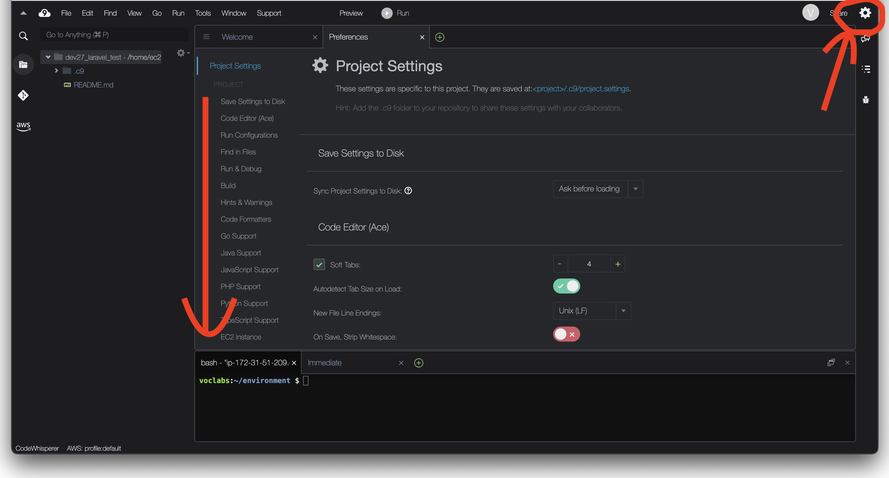<figcaption></figcaption></figure>

`Experimental` > `Save`の項目から、`Auto-Save Files:`を`After Delay`に変更　※既になっていればok
