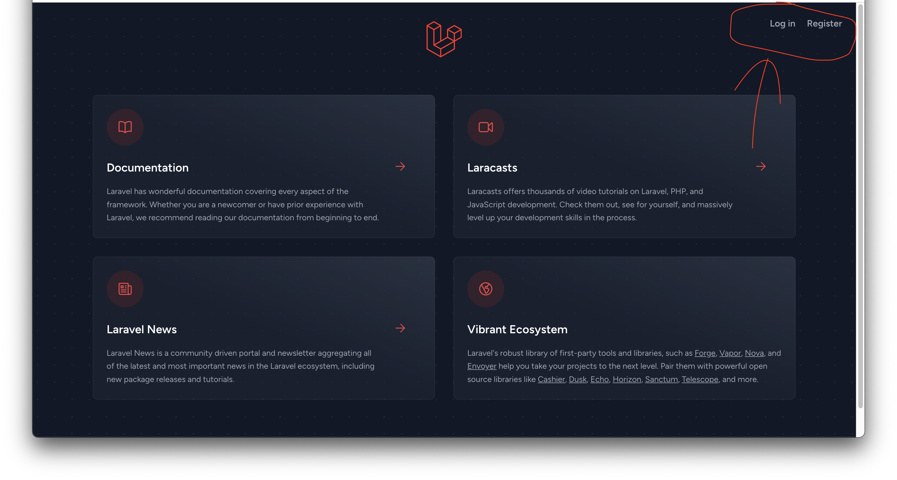

# Laravel Breeze の導入

Laravel Breeze は、手軽に利用できる認証パッケージです。&#x20;

パッケージを利用すると非常に簡単にログイン機能等が実装できます！
Laravel Breeze をプロジェクトにインストールしましょう。

#### Breeze準備/まずはlaratterにいることを確認。

_まずは自分がcms階層にいることを確認_

いなければ以下実行して、移動。

```bash
$ cd laratter
```

**breezの導入**

```bash
$ ./vendor/bin/sail composer require laravel/breeze --dev
```

#### インストール

```bash
$ ./vendor/bin/sail artisan breeze:install
```

選択肢が出てくるが全部Enterでok


```bash
 ┌ Which Breeze stack would you like to install? ─┐
 │ Blade with Alpine                              │
 └────────────────────────────────────────────────┘

 ┌ Would you like dark mode support? ─────────────┐
 │ No                                             │
 └────────────────────────────────────────────────┘

 ┌ Which testing framework do you prefer? ────────┐
 │ PHPUnit                                        │
 └────────────────────────────────────────────────┘
```

#### HTML/CSS/JSをビルド = フロントで何か修正したらビルド）

```bash
$ sail npm run build
```

完了したら、Laravelのトップページにログイン機能が追加されます。

<figure><figcaption></figcaption></figure>

ただし、まだ登録するためのテーブルが無いので作成する必要あります。


#### テーブル作成

DB内に何もない状況なので、すでに存在している`cms/database/migrations/...`ファイルの中身をDBに反映させる。

```bash
$ ./vendor/bin/sail artisan migrate
```

実行するとこんな感じのlogが出ます。
マイグレーションファイルが実行されて、DONEの記載が出てますね！

```bash
$ ./vendor/bin/sail artisan migrate

   INFO  Preparing database.  

  Creating migration table ................................. 78ms DONE

   INFO  Running migrations.  

  2014_10_12_000000_create_users_table ..................... 25ms DONE
  2014_10_12_100000_create_password_reset_tokens_table ..... 10ms DONE
  2019_08_19_000000_create_failed_jobs_table ............... 24ms DONE
  2019_12_14_000001_create_personal_access_tokens_table .... 32ms DONE

```

ユーザー登録ができるようになったら、２−３人適当にユーザーを作成してください。
