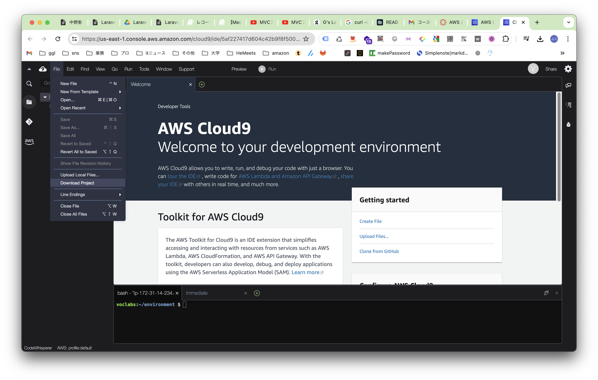
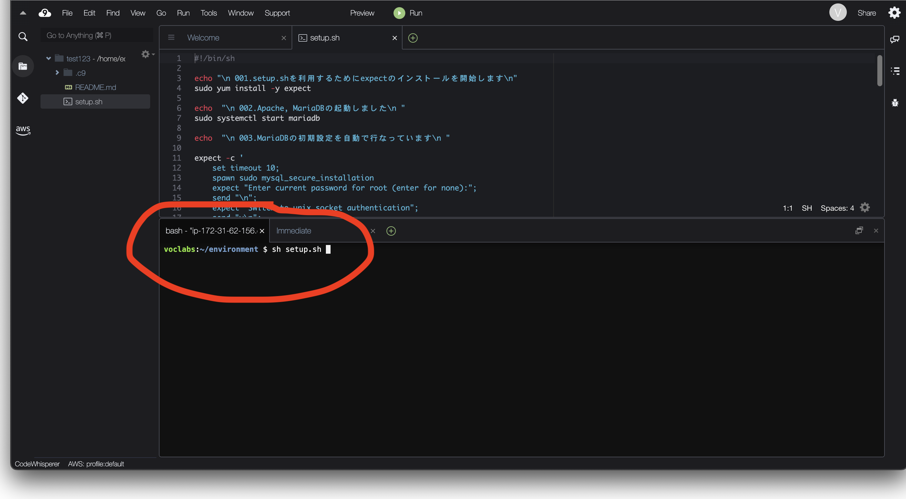
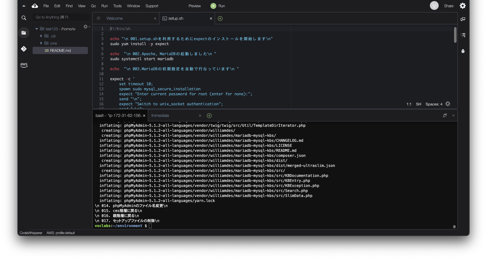
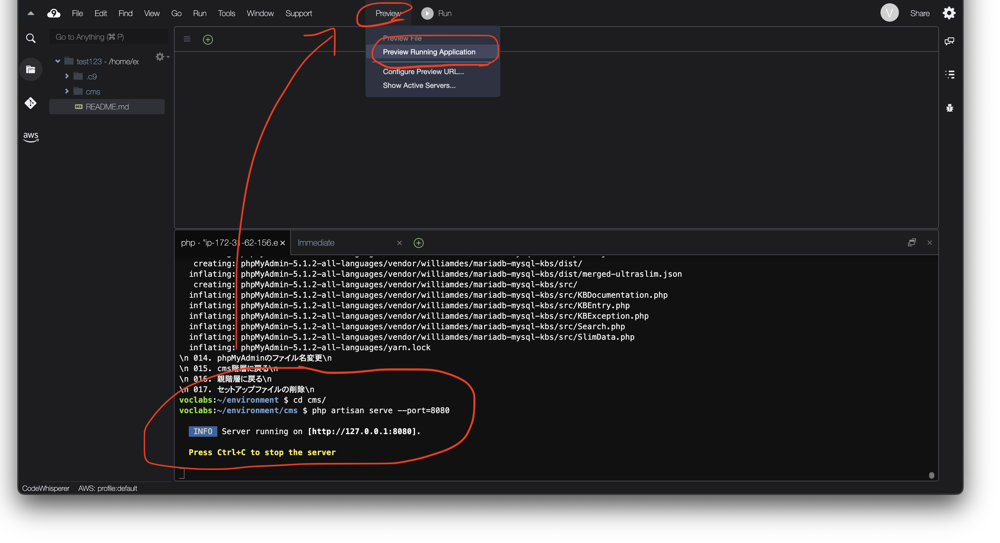
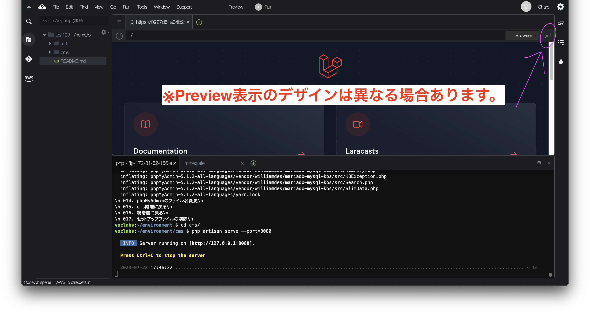
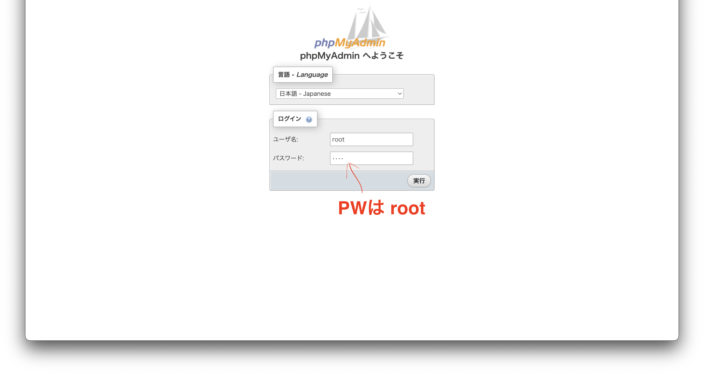
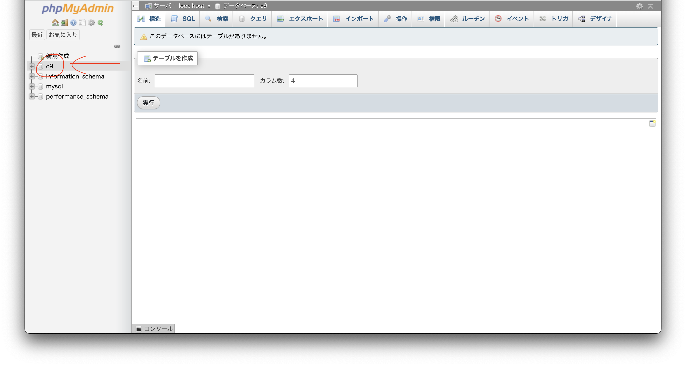
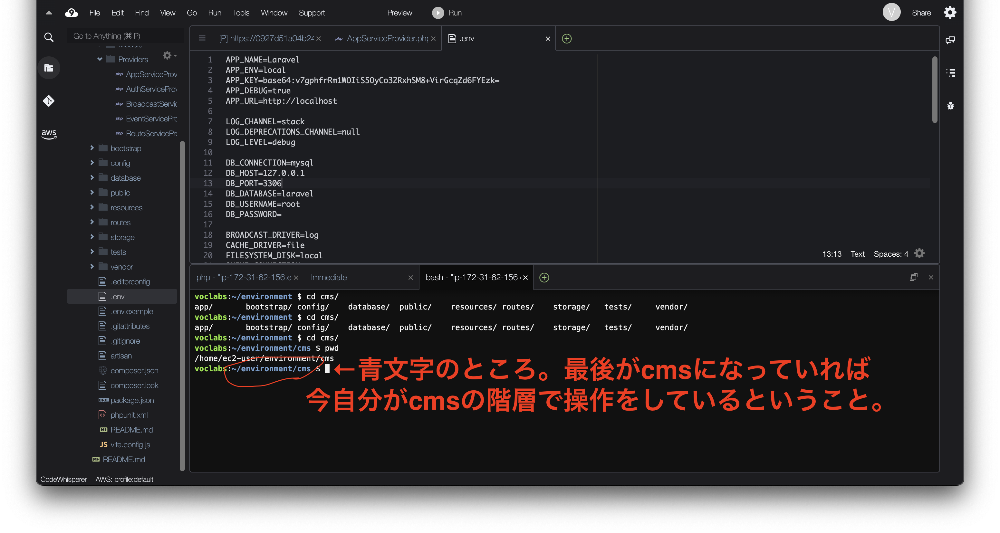
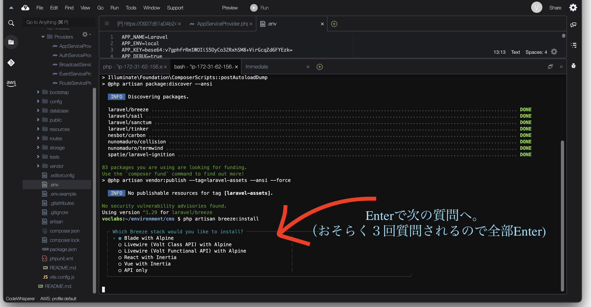

# 🍖 002\_Laravel導入

## 今回やること

* AWS Cloud9にLaravelを入れて、開発の準備をする。

## Laravel導入

1. [ここからファイルダウンロード](https://gitlab.com/gs\_hayato/gs-php-01/-/raw/master/laravel/setup.sh?ref\_type=heads\&inline=false)
2. `File`から`Upload Local Files`をクリックして、ダウンロードしたファイルをアップロードしてください。

<figure><figcaption></figcaption></figure>

3.  先ほどダウンロードしたファイルをupload。uploadが完了すると、ファイルに`setup.sh`が追加される。（`setup.sh`ダブルクリックすると中身が表示されるぞ） `setup.sh`のアップロードが確認できたら、下の`terminal`に

    ```bash
    $ sh setup.sh
    ```

    と記入して`Enter`を押す。処理が開始されるので数分待機。&#x20;



```
$ sh setup.sh
↑この$マークは「terminalで操作してね」という意味です。
コピペする際ここも一緒にコピーしないように注意。
```


<figure><figcaption></figcaption></figure>

4. 最後に、`\n 017. セットアップファイルの削除`と表示されたら完了。

* ファイルから`setup.sh`が削除されていること
* cmsというフォルダが追加されていることを確認しましょう。

<figure><figcaption></figcaption></figure>

## Laravel導入の確認

Laravelの`BuiltIn`サーバーを起動してみる。

`terminal`にて以下実行

```bash
$ cd cms
$ php artisan serve --port=8080
```

`INFO Server running on [http://127.0.0.1:8080].`というメッセージが出たら、上記メニューの`Preview`から、`Preview Running Application`をクリック

<figure><figcaption></figcaption></figure>

ブラウザのようなものがページ内のどこかに表示されるので、そのタブの画像のアイコンをクリック。 別タブでlaravelのトップページが出ることを確認する。


awsの環境等によって、ブラウザの場所が異なる場合あります。



laravelの画面は後で利用するので、そのまま消さずに置いといてね


<figure><figcaption></figcaption></figure>

## DB設定、phpMyAdminの確認

### AppServiceProviderの設定

`/app/Providers/AppServiceProvider.php`を以下のように変更しましょう。

※ 全コピペでもokです。

```php
namespace App\Providers;

use Illuminate\Support\ServiceProvider;
use Illuminate\Support\Facades\URL; // ⭐️この行を追加

class AppServiceProvider extends ServiceProvider
{
    /**
     * Register any application services.
     */
    public function register(): void
    {
        //
    }

    /**
     * Bootstrap any application services.
     */
    public function boot(): void
    {
       URL::forceScheme('https'); // ⭐️この行を追加
    }
}

```


↑の処理はcloud9で処理する時の設定です。普段はこのように設定しません。


### データベース作成

```bash
// cms階層にいることを確認してから
$ mysql -u root -p

// root と記載してEnterおす

MariaDB [(none)]>  create database c9;
exit;
```


MariaDBから抜け出す時、`control + c`でもok


### `.env`のDB箇所を修正

左のファイルから、`.env`をダブルクリックして、編集できるようにする。 以下の箇所をそのままコピペする。

```bash
// ⭐️↓↓↓↓ 変更前 ↓↓↓↓⭐️

DB_CONNECTION=mysql
DB_HOST=127.0.0.1
DB_PORT=3306
DB_DATABASE=laravel
DB_USERNAME=root
DB_PASSWORD=

// ⭐️↑↑↑↑ 変更前 ↑↑↑↑⭐️
```

```bash
// ⭐️↓↓↓↓ 変更 後 ↓↓↓↓⭐️

DB_CONNECTION=mysql
DB_HOST=localhost
DB_PORT=3306
DB_DATABASE=c9
DB_USERNAME=root
DB_PASSWORD=root

// ⭐️↑↑↑↑ 変更 後 ↑↑↑↑⭐️
```

### ブラウザでphpMyAdminの確認

ブラウザで開いているlaravelの画面の末尾にmatubini`/phpMyAdmin/`と追加してそのページに遷移する。 例えば、URLが`https://XXXX.amazonaws.com`だったら、`https://XXXX.amazonaws.com/phpMyAdmin/`


URLの phpMyAdmin の部分は、大文字小文字区別しているので注意。

publicに保存されているフォルダ名がそのままURLになっています。


<figure><figcaption></figcaption></figure>

DBにc9がいればok。 ※テーブルは作成していないので空っぽ。

<figure><figcaption></figcaption></figure>

### Laravel Breeze の導入

Laravel Breeze は、シンプルな認証スターターキット。&#x20;

ログイン，登録，パスワードリセットなどの基本的な認証機能を提供します。 以下のコマンドを実行して，Laravel Breeze をプロジェクトにインストールしましょう。

#### cmsにいることを確認。

_まずは自分がcms階層にいることを確認_

<figure><figcaption></figcaption></figure>

いなければ以下実行して、移動。

```bash
$ cd cms
```

**breezの導入**

```bash
$ composer require laravel/breeze --dev
```

#### インストール

```bash
$ php artisan breeze:install
```

選択肢が出てくるが全部Enterでok

<figure><figcaption></figcaption></figure>

```bash
 ┌ Which Breeze stack would you like to install? ─┐
 │ Blade with Alpine                              │
 └────────────────────────────────────────────────┘

 ┌ Would you like dark mode support? ─────────────┐
 │ No                                             │
 └────────────────────────────────────────────────┘

 ┌ Which testing framework do you prefer? ────────┐
 │ PHPUnit                                        │
 └────────────────────────────────────────────────┘
```

#### HTML/CSS/JSをビルド = フロントで何か修正したらビルド）

```bash
$ npm run build
```

完了したら、Laravelのトップページにログイン機能が追加されます。

<figure><figcaption></figcaption></figure>

ただし、まだテーブルが無いので作成する必要あり。

#### テーブル作成

DB内に何もない状況なので、すでに存在している`cms/database/migrations/...`ファイルの中身をDBに反映させる。

```bash
$ php artisan migrate
```

実行するとこんな感じのlogが出ます。

```bash
voclabs:~/environment/cms $ php artisan migrate

   INFO  Preparing database.  

  Creating migration table ................................. 78ms DONE

   INFO  Running migrations.  

  2014_10_12_000000_create_users_table ..................... 25ms DONE
  2014_10_12_100000_create_password_reset_tokens_table ..... 10ms DONE
  2019_08_19_000000_create_failed_jobs_table ............... 24ms DONE
  2019_12_14_000001_create_personal_access_tokens_table .... 32ms DONE

voclabs:~/environment/cms $ 
```

ユーザー登録ができるようになったら、２−３人適当にユーザーを作成してください。
