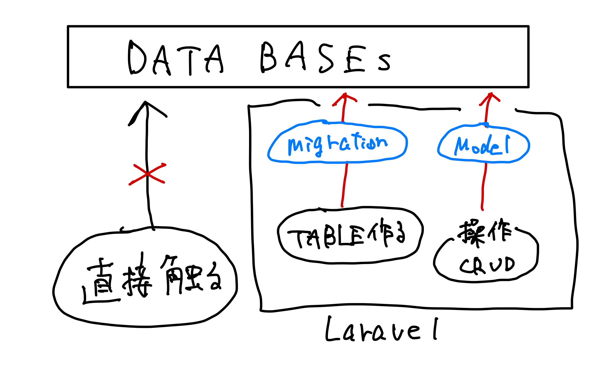
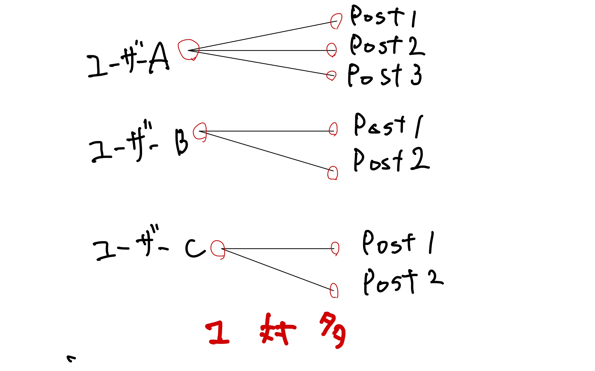

# 🐡 003\_Modelとテーブルの用意

## 今回やること

* 実際にコードを書き、動くものを作る。

## モデルとテーブルの作成

* Tweet のデータを扱うモデルを作成する
  * モデルに関連するマイグレーションファイル + コントローラ + ファクトリも併せて作成しましょう。
* Laratterで使用するテーブルを用意する。

## テーブルの用意

Laravelでテーブルを作成する場合は、
- `マイグレーションファイル`を作成
- コマンドでその`マイグレーションファイル`を実行して作成します。

&#x20;Laravel 側からテーブルを操作（CRUD 処理など）を行うためには`モデル`のファイルが必要となるため同時に作成します。

<figure><figcaption><p>Laravelでは、直接DBを触らない。</p></figcaption></figure>


基本的には`テーブルに対して一つのモデルファイル`を作成するよ



通常マイグレーションファイルは、`/database/migrations`の中に作成されるよ
マイグレーションファイルは、DBにテーブルを作成するための設計図です。
手動でテーブル作成せず、マイグレーションファイルを作成+実行でテーブル等作成しよう。


## Tweet モデルの作成

Tweet `モデル`とそれに関連する以下のファイルを作成します。

* `マイグレーションファイル` ... モデルに対応するテーブル作成に使用します。
* `コントローラ` ... Tweet データの CRUD 処理に使用するメソッドを記述を作成します。


モデルを作成時、コマンドにオプション（`-rm`）付加することで，これらを一括で生成する事ができるよ。

なお、Laravelではファイル名のルール等規則が多いです。
_コマンドでまとめて作成すると自動的に規則に従ってくれるので便利です。_
無理に手動で作成せず、コマンドに任せよう。


以下コマンドを`laratter`階層で実行する

`$ sail artisan make:model Tweet -rm`

以下のようなlogが吐き出されて、`Model`, `migrationsファイル`、`Controller`が作成されればok

```bash
// laratter階層にいることを確認
$ pwd
/Users/fukushimahayato/laratter

$ sail artisan make:model Tweet -rm

   INFO  Model [app/Models/Tweet.php] created successfully.  

   INFO  Migration [database/migrations/2025_01_24_194104_create_tweets_table.php] created successfully.  

   INFO  Controller [app/Http/Controllers/TweetController.php] created successfully.  
```

### マイグレーションファイルの編集

マイグレーションファイルはテーブル作成等のための設計図です。
テーブルに設定したい内容を、マイグレーションファイルに記載していきます。

まずは生成されたマイグレーションファイルに`tweet` カラムと`user_id` カラムを追加します。
これにより、テキスト共有データの格納と各Tweetがどのユーザに属するかを識別が可能になります。

* 今回は `User` と `Tweet` の関係が `1 対 多`となるため，`tweets` テーブルに `user_id` カラムを追加します。
* 他のテーブルとリレーションをさせるためには，カラム名を「モデル名小文字\_id」とする必要があります。


このようなルールがあるため、マイグレーションファイルを作成する時点で「`1 対 多`」「`多 対 多`」などリレーションを決めておきましょう。．


```php
// database/migrations/xxxx_xx_xx_xxxxxx_create_tweets_table.php

// 省略

public function up(): void
{
  Schema::create('tweets', function (Blueprint $table) {
    $table->id();
    
    // 🔽 2カラム追加
    $table->foreignId('user_id')->constrained()->cascadeOnDelete();
    $table->string('tweet');

    $table->timestamps();
  });
}

// 省略
```

* `foreignId('user_id')->constrained()`
  * user\_idという用に、`"テーブル名（単数）_id"`とすると、そのテーブルと連携することを認識
  * `foreignId`は「外部キー」というもの。`tweets`テーブルにレコード作成する際に、`user`テーブルに存在しないidを`user_id`に設定するとエラーになる。
  * `->constrained()` つけると、連携してくれて、データを一発で取ってくれるようになる。
    * （この書き方はほぼテンプレ）
* `cascadeOnDelete()` ... とあるusersテーブルのレコードが削除されたら、関連するtweetsテーブルのレコードも自動的に削除する制約を設定する。
  * userがdeleteされたときに関連するtweetを消さないと、例えばそのtweetを表示したときにuserがいないのでエラーになる。
* `string('tweet')` ... `string`型の`tweet`カラムを作成する。
* `timestamps();` ... 自動で、`created_at`カラムと、`updated_at`カラムをの二つを作成してくれる。基本的にこの1行はほぼ必須。

マイグレーションファイルに記述して保存できたら、マイグレートを実行

```bash
$ sail artisan migrate
```

```bash
$ sail artisan migrate             

   INFO  Running migrations.  

  2025_01_24_194104_create_tweets_table ................................................................................. 59.52ms DONE
```

phpMyAdminを確認して、テーブルのカラムを確認しよう。 以下のようなルールになっていればok

```bash
+------------+---------------------+------+-----+---------+----------------+
| Field      | Type                | Null | Key | Default | Extra          |
+------------+---------------------+------+-----+---------+----------------+
| id         | bigint(20) unsigned | NO   | PRI | NULL    | auto_increment |
| user_id    | bigint(20) unsigned | NO   | MUL | NULL    |                |
| tweet      | varchar(255)        | NO   |     | NULL    |                |
| created_at | timestamp           | YES  |     | NULL    |                |
| updated_at | timestamp           | YES  |     | NULL    |                |
+------------+---------------------+------+-----+---------+----------------+
```

### モデルファイルの設定

モデルファイルには関連するデータとの連携を定義します。
ここに連携を記述しておくことで、連携先のデータを容易に操作できるようになります。

例えば、
* とあるユーザーがpostした投稿を取得したり、
* 投稿からだれがpostしたのか
がすぐにわかるようになります。

今回は `User` モデルと `Tweet` モデルを `1 対 多`で連携する。

<figure><figcaption></figcaption></figure>

`app/Models/User.php`にて`User` モデルに `Tweet` モデルとの関連を追記する。

`User` モデルから見ると，`Tweet` モデルとの関係は `1 対 多`となるため`tweets()`を作成する。

```php
// app/Models/User.php

// 省略

class User extends Authenticatable
{

  // 省略

  protected $casts = [
      'email_verified_at' => 'datetime',
      'password' => 'hashed',
  ];
  
  // 一番下に以下のメソッドを追加する。
  public function tweets()
  {
    // $thisは、Userモデルそのものと思ってください。
    return $this->hasMany(Tweet::class);
  }
}

```


UserからみるとTweetを複数持っている1対多なので、`hasMany`となります。
`tweets()`はメソッドです。
UserからTweetを取得するために`tweets()`メソッドが利用できることを覚えておいてください。


反対に、 `Tweet` モデルにも関係を定義する。

`app/Models/Tweet.php` ファイルを開き`user` メソッドを追加。

`Tweet` と `User` の間に `多 対 1`の関係が定義される。

また，`$fillable` に `tweet` を追加する。

`$fillable` にはユーザからの入力を受け付けるカラムを指定する．

```php
// app/Models/Tweet.php

// 省略

class Tweet extends Model
{
  use HasFactory;

  // ↓1行追加
  protected $fillable = ['tweet'];

  // 以下userメソッド追加
  public function user()
  {
    return $this->belongsTo(User::class);
  }
}

```


モデルを作成した段階で、別モデルとの連携を記述しておくことで，連携先のデータを容易に操作できるようになる



`$fillable`はアプリケーション側から変更できるカラムを指定する`ホワイトリスト`です。

対して`$guarded`はアプリケーション側から変更できないカラムを指定する`ブラックリスト`です。

どちらかを使用する必要があります。どちらでもいいですが、基本的にはどっちを使うか統一することをお勧めします。


### ルーティングの設定

`routes/web.php`ファイルに，`Tweet`に関するルートを設定します。
コード2行追加。

なお、今回はモデル作成時に `-r` オプション（`--resource`）を指定しており`Tweet` に関する `CRUD` 処理のルートが自動的に追加されている。

```php
// routes/web.php

<?php

use App\Http\Controllers\ProfileController;

// ⭐️1行追加⭐️
use App\Http\Controllers\TweetController;

use Illuminate\Support\Facades\Route;

Route::get('/', function () {
  return view('welcome');
});

Route::get('/dashboard', function () {
  return view('dashboard');
})->middleware(['auth', 'verified'])->name('dashboard');

Route::middleware('auth')->group(function () {
  Route::get('/profile', [ProfileController::class, 'edit'])->name('profile.edit');
  Route::patch('/profile', [ProfileController::class, 'update'])->name('profile.update');
  Route::delete('/profile', [ProfileController::class, 'destroy'])->name('profile.destroy');

  // ⭐️ 追加 ⭐️
  Route::resource('tweets', TweetController::class);
});

require __DIR__ . '/auth.php';
```

`Route::middleware('auth')->group(function () { ... });` に囲まれているルートは、ユーザーが認証されている（ログインしている）状態でないとアクセスできないことを表しています。


### ルーティングの確認

ルーティングは下記のコマンドで確認可能です。
`resource` を用いることで `Tweet` に関する `CRUD` 処理のルートが自動的に追加されていることが確認できます。

```bash
$ sail artisan route:list --path=tweets

  GET|HEAD        tweets ...................... tweets.index  › TweetController@index
  POST            tweets ...................... tweets.store  › TweetController@store
  GET|HEAD        tweets/create ............. tweets.create   › TweetController@create
  GET|HEAD        tweets/{tweet} ................ tweets.show › TweetController@show
  PUT|PATCH       tweets/{tweet} ............ tweets.update   › TweetController@update
  DELETE          tweets/{tweet} .......... tweets.destroy    › TweetController@destroy
  GET|HEAD        tweets/{tweet}/edit ........... tweets.edit › TweetController@edit
                                                                                               Showing [7] routes                                                                                              
```
