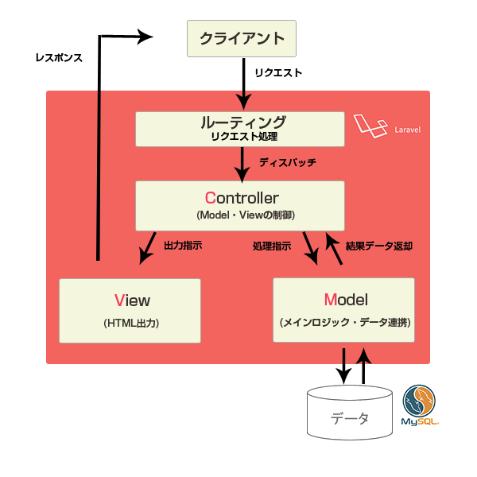

# Laravelについて。

Laravel とは PHP の MVC フレームワーク。

### フレームワークとは．．．??

* ある言語で作るシステムの枠組み。考え方。
* よく使う関数やクラスが用意されている。
* 規則が決まっているので誰が書いても似たコードになる。

#### メリット・デメリット 

| メリット                                                                    | デメリット                      |
| ----------------------------------------------------------------------- | -------------------------- |
| 
✅ 既存の機能を使える． ✅ 組み込まれている機能があるので実装の負荷が少ない． ✅ セキュリティなど（わりと）安心
 | 
🔼 学習コスト 🔼 環境構築
 |


Laravelは「学習コストが低い」と言及されることがある。ただしそれは「一般的なWEBエンジニアにとって」であり、初学者が勉強するには普通にむずい（覚えること・理解することが多い）ぞ！


各言語のフレームワークの例

| 言語         | フレームワーク                     |
| ---------- | --------------------------- |
| PHP        | Laravel, CakePHP, Symphony  |
| Ruby       | Ruby on Rails               |
| Python     | Django, Flask               |
| Node.js    | Express, NestJS             |
| JavaScript | Next.js, Gatsby.js, Nuxt.js |

### MVCとは

**MVC とは役割分担の概念。**

これまでは適当な PHP ファイルに処理を全部書いていた！

* ファイル数が増える．．．
* あの処理，どのファイルに書いたっけ．．？？
* バグあったけど次の処理が他の人の書いたファイルに．．．（チーム開発）

\=> いずれ詰む未来が見える．．．

\=> せや，処理毎に別々のところに書いて管理や分類をしやすくしたろ！MVC の 3 つくらいでええやろ！

#### 役割 

| コンポーネント    | 責務                                                                                                         |
| ---------- | ---------------------------------------------------------------------------------------------------------- |
| Model      | DB 操作とテーブル連携の定義を担当する．                                                                                      |
| View       | ユーザーインターフェースを担当する．データを表示するための画面を作成する．                                                                      |
| Controller | ユーザーの入力に応じた「リクエスト」「レスポンス」を担当する．Model が取得したデータを View に渡すなど，両者の間をつなぐ．                                        |
| Route      | 
アクセスされた URL に応じて処理を振り分ける．URL と Controller の関数の対応を決める． 実際の処理は Controller を通じて Model や View が実行する．
 |

#### 処理イメージ 

MVC では処理によって役割分担されているため，「処理の順番」と「データ流れ」を把握することが理解への近道。

例として、DB から取り出したデータを一覧画面に表示する流れを考えてみる！！

<figure><figcaption>
Laravel学習帳より<a href="https://laraweb.net/surrounding/922/">https://laraweb.net/surrounding/922/</a>
</figcaption></figure>

* リクエストからの処理の流れ

`リクエスト -> Route(ルーティング) -> Controller` の順で処理が実行される．

* DBから取り出したデータの流れ

`Model -> Controller -> View` の順で処理が実行される．
