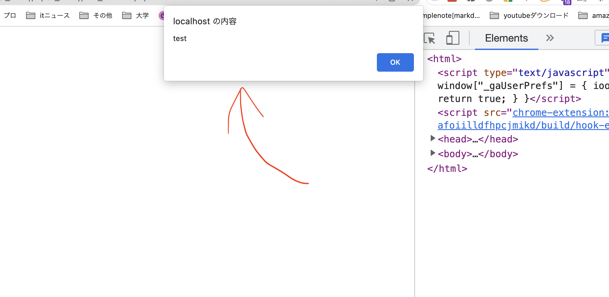

# 😀 011_gs_php_day1

### 授業資料 <a href="#shou-ye-zi-liao" id="shou-ye-zi-liao"></a>

[https://gitlab.com/gs_hayato/gs-php-01/-/blob/master/php01.zip](https://gitlab.com/gs_hayato/gs-php-01/-/blob/master/php01.zip)



Mac を利用されている人は、data/data.txt ファイルの書き込み権限を変更してください。

参考 [https://support.apple.com/ja-jp/guide/mac-help/mchlp1203/mac](https://support.apple.com/ja-jp/guide/mac-help/mchlp1203/mac)


## Gs の PHP 授業でのお願い

授業ごとに ZIP 化した配布資料を共有します。

解凍したファイルは、必ず**htdocs/gs_code**に格納してください。

※gs_code フォルダがなければ、作成してください。

## 基礎文法

### _gs_code/php01/hello01.php_

```php
<?php

echo 'hello world';

// コメントアウトは、 スラッシュ２個

?>
```


終了タグ ?> は省略可能

本当は省略が推奨だが、授業の最初は丁寧に?>を記述していきます。


ブラウザの URL に`localhost/gs_code/php01/hello01.php`と記入して出力を確認してみましょう。


mamp を使っている場合や、設定によっては、localhost:8888/gs_code/php01/hello01.php



エラーの場合は以下を確認してみてください。

- `XAMPP`を起動しているか。
- 開始タグ・終了タグに間違いが無いか。
- htdocs/gs_code に格納しているか。
- 書き間違いが無いか。
- 文の最後に ; が抜けていないか。
- 全角スペースを記入していないか。
- その他不要な文字などが入ってないか。
  


表示がされない場合、

1\. 保存

2\. ブラウザ更新

3\. 画面の確認

の３点を行ったか確認してみださい。 この３つが基本の動作です。

もし、VScode の自動保存をしていない場合は、利用してみて下さい。


### hello02.php

php は HTML と合わせて記述することが可能です。

```php
<!DOCTYPE html>
<html lang="ja">

<head>
    <meta charset="UTF-8">
    <meta http-equiv="X-UA-Compatible" content="IE=edge">
    <meta name="viewport" content="width=device-width, initial-scale=1.0">
    <title>Document</title>
</head>

<body>
    <p>こんにちは。</p>
    <p>私の名前は <?php echo '福島'; ?>です。</p>
</body>

</html>
```


PHP 部分は改行せずに、１行で記述しよう。



記述して保存したら、`localhost/gs_code/php01/hello02.php` をブラウザで確認してみてください。


### variable.php

```php
    <?php
    echo 'Hello world';
    echo 'ふくしま'; // string型(文字列型)
    echo 90; // int型（整数）
    echo '<h1>タイトル</h1>'; // 文字列としてhtmlを表示すると、そのままhtmlとして処理される。


    // 変数は、頭に $ をつけるだけ。
    $myouji = 'ふくしま';
    $namae = 'はやと';

    // 変数/文字列を結合する場合は、ドット `.` となる。
    echo $myouji . $namae;
    echo $namae . 'test';

    // 出力内容の詳細・データを知りたい場合はvar_dumpを利用
    var_dump($namae);
    ?>
```


現状、JavaScript の`console.log`に当たるものが、PHP の`echo`, `var_dump()`だと思ってください。



ドット.で結合する際は、ドットの左右に半角スペースを入れると読みやすいです。

`△ echo $myouji.$namae;`

`◎ echo $myouji . $namae;`



文字列を示すクオーテーションですが、シングルでもダブルでも現状はどちらでも良いです。 私はシングルクオーテーションを多用します。 大事なことは、どちらを使うか決めたら統一して利用するということです。 例えば、あっちではシングルクオーテーション使ってこっちではダブルクオーテーション使って、、、、というのはご法度です。

※なお、シングルとダブルは利用方法に違いがあります。

参考 : [https://www.php.net/manual/ja/language.types.string.php#language.types.string.parsing](https://www.php.net/manual/ja/language.types.string.php#language.types.string.parsing)


### array.php

```php
    <?php

    $ary = ['東京', 'oosaka', '愛知'];
    // echo $ary; だと、中身が見られない😭
    var_dump($ary);
    var_dump($ary[0]);

    // 配列に追加
    $ary[] = '福岡';
    var_dump($ary);
    echo $ary[0];

    $loveFoods = ['寿司', 'ラーメン二郎', 'ピザ'];
    echo $loveFoods[1];

    ?>
```


配列への要素の追加方法は他にもたくさんあります。 また、配列の種類（例えば連想配列、多次元配列など）もたくさんあるので調べてみてください。


### func.php

ここでは代表的な組み込み関数の対応を行います。 単純に「こういう関数有るんだ〜」という確認程度の内容です。


php にて組み込み関数（最初から用意されている関数）を利用する時の基本的な形は、 `関数名()` の形になります。


```php
    <?php

    // 日付表示
    // ※　アルファベット大文字小文字を間違えないでください。
    // 関数名()の形になっていることを確認してください。
    $today = date('Y/m/d H:i');
    $today2 = date('Y年m月d日 H時');

    echo $today;
    echo '<br>';
    echo $today2;
    echo '<br>';
```


php のデフォルトのタイムゾーンはドイツ・ベルリンになっています。
タイムゾーンの変更はこちらを参照してください。
https://nu0640042.gitbook.io/gs_php/php/something#xamppnotaimuzn


文字長さを計るには、`strlen('文字列')`関数を利用します。 例えば`alphabet`という　単語の文字数を画面に出力するにはどのように書けばよいでしょうか。

```php
<?php

    // 省略↓↓↓↓↓↓↓↓↓↓↓↓↓↓↓↓↓↓↓↓↓↓↓↓↓↓↓↓↓↓↓↓↓↓↓↓↓↓↓↓↓
    $string = 'alphabet';
    $length = strlen($string);
    echo $string . 'の文字数は' . $length . '文字';
    echo "<br>";
    // 正確には、strlen() が返すのはバイト数であり、 文字数ではありません。
    // 日本語文字数の場合は、https://www.flatflag.nir87.com/strlen-671

    // ※trim...全角スペースは取り除かない。取り除くものは↓
    // https://www.php.net/manual/ja/function.trim.php
    // 全角対応は、str_replaceを利用する。
    $string2 = ' abcde '; // 前後にわざと半角スペースいれている
    var_dump($string2);
    echo '<br>';
    var_dump(trim($string2));
    // 省略↑↑↑↑↑↑↑↑↑↑↑↑↑↑↑↑↑↑↑↑↑↑↑↑↑↑↑↑↑↑↑↑↑↑↑↑↑↑↑↑↑↑↑↑

    // ランダムな数字を表示する(rand)
    // 第1引数は最小の数、第2は最大の数
    $rand = rand(1, 10);
    echo '<pre>';
    var_dump($rand);
    echo '</pre>';

    // おみくじ
    echo '<br>';
    if ($rand === 1) {
        echo '大吉';
    } else {
        echo '大凶';
    }
    ?>
```


date()の引数はたくさん種類あります。

公式サイト参照してください。

[https://www.php.net/manual/ja/function.date.php](https://www.php.net/manual/ja/function.date.php)


### php と JS/CSS の動きを確認 ... other_lang.php

```php
<html>
<head>
    <meta charset="utf-8">
    // 外部にCSSファイルを用意してもいいですが、ここでは簡素化して<head>内に記述します。
    <style>
        .menu {
            background-color: #2FA6E9;
        }
        .red {
            color: red;
        }
    </style>
</head>

<body>
    <div class="menu">
        <h3>menu</h3>
        <ul>
            <li>PHPファイルとJS/CSSの動きを知る。</li>
        </ul>
    </div>
    <?php
    echo '<p class="red">css test</p>';
    echo '<p id="test">console test</p>';
    ?>
    <script>
        // 別ファイルにJavaScriptを記載して、呼び出してもokです。
        // getElementById('{id名}')で、idの要素が取得できます。
        let test = document.getElementById('test');
        console.log(test);
    </script>
</body>

</html>

```

### foreach.php ... foreach で配列を一つ一つ表示する

繰り返しの処理として foreach というものがあります。


当然、for 文もあります。 が、ここでは割愛。

```
for ($i = 0; $i < $num; $i++) {
    # code...
}
```



```php
<html>
<head>
    <meta charset="utf-8">
    <style>
        .menu {
            background-color: #2FA6E9;
        }
        .red {
            color: red;
        }
    </style>
</head>

<body>
    <div class="menu">
        <h3>menu</h3>
        <ul>
            <li>PHPファイルとJS/CSSの動きを知る。</li>
        </ul>
    </div>
    <?php
        // 配列を作成する
        $lang = ['PHP', 'JS', 'Python', 'Ruby'];

        // foreachで一つ一つ表示する
        foreach ($lang as $val) {
            echo $val."<br>";
        }
    ?>
</body>
</html>
```


foreach に key を与えて

```
foreach ($variable as $key => $value) {
    echo $key . $value;
}
```

という書き方もできる。


### while 文に触れる

foreach は、回数が決まっているものに対して繰り返しをおこなります。

一方で、回数が決まっていない・条件がある限り繰り返しには、`while文`があります。

```php
    // 初期値を決める
    $money = 10000;

    // whileのカッコの中に継続条件を書く
    while ($money >= 0) {
        echo $money."<br>";
        $money = $money - 3000;
    }
```


継続条件を間違えると、処理が永遠に終わらない可能性あるので注意です。


### Form 操作

Form を利用して、データの送信・受け取り方法を知る。


Form で大事な項目は３つ。

1. _action で、送信先を設定_
2. _method で送信メソッドを設定_
3. _input タグ内の name でそれぞれ送る情報に名前をつける。_
   

_get.php （送信側）_

```php
    <form action="get_confirm.php" method="get">
        お名前: <input type="text" name="name">
        EMAIL: <input type="text" name="mail">
        <input type="submit" value="送信">
    </form>
```

get*confirm.php *（受け取り側）\_

```php
<?php
// GETで送られてきた名前とアドレスのデータを受け取る
// まずは、var_dump($_GET);で見てみる。
echo '<pre>';
var_dump($_GET);
echo '</pre>';

// $_GETの中身を変数に移動
$name = $_GET['name'];
$mail = $_GET['mail'];
?>

<html>

<head>
    <meta charset="utf-8">
    <title>GET練習（受信）</title>
</head>

<body>
　
    <p>お名前：<?= $name ?></p>
    <p>Mail：<?= $mail ?> </p>
    <ul>
        <li><a href="index.php">index.php</a></li>
    </ul>
</body>

</html>

```


var_dump は\<pre>で囲ってあげると、整形されて見やすいです。

```php
// ↓ こんな感じ
echo '<pre>';
var_dump($_GET);
echo '</pre>';
```




HTML 内では、echo は以下のように省略した記述が可能です。

```php
<?php echo $name ?>
// ↓
<?= $name ?>
```




フォームに新しい input 要素(例えば、年齢や性別など)を加えて、それを受け取ってみましょう。


_post.php(送信側)_

```php
    <form action="post_confirm.php" method="post">
        お名前: <input type="text" name="name">
        EMAIL: <input type="text" name="mail">
        パスワード:<input type="text" name="password">
        <input type="submit" value="送信">
    </form>
```


_get と post は method を変えるだけです。_


_post_confirm.php(受け取り側)_


フォームから値が送信されていない場合、$_POST['name']のように直接アクセスすると「Notice: Undefined index」が表示されることがあります。
そのため、isset($\_POST['name'])や$\_POST['name'] ?? ''のように、isset を用いて値が存在するか確認してから使いましょう


```php
<?php
// POSTを受け取る
$name = $_POST['name'];
$mail = $_POST['mail'];
$password = $_POST['password'];
?>

<html>

<head>
    <meta charset="utf-8">
    <title>POST（受信）</title>
</head>

<body>
    お名前：<?= ($name) ?>
    EMAIL：<?= ($mail) ?>
    パスワード：<?= ($password)  ?>
    <ul>
        <li><a href="index.php">index.php</a></li>
    </ul>
</body>

</html>

```


`POST`と`GET`は以下のように違いを捉えてください。

- `POST`:リソース（DB の中身）を変化させるもの。例えば、何かを登録するときなど。
- `GET`:リソース（DB の中身）の取得をするのみ。例えば、検索してその結果を取得する場合など。
  

### セキュリティ / XSS(クロスサイトスクリプティング)

まず、post.php のフォームに以下のスクリプトを記入後、そのまま送信して、遷移先のページで動きを確認してください。

(get.php のページで行っても問題ありません。)

```javascript
<script>alert("test");</script>
```

<figure><figcaption></figcaption></figure>

以下のような感じで、アラートが動作＝スクリプトが動作していることがわかります。

<figure><figcaption></figcaption></figure>

今回は、簡単なアラート動作だけですが、**もしここにもっと悪質な script を仕込まれた場合セキュリティ上の脅威になる可能性が高いです。**

よって、この対策のために、`htmlspecialchars()を利用します。`


ipa の「安全なウェブサイトの作り方 - 1.5 クロスサイト・スクリプティング」に詳しい。

[https://www.ipa.go.jp/security/vuln/websecurity-HTML-1_5.html](https://www.ipa.go.jp/security/vuln/websecurity-HTML-1_5.html)

なお、セキュリティについて確認したい場合は、基本的に ipa のサイト（個人のブログ等ではなく）を確認することをお勧めします。



不特定多数の人間が記入できる Form は、悪意を持った人にスクリプトを埋め込まれる可能性があります。

**WEB 上には悪いことをする人がかならずいる**という前提でプロダクト制作をしてください。



GET や POST で受け取ったデータを出力する場合は**必ず**以下の処理を行ってください。

なお、**入力時には不要、出力時のみ必要**なので出力しない場合は、htmlspecialchars()を利用しなくても結構です。


`htmlspecialchars()`はフォームから受け取った文字列をブラウザに出力する際に利用します。

_post_confirm.php_

```php
<body>
    <p>お名前：<?= htmlspecialchars($name, ENT_QUOTES) ?> </p>
    <p>Mail：<?= htmlspecialchars($mail, ENT_QUOTES) ?></p>
    <ul>
        <li><a href="index.php">index.php</a></li>
    </ul>
</body>

```

上記記述した後、再度 form から`<script>alert("test");</script>`を送信して、次のページでスクリプトが動作しないことを確認してください。


上記の場合は、`htmlspecialchars()`が２つだけですが通常のフォームは、もっと項目数が多いことが多いです。

その場合すべての項目に`htmlspecialchars()`を書くのはとても面倒です。

よって、通常は関数化して`htmlspecialchars()を利用します。`


1. form から送られてきた情報を、表示出力する画面に以下関数を記述

```php
// XSS対策関数
function h($val){
   return htmlspecialchars($val,ENT_QUOTES);
}
```

2\. \_\_ 表示出力する箇所を`h()`で囲む\
`<?php echo h(変数); ?>`

具体的に、`post_comfirm.php`を以下のように変更してみてください。

```php
<?php
// XSS対策
function h($str)
{
    return htmlspecialchars($str, ENT_QUOTES);
}

$name = $_POST['name'];
$mail = $_POST['mail'];
?>
<html>

<head>
    <meta charset="utf-8">
    <title>POST（受信）</title>
</head>

<body>
    <p>お名前：<?= h($name) ?> </p>
    <p>Mail：<?= h($mail) ?></p>
    <ul>
        <li><a href="index.php">index.php</a></li>
    </ul>
</body>
</html>
```

そして、改めて`form`から`<script>alert('test')</script>`と送信してみて、遷移先でスクリプトが実行されないことを確認してください。


【発展】

上記 h 関数は、さまざまな場所で利用できる可能性が高いので、任意のファイル（例えば`funciton.php)に切り出して、利用したい箇所でrequire_onceで呼び出すとより便利になります。`

`授業でも扱いますが、余力がある人はチャレンジしてみてください。`


### ファイル保存・読み込み <a href="#fairu" id="fairu"></a>


データベースを利用した保存方法を行いたいところですが時間的に厳しいので、ファイルへの保存方法を学びます。



Mac を利用されている人は、data/data.txtファイルの書き込み権限を変更してください。

参考 [https://support.apple.com/ja-jp/guide/mac-help/mchlp1203/mac](https://support.apple.com/ja-jp/guide/mac-help/mchlp1203/mac)


#### write.php

```php
<?php

$time = date('Y-m-d H:i:s');

// 書き込むデータの内容を整形する。
// "\n"は改行。HTMLの<br>と同じようにtext中で利用されるとtextは改行される。
$data = $time . 'test' . "\n";

// 第３引数に、FILE_APPENDしないと上書きされちゃう
file_put_contents('data/data.txt', $data, FILE_APPEND);
?>
```


`write.php`に上記コードを書いたあとに（書き込み権限を修正して）`write.php`をブラウザで開くと、`data.txt`に自動で書き込みされます。


#### read.php

txt ファイルに保存した内容をブラウザでも確認するため、`read.php`を準備します。 まずは下記を`read.php`に記述してください。

```php
<?php
// ファイルを開いて内容を読み込む
$data = file_get_contents('data/data.txt');

// nl2br ... textファイルの改行"\n"を<br>に変換する関数
echo nl2br($data);
```

記述後、ブラウザで`read.php`を開いて、保存したデータがブラウザで閲覧できることを確認してください。

<figure><figcaption><p>txtに記述したないようが表示されればok</p></figcaption></figure>

### `input.php`から`write.php`に内容を送ってみよう

#### input.php

```php
$name = $_POST['name'];
$birthPlace = $_POST['birthPlace'];

// 変数を用意
$time = date("Y-m-d H:i:s");

// 書き込むデータの内容を整形する。
// "\n"は改行。HTMLの<br>と同じようにtext中で利用されるとtextは改行される。
$data = $time . '/' . $name . '/' .  $birthPlace . "\n";

// 第３引数に、FILE_APPENDしないと上書きされちゃう
file_put_contents('data/data.txt', $data, FILE_APPEND);
```

### 課題

#### 【課題】 アンケート集計/表示アプリ

- `post.php` (データ入力)
- `write.php` (データ登録)
- `read.php` (データ表示)

1. データ登録:名前,Email,聞きたい問い複数
2. データ表示:登録されてるデータを表で表示

◇ 更に Good ライン

1. データをグラフ化したり
2. JS と絡めてみたり

### 補足

以前は、`file_put_contents()`ではなく、`fopen`,`fgets`,`fclose`という関数を利用していました。 より細かい作業がしたい場合や書き込む内容が膨大（１万行とか）の場合は`fopen`,`fgets`,`fclose`が便利です。 `fopen`,`fgets`,`fclose`を利用した場合の書き方を以下に記述しておきます。

#### write.php

```php
<?php
// ファイルに書き込む内容を用意。まずは日付を保存する。
$time = date("Y-m-d H:i:s");

// aモードでファイルをオーブン
$file = fopen('data/data.txt', 'a');

//ファイルへの書き込み。"\n"は「ファイル内での改行」を指示する記述。ブラウザでいう<br>とのようなもの。
fwrite($file, $time."\n");

//ファイルを閉じる
fclose($file);
?>
```

- fopen の引数について fopen の第２引数(open モード)には以下のような種類があります。 方法によって使い分けてください。

間違えると、中身を削除してしまうので、ご利用は慎重に。



```
r 読み込みのみでオープンします。
r+ 読み込み/書込み用にオープンします。

w 書込みのみでオープンします。内容をまず削除、ファイルがなければ作成
w+ 読み込み/書込み用でオープンします。内容をまず削除、ファイルがなければ作成

a 追加書込み用のみでオープンします。ファイルがなければ作成
a+ 読み込み/追加書込み用でオープンします。ファイルがなければ作成
```




ファイル操作の基本は、

1. open
2. 処理
3. close の３つがセットです。
   

#### read.php

txt ファイルに保存した内容をブラウザでも確認するため、`read.php`を準備します。 まずは下記を`read.php`に記述してください。

```php
<?php
// ファイルを開く。モードは'r' = 読み込みのみでオープン。
$openFile = fopen('./data/data.txt', 'r');

// ファイル内容を1行ずつ読み込んで出力
while ($str = fgets($openFile)) {
    echo nl2br($str);
};

fclose($openFile);
```

記述後、ブラウザで`read.php`を開いて、保存したデータがブラウザで閲覧できることを確認してください。

<figure><figcaption><p>txtに記述したないようが表示されればok</p></figcaption></figure>


上記コードの while,,,の部分は少し難しいかもしれません。

処理の流れは、

```
fgets($openFile)でファイルの上から１行ずつ取得して、$strに代入
$strをechoする。その際に、text内の改行を<br>に変換させるnl2brを利用
もし読み込む行がなくなった場合、条件はFALSEになり、whileは終了する。
```



### `input.php`から`write.php`に内容を送ってみよう

#### input.php

```
$name = $_POST['name'];
$birthPlace = $_POST['birthPlace'];

// 変数を用意
$time = date("Y-m-d H:i:s");

// $timeや$nameをファイルに書き込む際、区切り文字として、 /(スラッシュ)を結合しています。
$str = $time . ' / ' . $name . ' /' .  $mail . ' ' . $birthPlace;

// ファイルに書き込み
$file = fopen('data/data.txt', 'a');
fwrite($file, $str . "\n");
fclose($file);
```
