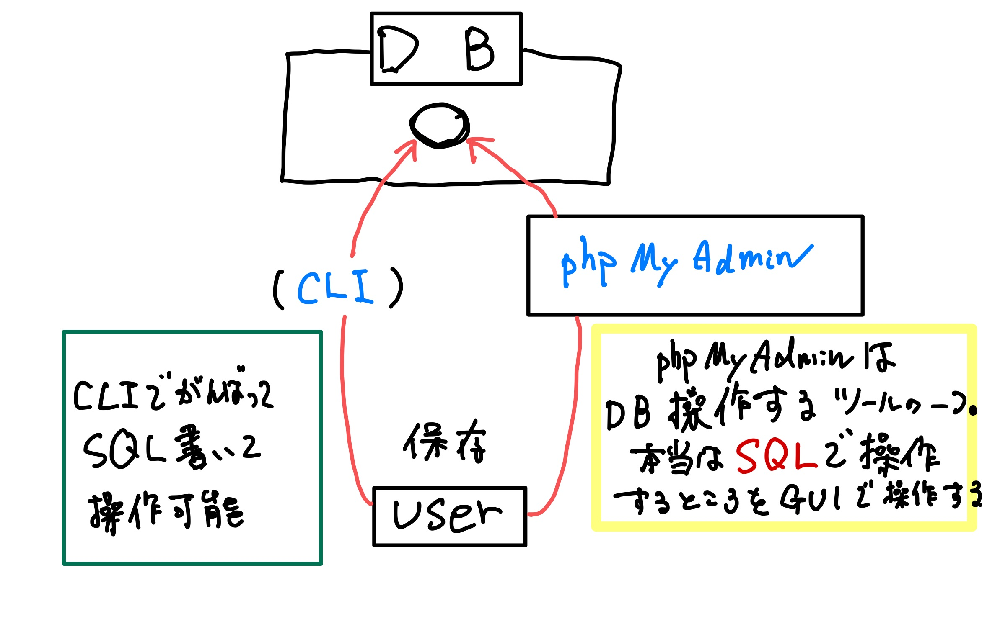
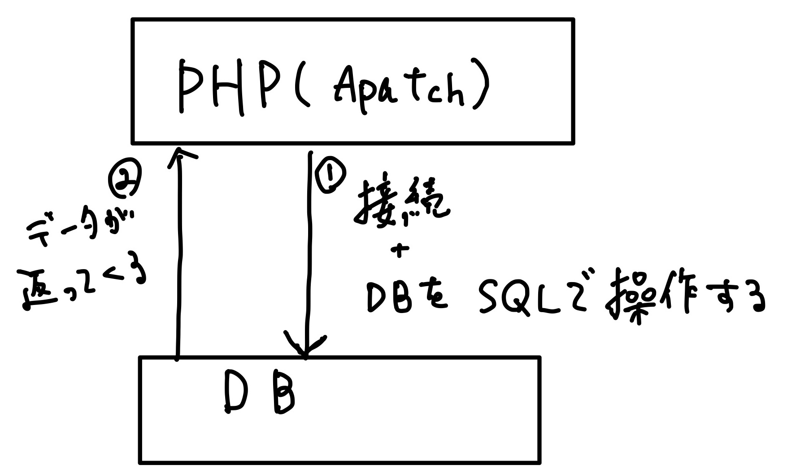

# 😁 012_gs_php_day2

### 授業資料 <a href="#shou-ye-zi-liao" id="shou-ye-zi-liao"></a>



リンク先の`php02_haifu.zip`からダウンロードしてください。

## 前回のおさらい

- 今までの学習はクライアントサイドの学習
  - HTML : どのような文字などを出すかを指示する
  - CSS : どのなレイアウトにするかを指示する
  - JS : どのような動きをするかを指示する
- サーバーサイド
  - クライアントから情報を受け取り、その内容をもとに処理をする。

## 今回やること

- 前回フォームで受け取ったデータを txt に保存しましたが、今回は DB(= データベース)への保存ができるようにします。

### データベース？？？

#### (※ここでは、 リレーショナルデータベースのことをデータベースとします)

- 情報を記録するもの。
  - DB と
  - テーブルで構成される。
  - その中に、表形式で記録していく。

#### 今後、データベースを DB と略して表記します

スプレッドシートでいうと、

- ファイルそのもの(XXXX.xlsx)が`DB`
- シートが`テーブル`

のイメージ。


スプレッドシートだと、画面見ながら操作できる DB は **通常 CLI（コマンドラインインターフェース） = 黒い画面に文字で操作します**

それだととっつきにくいので、CGI で操作できる`phpMyAdmin`というソフトを利用する。


`phpMyAdmin` = DB ではありません。 DB 操作をする際に、便利に操作するためのソフトが`phpMyAdmin`です



ちなみに、リレーショナルデータベースの**リレーションという言葉**は、数学で「二次元表」を表す単語らしいよ


## phpMyAdmin

操作

1. `XAMPP`を起動。
2. chrome にて、`localhost`へ接続。
3. 画面 header メニューの`phpMyAdmin`をクリック

<figure><figcaption></figcaption></figure>

ブラウザの URL からは、多分 `http://localhost/phpmyadmin/`で行ける。

<figure><figcaption></figcaption></figure>

## DB 作成

### 新規 DB 作成

1. 左メニューから\[新規作成]
2. データベース名は **`gs_db_class`**
3. 照合順序&#x306F;**`utf8mb4_general_ci`** (ディフォルトのまま)
4. 作成クリック。
5. 特にエラーの文言が出なければ ok


### 新規テーブル作成

1. テーブル名：**`gs_an_table`**
2. カラム数：5

### カラムを作成


以下の例のように、項目名にはアルファベットを利用してください。


```
`id`:    int(12) AUTO_INCREMENT PRIMARY KEY
`name`:  var_char(64)
`email`:  var_char(128)
`content`: text
`date`: datetime
```

記入したら保存



varchar と text 違い → メモリ容量

varchar 型の文字列はデータベースに直接保存されます。

text 型の文字列はデータベースとは別に保存。データベースにはそのポインターのみ保存されます。

そのため、短い文字列であれば varchar を使った方が効率良く処理できます。



【プライマリキー】 データを一意に識別するために使われる項目。 例えば、データの中から、名前が「田中」を抽出した場合他の人と被る可能性がある。 連番 ID であれば、他のデータと被らない。 ※データは必ず入力しなければならない。(NULL)にはならない。



【オートインクリメント】

連続した数値を自動で入れてくれる。



【NULL】 データを保存する時、空白にしていいかどうか。 NULL でも ok = `Nullable`にしていい場合は、チェック入れる。 Nullable の場合、データが空白でも保存可能。 そうでない場合は、保存時にエラーが出る。


### SQL

エクセルに記入する場合は画面見ながら操作。 DB に登録や編集削除等する場合`SQL`という言語を利用します。

この章ではデータに対して

- 登録 : `INSERT`
- 取得表示 : `SELECT` の処理を行います。

### INSERT

データを記録する際に用いる。

基本的な書き方は `INSERT INTO テーブル名(カラム1,カラム2,カラム3・・・) VALUES (値1,値2,値3・・・);`

- 基本的に大文字(小文字でも動作しますが慣習的に。)
- 基本的に行の最後は`;`をつけてあげてください。(なくても動いてくれうこと多々あり。)

例文

```sql
INSERT INTO
    gs_an_table(id, name, email, content, date)
VALUES
    (NULL, '福島はやと', 'test@test.jp', '内容', now());
```


SQL は１行で書いてあげてもいいが、右に長くなるので改行してあげると見やすい。 `;`までが１つの文章なので、改行したまま実行可能



`INSERT`文はもう少し省略して書くことができます。どうやって書くかは、君の目で確かめてくれ！



**名前やメルアドを変えて 3 つ以上登録してください**


### SELECT

データを取得表示する際に用いる。

1. 書式 `SELECT 表示するカラム FROM テーブル名;`
2. データ取得の基本バリエーション

```sql
SELECT * FROM gs_an_table; --全カラム指定取得
SELECT name FROM gs_an_table; --単一カラム指定取得
SELECT name,email FROM gs_an_table; --複数カラム指定取得
SELECT * FROM gs_an_table WHERE name='テスト太郎'; --WHEREを使った特定データの取得
```

1. 条件付き検索取得

```sql
--演算子を使った検索
SELECT * FROM テーブル名 WHERE id = 1;
SELECT * FROM テーブル名 WHERE id >= 3;

--AND,ORで検索条件を複数指定
SELECT * FROM テーブル名 WHERE id = 1 OR id = 2;
SELECT * FROM テーブル名 WHERE id = 1 AND id = 2;

--曖昧検索
SELECT * FROM テーブル名 WHERE date LIKE '2021-06%';
SELECT * FROM テーブル名 WHERE email LIKE '%@gmail.com';
SELECT * FROM テーブル名 WHERE email LIKE '%@%';
```

1. ソート取得と制限取得

```sql
--ソート
SELECT * FROM テーブル名 ORDER BY ソート対象カラム ソートルール;
SELECT * FROM テーブル名 ORDER BY id DESC; --降順
SELECT * FROM テーブル名 ORDER BY id ASC; --昇
--取得数制限
書式：SELECT * FROM テーブル名 LIMIT ***;

SELECT * FROM テーブル名 LIMIT 5; --最大5件取得
SELECT * FROM テーブル名 LIMIT 3,5; --4番目のデータから最大5件取得(0始まりであるので注意)
```

## PHP から MySQL を操作

DB というものと、BD を操作するための`SQL`を学びました。 次に PHP 内で、`SQL`を書いて`MySQL`を操作していきます。

<figure><figcaption></figcaption></figure>

### form を作成

`index.php`の form を修正する。

```
method：POST
action：insert.php
```

### 受け取り/登録処理を作成(INSERT)

`insert.php`を以下のように記述

```php
<?php
//1. POSTデータ取得
$name = $_POST['name'];
$email = $_POST['email'];
$content = $_POST['content'];

//2. DB接続
try {
    //Password注意。MAMP='root'　XAMPP=''
    $pdo = new PDO('mysql:dbname=gs_db_class; charset=utf8; host=localhost', 'root', '');
} catch (PDOException $e) {
    exit('DBConnectError:' . $e->getMessage());
}

//３．データ登録SQL作成
$stmt = $pdo->prepare('INSERT INTO gs_an_table(id, name, email, content, date)
                        VALUES(NULL, :name, :email, :content, now())');

//Integer（数値の場合 PDO::PARAM_INT)
//String（文字列の場合 PDO::PARAM_STR)
$stmt->bindValue(':name', $name, PDO::PARAM_STR);
$stmt->bindValue(':email', $email, PDO::PARAM_STR);
$stmt->bindValue(':content', $content, PDO::PARAM_STR);
$status = $stmt->execute();

//４．データ登録処理後
if ($status === false) {
    //SQL実行時にエラーがある場合（エラーオブジェクト取得して表示）
    $error = $stmt->errorInfo();
    exit('ErrorMessage:' . print_r($error, true));
} else {
    header('Location: index.php');
}
```


`if ($status === false)`の部分は、 `if (!$status)`と書くことも可能。



try-catch

まず try の中身を処理.

もしエラー(例外処理)をキャッチしたら、`catch`の中身が実行される。


---

### プレースホルダについてもう少し詳しく。


SQL インジェクションを防ぐ。

[https://blog.senseshare.jp/placeholder.html](https://blog.senseshare.jp/placeholder.html)


#### \_プレースホルダーを使わないと・・・!?!?!?!?!?

```php
$name = "'; DROP TABLE gs_an_table; --";
$sql = "INSERT INTO gs_an_table (name) VALUES ('$name')";
```

_↓ 生成される SQL_

```sql
INSERT INTO gs_an_table (name) VALUES (''; DROP TABLE gs_an_table; --')
```

ここで、`'; DROP TABLE gs_an_table; --` が SQL の一部として認識され、テーブル削除命令が実行される可能性がある！！！

#### プレースホルダを利用すると？

```php
$name = "'; DROP TABLE gs_an_table; --";
$stmt = $pdo->prepare('INSERT INTO gs_an_table (name) VALUES (:name)');
$stmt->bindValue(':name', $name, PDO::PARAM_STR);
$stmt->execute();
```

生成される SQL イメージ

```sql
INSERT INTO gs_an_table (name) VALUES ('\'; DROP TABLE gs_an_table; --')
```

入力された値が SQL 文の一部として認識されるのではなく、「単なるデータ」として扱われます。

**エスケープ処理の仕組み**

- プレースホルダーを使うと、文字列中の特殊文字（シングルクォート `'`、ダブルクォート `"`, バックスラッシュ `\`）は、データベースエンジンによって自動的にエスケープされる。
- 例えば、シングルクォート `'` は通常次のようにエスケープされる。
  - `'` → `\'` (MySQL のエスケープ形式)

#### 大事なポイント

- **変わるのは SQL 文内の扱い方で、元の文字列そのものは変更されない。**
- 入力された文字はそのままデータベースに保存され、`'; DROP TABLE gs_an_table; --` として格納される。
- **ただし、SQL 文の構造を壊さない** ようにエスケープされるため、**テーブルの削除命令は実行されない。**

---

### データの取得と表示(SELECT)

#### `select.php` - 1

```php
<?php

//1.  DB接続
try {
    //Password....最後の引数の部分。MAMP='root',XAMPP=''
    $pdo = new PDO('mysql:dbname=gs_db_class;charset=utf8;host=localhost', 'root', '');
} catch (PDOException $e) {
    exit('DBConnectError' . $e->getMessage());
}

//２．データ取得SQL作成
$stmt = $pdo->prepare('SELECT * FROM gs_an_table');
$status = $stmt->execute();

//３．データ表示
$view = '';
if ($status === false) {
    //execute（SQL実行時にエラーがある場合）
    $error = $stmt->errorInfo();
    exit('ErrorQuery:' . $error[2]);
} else {
    // Selectデータの数だけ自動でループしてくれる
    // FETCH_ASSOC = http://php.net/manual/ja/pdostatement.fetch.php
    while ($result = $stmt->fetch(PDO::FETCH_ASSOC)) {
        $view .= '<p>';
        $view .= $result['date'] . ':' . $result['name'] . ' ' . $result['content'] . ' ' . $result['email'];
        $view .= '</p>';
    }
}
?>
```

#### `select.php` - 2

- フロント表示部分

```php
    <!-- Main[Start] -->
    <div>
        <div class="container jumbotron"><?= $view ?></div>
    </div>
```

### セキュリティ対策 XSS -1

`select.php`に`funcs.php`を読み込んで作成した関数を使う

```php
<?php
//select.phpの一番上に1行追記
require_once('funcs.php');
```

### セキュリティ対策 XSS - 2

\`funcs.php\`

```php
<?php
//共通に使う関数を記述
//XSS対応（ echoする場所で使用！それ以外はNG ）
function h($str)
{
    return htmlspecialchars($str, ENT_QUOTES);
}
```

`select.php` の `$result`を出力する部分に`XSS対策`をする。

```php
while ($result = $stmt->fetch(PDO::FETCH_ASSOC)) {
    $view .= '<p>';
    $view .= h($result['date']) . ' : ' . h($result['name']) . ' ' . h($result['content']) . ' ' . h($result['email']);
    $view .= '</p>';
}
```

#### 【課題】 ブックマークアプリ

1. まず、以下の通り DB とテーブルを作成

- DB 名:自由
- table 名:`gs_bm_table`
- 項目（カラム）名
  - ※ カラム名は下記を参照して英語にしてください。例:書籍名は book とか、name とか。
  - ユニーク値 (int 12 , PRIMARY, AutoIncrement)
  - 書籍名 (varChar 64)
  - 書籍 URL (text)
  - 書籍コメント(text)
  - 登録日時 (datetime)

1. 授業でやったように、

- 登録画面
- 登録処理画面
- 登録内容確認画面

を作成してください。

1. 課題を提出するときは、必ず sql ファイルも提出。 ファイルの用意の仕方は[ここを参照](https://gitlab.com/gs_hayato/gs-php-01/-/blob/master/%E3%81%9D%E3%81%AE%E4%BB%96/howToExportSql.md)
