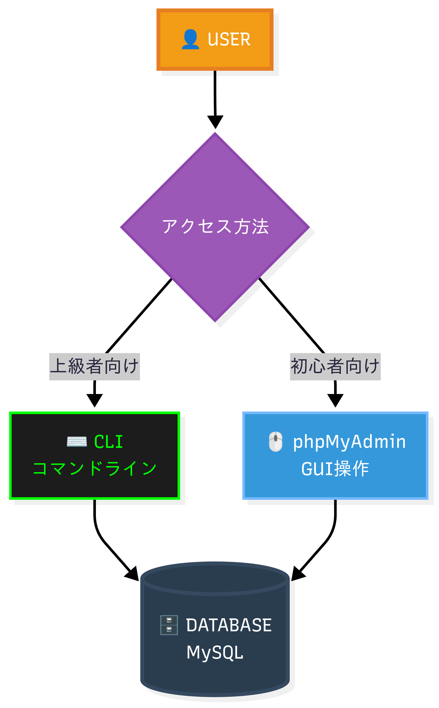
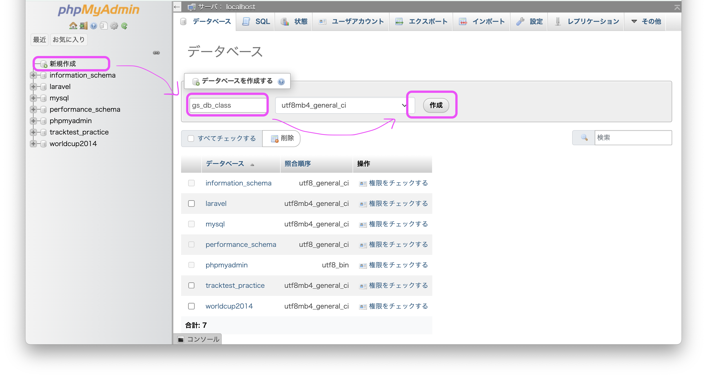
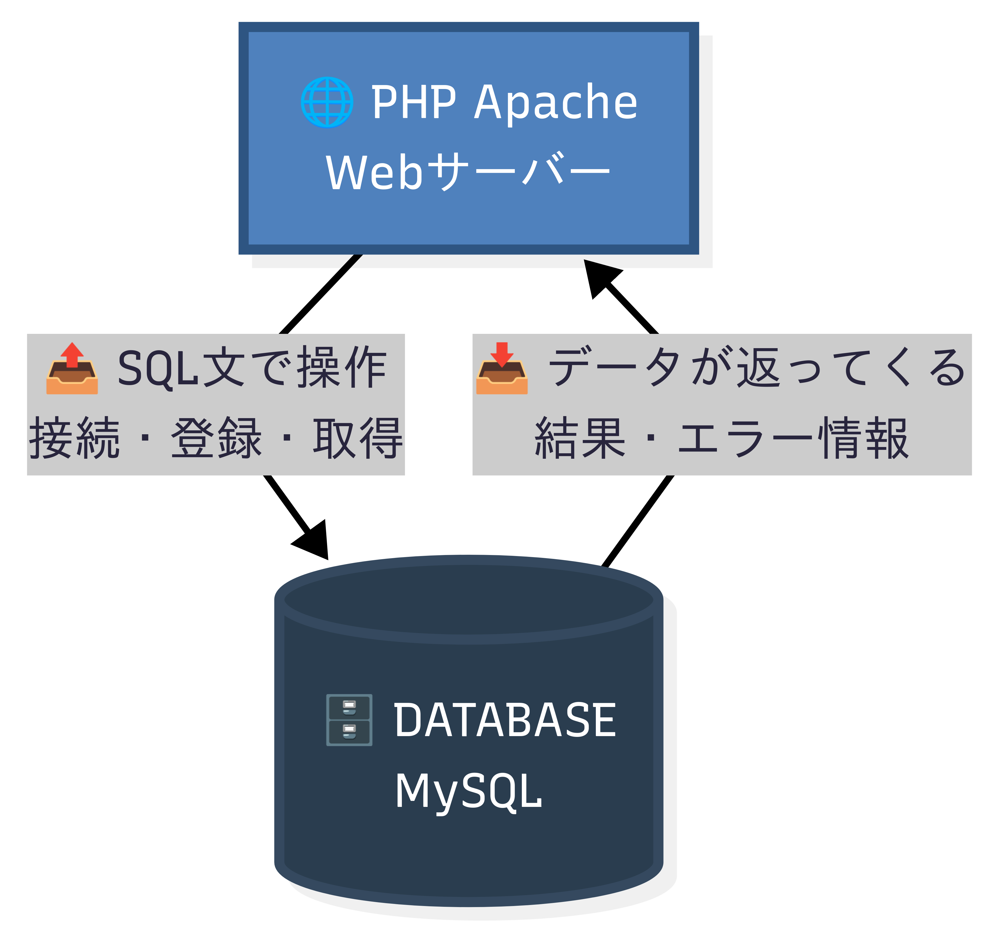

# 012\_gs\_php\_day2

## PHP授業 全5日間の概要

| Day | テーマ | 学ぶこと |
|---|---|---|
| Day1 | PHP基礎 | 変数・配列・関数・ループ、フォーム操作、ファイル保存 |
| **Day2** | **DB入門** | **DB・テーブルの概念、SQL（INSERT/SELECT）、PHPからDB操作（PDO）** |
| Day3 | CRUD | 詳細表示・更新（UPDATE）・削除（DELETE）、コードの関数化 |
| Day4 | ログイン機能 | セッション管理、権限による処理の分岐、パスワードのハッシュ化 |
| Day5 | DBリレーション | テーブルの設計・正規化、JOINで複数テーブルを扱う |

### 授業資料 <a href="#shou-ye-zi-liao" id="shou-ye-zi-liao"></a>



リンク先の`php02_haifu.zip`からダウンしてください。

## 前回のおさらい

* 今までの学習はクライアントサイドの学習
  * HTML : どのような文字などを出すかを指示する
  * CSS : どのなレイアウトにするかを指示する
  * JS : どのような動きをするかを指示する
* サーバーサイド
  * クライアントから情報を受け取り、その内容をもとに処理をする。

## 今回やること

* 前回フォームで受け取ったデータを txt に保存しましたが、今回は DB(= データベース)への保存ができるようにします。

## 本日のタイムライン

| コマ | テーマ | 内容 |
|---|---|---|
| コマ1（50分） | DBを知る・触る | DB概念 → phpMyAdmin操作 → SQL基礎 |
| コマ2（50分） | PHPとDBをつなぐ | PDO → SELECT表示 → XSS対策 |
| コマ3（50分） | セキュリティ体感・まとめ | SQLインジェクション体感 → 宿題説明 → バッファ |


**AI活用について**

この授業ではAIをツールとして積極的に活用します。コマごとに使い方を変えます。
* コマ1：概念理解のためにAIに聞く
* コマ2：雛形生成 → 読んで理解する
* コマ3：攻撃側の視点でAIを使う


### AIに渡すコンテキスト定型文

AI に質問する前に、毎回以下をチャットに貼り付けてください。これを渡すことで、授業の内容に合ったコードを生成してくれます。

```
【このAIセッションのコンテキスト】
- PHPの授業でXAMPPを使っています
- フレームワークは使わず、素のPHPで書きます
- DBはMySQLで、接続にはPDOを使います
- DB名: gs_db_class、テーブル: gs_an_table
- カラム: id(PK,AI), name(varchar64), email(varchar128), content(text), date(datetime)
- コードはシンプルに。初学者向けで、変数名もわかりやすく
- mysql_*関数やmysqliは使わず、必ずPDO＋プレースホルダで書いてください
```

---

## コマ1：DBを知る・触る

### データベース？？？

#### (※ここでは、 リレーショナルデータベースのことをデータベースとします)

* 情報を記録するもの。
  * DB と
  * テーブルで構成される。
  * その中に、表形式で記録していく。

#### 今後、データベースを DB と略して表記します

スプレッドシートでいうと、

* ファイルそのもの(XXXX.xlsx)が`DB`
* シートが`テーブル`

のイメージ。



**【AI活用】DBとテーブルについてAIに聞いてみよう**

出てきた回答を全体で共有します。

【サンプルプロンプト】
```
PHPの授業でデータベースを学び始めました。初学者向けにわかりやすく教えてください。

【質問】
DBとテーブルの違いを教えてください。スプレッドシート（Excelなど）に例えて説明してください。
```


スプレッドシートだと、画面見ながら操作できる DB は **通常 CLI（コマンドラインインターフェース） = 黒い画面に文字で操作します**

それだととっつきにくいので、GUI で操作できる`phpMyAdmin`というソフトを利用する。


`phpMyAdmin` = DB ではありません。 DB 操作をする際に、便利に操作するためのソフトが`phpMyAdmin`です



ちなみに、リレーショナルDBの**リレーションという言葉**は、数学で「二次元表」を表す単語らしいよ


### XAMPPの全体構成

<figure><figcaption></figcaption></figure>

#### データの流れ

1. **① HTTPリクエスト** - ユーザーがフォーム送信
2. **② SQL文でやり取り** - PHPがMySQLと連携してデータを操作
3. **③ HTMLレスポンス** - 処理結果をユーザーに表示


📝 **DBサーバーへのアクセス方法**

MySQLデータベースサーバーには、以下の方法でアクセスできます：

* **PHP経由** : Webアプリケーションとしてデータを操作
* **phpMyAdmin経由** : ブラウザでGUI操作
* **CLI経由** : コマンドラインで直接操作（授業ではやりません）


## phpMyAdmin

操作

1. `XAMPP`を起動。
2. chrome にて、`localhost`へ接続。
3. 画面 header メニューの`phpMyAdmin`をクリック

<figure><figcaption></figcaption></figure>

ブラウザの URL からは、多分 `http://localhost/phpmyadmin/`で行ける。

## 📊 データベースアクセス方法

<figure><figcaption></figcaption></figure>

## DB 作成

### 新規 DB 作成

1. 左メニューから\[新規作成]
2. DB名は **`gs_db_class`**
3. 照合順序&#x306F;**`utf8mb4_general_ci`** (ディフォルトのまま)
4. 作成クリック。
5. 特にエラーの文言が出なければ ok

<figure><figcaption></figcaption></figure>

### 新規テーブル作成

1. テーブル名：**`gs_an_table`**
2. カラム数：5

### カラムを作成


以下の例のように、カラム名にはアルファベットを利用してください。


```
`id`:    int(12) AUTO_INCREMENT PRIMARY KEY
`name`:  varchar(64)
`email`:  varchar(128)
`content`: text
`date`: datetime
```

記入したら保存



varchar と text の違い

varchar: 可変長文字列型。指定した最大文字数まで格納可能（例：varchar(64)なら最大64文字）

text: 大容量テキスト用。varcharより大きなデータを格納可能

パフォーマンス面では、短いデータならvarcharが効率的です。

理由： varchar: データがテーブルと一緒に格納される（インライン格納） text: データは別の場所に格納され、テーブルにはその場所を示すポインタのみ格納 そのため、varcharの方がデータ読み取りが1回で済み、高速



【プライマリキー】 データを一意に識別するために使われるカラム。 例えば、データの中から、名前が「田中」を抽出した場合他の人と被る可能性がある。 連番 ID であれば、他のデータと被らない。 ※データは必ず入力しなければならない。(NULL)にはならない。



【オートインクリメント】

連続した数値を自動で入れてくれる。



【NULL】 データを保存する時、空白にしていいかどうか。 NULL でも ok = `Nullable`にしていい場合は、チェック入れる。 Nullable の場合、データが空白でも保存可能。 そうでない場合は、保存時にエラーが出る。


### SQL

エクセルに記入する場合は画面見ながら操作。 DB に登録や編集削除等する場合`SQL`という言語を利用します。

この章ではデータに対して

* 登録 : `INSERT`
* 取得表示 : `SELECT` の処理を行います。

### INSERT

データを記録する際に用いる。

基本的な書き方は `INSERT INTO テーブル名(カラム1,カラム2,カラム3・・・) VALUES (値1,値2,値3・・・);`

* 基本的に大文字(小文字でも動作しますが慣習的に。)
* 基本的に行の最後は`;`をつけてあげてください。(なくても動いてくれうこと多々あり。)


**【AI活用】INSERT文をAIで生成してみよう**

生成されたSQL文を読んで、書き方を理解しましょう。

【サンプルプロンプト】
```
【コンテキスト】
- MySQLを使っています
- DB名: gs_db_class、テーブル: gs_an_table
- カラム: id(PK, AutoIncrement), name(varchar64), email(varchar128), content(text), date(datetime)

【依頼】
gs_an_tableに1件データを登録するINSERT文を書いてください。
idはNULL、dateはnow()を使ってください。
```


例文

```sql
INSERT INTO
    gs_an_table(id, name, email, content, date)
VALUES
    (NULL, '福島はやと', 'test@test.jp', '内容', now());
```


SQL は１行で書いてあげてもいいが、右に長くなるので改行してあげると見やすい。 `;`までが１つの文章なので、改行したまま実行可能



`INSERT`文はもう少し省略して書くことができます。どうやって書くかは、君の目で確かめてくれ！



**名前やメルアドを変えて 3 つ以上登録してください**


### SELECT

データを取得表示する際に用いる。

1. 書式 `SELECT 表示するカラム FROM テーブル名;`
2. データ取得の基本バリエーション

```sql
SELECT * FROM gs_an_table; --全カラム指定取得
SELECT name FROM gs_an_table; --単一カラム指定取得
SELECT name,email FROM gs_an_table; --複数カラム指定取得
SELECT * FROM gs_an_table WHERE name='テスト太郎'; --WHEREを使った特定データの取得
```

1. 条件付き検索取得

```sql
--演算子を使った検索
SELECT * FROM テーブル名 WHERE id = 1;
SELECT * FROM テーブル名 WHERE id >= 3;

--AND,ORで検索条件を複数指定
SELECT * FROM テーブル名 WHERE id = 1 OR id = 2;
SELECT * FROM テーブル名 WHERE id = 1 AND id = 2;

--曖昧検索
SELECT * FROM テーブル名 WHERE date LIKE '2021-06%';
SELECT * FROM テーブル名 WHERE email LIKE '%@gmail.com';
SELECT * FROM テーブル名 WHERE email LIKE '%@%';
```

1. ソート取得と制限取得

```sql
--ソート
SELECT * FROM テーブル名 ORDER BY ソート対象カラム ソートルール;
SELECT * FROM テーブル名 ORDER BY id DESC; --降順
SELECT * FROM テーブル名 ORDER BY id ASC; --昇
--取得数制限
書式：SELECT * FROM テーブル名 LIMIT ***;

SELECT * FROM テーブル名 LIMIT 5; --最大5件取得
SELECT * FROM テーブル名 LIMIT 3,5; --4番目のデータから最大5件取得(0始まりであるので注意)
```

---

## コマ2：PHPとDBをつなぐ

## PHP から MySQL を操作

DB というものと、DB を操作するための`SQL`を学びました。 次に PHP 内で、`SQL`を書いて`MySQL`を操作していきます。

<figure><figcaption></figcaption></figure>

### PDOとは

PDO（PHP Data Objects）は、PHPでデータベースを操作するための仕組みです。

**PDOの利点：**

* 複数のデータベース（MySQL、PostgreSQL等）を同じ方法で操作できる
* セキュリティが高い（プレースホルダが使える）
* エラーハンドリングがしやすい

### prepare文とは

prepare = 事前にSQL文を準備することで、以下の利点があります：

セキュリティ向上（SQLインジェクション対策） 同じSQL文を何度も実行する場合のパフォーマンス向上

```php
$stmt = $pdo->prepare('SELECT * FROM gs_an_table');
```

### form を作成

`index.php`の form を修正する。

```
method：POST
action：insert.php
```

### 受け取り/登録処理を作成(INSERT)


**【AI活用】insert.phpの雛形をAIで生成してみよう**

生成されたコードを読んで、各部分が何をしているか確認します。

【サンプルプロンプト】
```
【コンテキスト】
- PHPの授業でXAMPPを使っています
- フレームワークは使わず、素のPHPで書きます
- DBはMySQLで、接続にはPDOを使います（mysql_*やmysqliは使わないでください）
- DB名: gs_db_class、テーブル: gs_an_table
- カラム: id(PK, AutoIncrement), name(varchar64), email(varchar128), content(text), date(datetime)
- コードはシンプルに。初学者向けで、変数名もわかりやすく

【依頼】
POSTで受け取ったname・email・contentをgs_an_tableにINSERTするPHPファイル（insert.php）を書いてください。
プレースホルダ（bindValue）を使ってください。
```


`insert.php`を以下のように記述（AIの生成コードと見比べてみよう）

```php
<?php
//1. POSTデータ取得
$name = $_POST['name'];
$email = $_POST['email'];
$content = $_POST['content'];

// 2. DB接続
try {
    //Password注意。MAMP='root'　XAMPP=''
    $pdo = new PDO('mysql:dbname=gs_db_class; charset=utf8; host=localhost', 'root', '');
} catch (PDOException $e) {
    // 開発環境：学習用に詳細なエラー情報を表示
    // 本番環境：詳細情報は非表示にしてログに記録するようにしてください。
    exit('DBConnectError:' . $e->getMessage());
}

// 3．データ登録SQL作成
$stmt = $pdo->prepare('INSERT INTO gs_an_table(id, name, email, content, date)
                        VALUES(NULL, :name, :email, :content, now())');

//Integer（数値の場合 PDO::PARAM_INT)
//String（文字列の場合 PDO::PARAM_STR)
$stmt->bindValue(':name', $name, PDO::PARAM_STR);
$stmt->bindValue(':email', $email, PDO::PARAM_STR);
$stmt->bindValue(':content', $content, PDO::PARAM_STR);
$status = $stmt->execute();

// 4．データ登録処理後
if ($status === false) {
    //SQL実行時にエラーがある場合（エラーオブジェクト取得して表示）
    $error = $stmt->errorInfo();
    exit('ErrorMessage:' . print_r($error, true));
} else {
    header('Location: index.php');
}
```


本番環境での注意点 開発・学習段階では詳細なエラー情報を表示していますが、本番環境では $e->getMessage() を直接表示せず、 ログファイルに記録して、ユーザーには一般的なエラーメッセージを表示するようにしてください。



`if ($status === false)`の部分は、 `if (!$status)`と書くことも可能。



try-catch

まず try の中身を処理.

もしエラー(例外処理)をキャッチしたら、`catch`の中身が実行される。



**bindValueとプレースホルダについて**

`:name` `:email` `:content` のことをプレースホルダと呼びます。SQLインジェクション攻撃を防ぐための重要な仕組みです。詳しくはコマ3で体感します。



**【自分で書こう】bindValueの部分だけ自分で書いてみよう**

上のコードのうち、`bindValue`の3行は自分で書いてみてください。書き方のパターンを手で覚えましょう。


***

### データの取得と表示(SELECT)


**【AI活用】select.phpの雛形もAIで生成してみよう**

【サンプルプロンプト】
```
【コンテキスト】
- PHPの授業でXAMPPを使っています
- フレームワークは使わず、素のPHPで書きます
- DBはMySQLで、接続にはPDOを使います（mysql_*やmysqliは使わないでください）
- DB名: gs_db_class、テーブル: gs_an_table
- カラム: id(PK, AutoIncrement), name(varchar64), email(varchar128), content(text), date(datetime)
- コードはシンプルに。初学者向けで、変数名もわかりやすく

【依頼】
gs_an_tableの全件データを取得して、date・name・content・emailを<p>タグで表示するPHPファイル（select.php）を書いてください。
```


#### `select.php` - 1

```php
<?php

// 1.  DB接続
try {
    //Password....最後の引数の部分。MAMP='root',XAMPP=''
    $pdo = new PDO('mysql:dbname=gs_db_class;charset=utf8;host=localhost', 'root', '');
} catch (PDOException $e) {
    exit('DBConnectError' . $e->getMessage());
}

// 2．データ取得SQL作成
$stmt = $pdo->prepare('SELECT * FROM gs_an_table');
$status = $stmt->execute();

// 3．データ表示
$view = '';
if ($status === false) {
    //execute（SQL実行時にエラーがある場合）
    $error = $stmt->errorInfo();
    exit('ErrorQuery:' . $error[2]);
} else {
    // Selectデータの数だけ自動でループしてくれる
    // FETCH_ASSOC = http://php.net/manual/ja/pdostatement.fetch.php
    while ($result = $stmt->fetch(PDO::FETCH_ASSOC)) {
        $view .= '<p>';
        $view .= $result['date'] . ':' . $result['name'] . ' ' . $result['content'] . ' ' . $result['email'];
        $view .= '</p>';
    }
}
?>
```

#### `select.php` - 2

* フロント表示部分

```php
<div class="data-container">
    <?php if(empty($view)): ?>
        <!-- もし $view データがない場合の表示 -->
        <div class="empty-state">
            <div class="empty-icon">
                <i class="fas fa-inbox"></i>
            </div>
            <p>まだデータがありません</p>
            <p style="margin-top: 0.5rem; font-size: 0.9rem; color: #999;">
                最初のアンケートを投稿してみましょう！
            </p>
        </div>
    <?php else: ?>
        <!-- もし $view データが存在する場合 -->
        <?= $view ?>
    <?php endif; ?>
</div>
```

### セキュリティ対策 XSS -1

`select.php`に`funcs.php`を読み込んで作成した関数を使う

```php
<?php
//select.phpの一番上に1行追記
require_once('funcs.php');
```

### セキュリティ対策 XSS - 2

\`funcs.php\`

```php
<?php
//共通に使う関数を記述
//XSS対応（ echoする場所で使用！それ以外はNG ）
function h($str)
{
    return htmlspecialchars($str, ENT_QUOTES);
}
```

`select.php` の `$result`を出力する部分に`XSS対策`をする。

```php
while ($result = $stmt->fetch(PDO::FETCH_ASSOC)) {
    $view .= '<p>';
    $view .= h($result['date']) . ' : ' . h($result['name']) . ' ' . h($result['content']) . ' ' . h($result['email']);
    $view .= '</p>';
}
```

---

## コマ3：セキュリティ体感・まとめ

### SQLインジェクション体感


**【AI活用】攻撃側の視点でAIを使ってみよう**

以下のコード（プレースホルダなし版）をAIに渡して、「このコードに対してSQLインジェクション攻撃をするSQL文を書いて」と依頼してみてください。

```php
$name = $_POST['name'];
$sql = "INSERT INTO gs_an_table (name) VALUES ('$name')";
```

生成された攻撃コードを読んで、「なぜbindValueが必要なのか」を理解しましょう。


#### プレースホルダーを使わないと・・・

攻撃者が `name` に以下を入力した場合：

```
'; DROP TABLE gs_an_table; --
```

生成されるSQL：

```sql
INSERT INTO gs_an_table (name) VALUES (''; DROP TABLE gs_an_table; --')
```

`'; DROP TABLE gs_an_table; --` が SQL の一部として認識され、テーブル削除命令が実行される可能性がある！

#### プレースホルダを使えば防げる

bindValueを使うと、入力値は「単なるデータ」として扱われ、SQLの構造を壊せない。


SQLインジェクションの詳細な仕組みは次回以降に扱います。


***

### 宿題

#### 【課題】 ブックマークアプリ

1. まず、以下の通り DB とテーブルを作成

* DB 名:自由
* table 名:`gs_bm_table`
* カラム名
  * ※ カラム名は下記を参照して英語にしてください。例:書籍名は book とか、name とか。
  * ユニーク値 (int 12 , PRIMARY, AutoIncrement)
  * 書籍名 (varchar 64)
  * 書籍 URL (text)
  * 書籍コメント(text)
  * 登録日時 (datetime)

1. 授業でやったように、

* 登録画面
* 登録処理画面
* 登録内容確認画面

を作成してください。

1. 課題を提出するときは、必ず sql ファイルも提出。 ファイルの用意の仕方は[ここを参照](https://gitlab.com/gs_hayato/gs-php-01/-/blob/master/%E3%81%9D%E3%81%AE%E4%BB%96/howToExportSql.md)


AIをフル活用してOKです。ただし、生成されたコードの各部分が何をしているか説明できるようにしておいてください。


---

## プラスアルファ（早く終わった人向け）

### ① XSS攻撃を自分で試す（おすすめ）

1. `select.php`の`h()`を一時的に外す
2. フォームから `<script>alert('XSS')</script>` を投稿
3. アラートが出ることを確認（攻撃成功の状態）
4. `h()`を戻して、アラートが出なくなることを確認

### ② SELECTの応用をAIと遊ぶ

「登録日時の新しい順に3件だけ取得するSQL書いて」など、要件をAIに渡してSQL生成→phpMyAdminで実際に動かしてみよう。

```sql
-- ヒント：こんな形になるはず
SELECT * FROM gs_an_table ORDER BY date DESC LIMIT 3;
```

### ③ AIにコードレビューさせてみる

自分が書いたinsert.phpをAIに渡して「このコードの改善点を教えて」と聞いてみよう。AIのレビューを読んで、採用するかどうか自分で判断してみてください。
