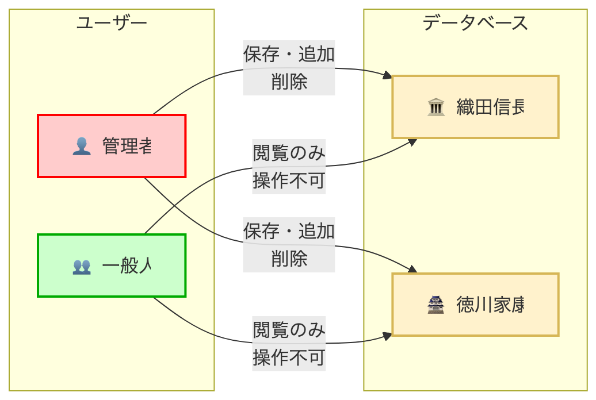
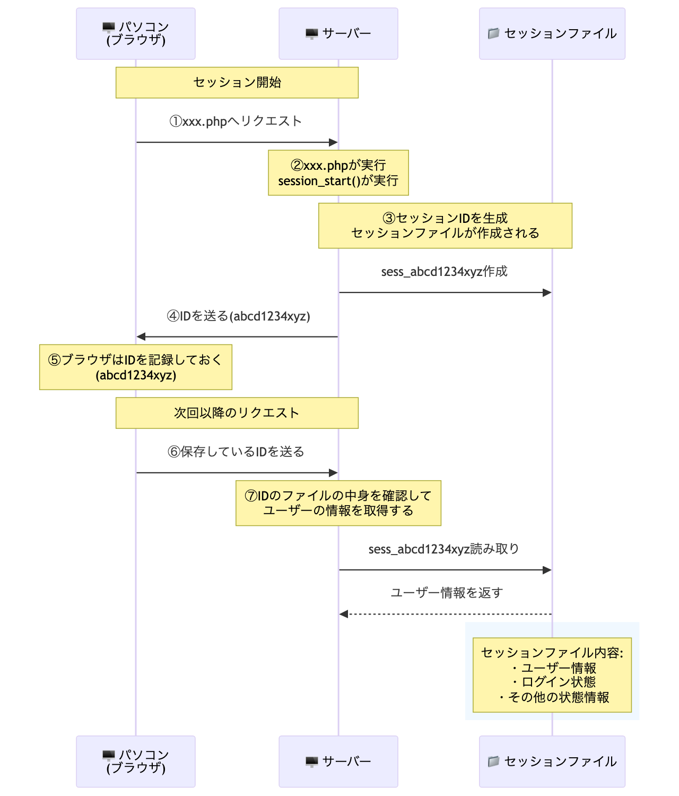
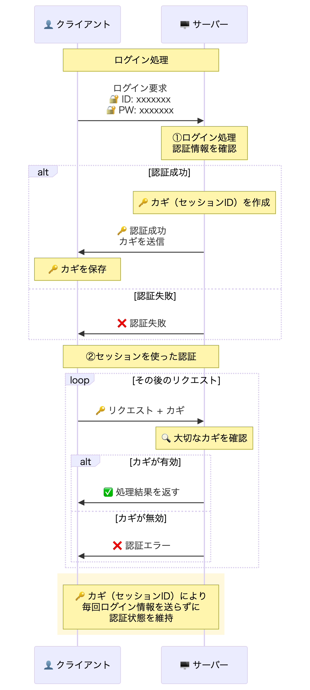

# 014\_gs\_php\_day4

## 014\_gs\_php\_day4

ユーザー側にデータを授業資料

[https://gitlab.com/gs\_hayato/gs-php-01/-/blob/master/PHP04.zip](https://gitlab.com/gs_hayato/gs-php-01/-/blob/master/PHP04.zip)

### 前回のおさらい

* `SQL`の`UPDATE`を書いた
* `SQL`の`DELETE`を書いた
* CRUDのC,R,U,D全部触った

### 今回やること

前回は、CRUD機能の`Updata（編集）`、`Delete（削除）`を行いました。

今日は、`SESSION`をやっていきます。

* `CRUD`とは？ [https://wa3.i-3-i.info/word123.html](https://wa3.i-3-i.info/word123.html)

### Xamppの起動、DB準備

1. Xamppを起動
2. phpMyAdminから、あたらしいDBを作成

```
データベース名：gs_db_class4
```

1. 作成ボタンをクリック 左側に`gs_db_class4`というデータベースができていると思います。 現在は空っぽです。

### SQLファイルからインポート

〇〇.sqlというSQLファイルをインポートしてデータを作成します。

1. 念の為、左側のメニューから`gs_db_class4`をクリック
2. `gs_db_class4`を選択した状態でインポートタブをクリック
3. ファイルを選択をクリックして配布した資料内のSQLフォルダ内の`gs_an_table.sql`を選択
4. 実行してみる
5. ファイルを選択をクリックして配布した資料内のSQLフォルダ内の`gs_user_table.sql`を選択 **今日のテーブルは2つあります。**
6. 実行してみる
7. 授業用のDBと中身を確認

\*\*DBの中身も確認しておいてください。\*\*

今日のプロダクトのイメージ

<figure><figcaption></figcaption></figure>

### 今日のゴール

ログイン機能を作成する。

#### `SESSION`の確認

* Amazonでカートに商品を入れたまま、他のページを見ても商品が残っている
* 一度ログインすると、他のページに移動してもログイン状態が保持される
* 銀行のATMで暗証番号を入力した後、複数の操作ができる

これらを実現するのがSESSIONの仕組みです。

`SESSION`そのものは概念 …… お互いが誰かを認識した状態でやりとりすること・やりとりを管理すること。

インターネットの通信（HTTP通信）はステートレス（State-less）です。これは、サーバーが過去のやりとりを記憶せず、アクセスがあるたびに毎回「初めまして」の状態になる、という意味です。これではECサイトなどで買い物カゴの状態を保持できないため、SESSIONを使ってユーザーの状態を維持します。

**例：ステートレスの問題**

```
1回目のアクセス: 「こんにちは、私は田中です」
2回目のアクセス: サーバー「はじめまして」（田中さんのことを覚えていない）
3回目のアクセス: サーバー「はじめまして」（また忘れている）
```

これではECサイトなどで買い物カゴの状態を保持できないため、SESSIONを使ってユーザーの状態を維持します。

`session`を利用するために...`session_start();`を利用する。

#### `session_start();`でできること　その１

* ファイルを超えてデータを共有できる。

**（例）普通の変数**

```php
// test01.php
<?php
$name = 'yamada';
echo $name;
// yamadaと出力される
?>
```

```php
// test02.php
<?php
echo $name;
// エラー。test02.phpの中には変数定義されていない。
?>
```

**`session01.php`を作成**

1. `session01.php`を作成
2. 以下記述
3. ★記述後、`session01.php`をブラウザで開く★

```php
<?php
// SESSIONスタート
// ★この１行は必須★
// この１行で、新しいセッションを開始しセッションIDが割り当てられて、ファイルが作成される。
session_start();

$name = 'jone';
$age = 30;

echo "通常の変数: " . $name . " " . $age . "<br>";

// SESSION変数にデータを登録
$_SESSION['name'] = $name;
$_SESSION['age'] = $age;

echo "セッション変数に保存しました。<br>";
echo '<a href="session02.php">session02.phpへ移動</a>';
?>
```


上記保存したら、ブラウザで`session01.php`をもう一度開いて（更新して）ください。

ブラウザで開くことで、`session01.php`が処理されます。


**`session02.php`を作成して以下記述**

```php
<?php
// SESSIONスタート
session_start();

// SESSION変数を取得
$name = $_SESSION['name'];
$age = $_SESSION['age'];

echo "セッション変数から取得: " . $name . " " . $age . "<br>";
echo "session01.phpで設定した値が取得できました！<br>";
echo '<a href="session01.php">session01.phpに戻る</a>';
?>
```


`$_SESSION`はサーバー内ならどこでも（＝htdocsの中にあるファイルであればどのファイルからでも）呼び出すことができます。


#### `session_start();`でできること　その2

IDをサーバー / クライアントで共有する。

`session01.php`をブラウザで開く★

```php
<?php
session_start();

// 適当な箇所に以下追加、SESSIONのidを取得
$sid = session_id();
echo $sid;
```


`session_start()` で新しいセッションを開始(最初のセッションIDを作成する)、あるいは既存のセッションを再開します。

`session_id()` は現在のセッションのセッションIDを返します。 `session_id()`単体での利用は、あくまでもIDを確認するだけです。 https://www.php.net/manual/ja/function.session-id.php


ブラウザには、id(セッションID)が表示されているはずです。

このidは**ブラウザ / サーバー の両方に同じIDが保存されています。**

<figure><figcaption></figcaption></figure>

_確認場所_

* ブラウザ `developer tools`の`検証 ＞ Application ＞ Cookies ＞ localhost`に`PHPSESSID`
* サーバー
  * XAMPP / Macは、`XAMPP/xamppfiiles/temp`
  * XAMPP / Windowsは、`C/xampp/tmp/`
  * MAMPは、`MAMP` > `tmp` > `php` > `sess_XXXXXXXXXXXXXXXXXXX`
    * XAMPPの場合は、ファイルの拡張子を`.txt`に変えてあげると中身が見られる。

このidが**鍵のような役割を行います。**

### 今日のイメージ

<figure><figcaption></figcaption></figure>

このように「ログイン機能」を作成するために`SESSION`を利用する。

#### `session ID`の更新・変更方法

例えば、家の鍵が盗まれたら鍵を新しくする必要があるように`session ID`もセキュリティの観点から頻繁に変更します。


セッション情報を鍵のように利用してログイン機能を実装します。

セッションIDを盗まれることを[`セッション・ハイジャック`](https://www.ipa.go.jp/security/vuln/websecurity-HTML-1_4.html)と呼びます。

万が一盗まれても良いように、セッションIDを変更(鍵を変更)する必要が有るわけです


#### session\_regenerate\_id.php に以下記述を追加

```php
<?php
//必ずsession_startは最初に記述
session_start();

//現在のセッションIDを取得
$old_session_id = session_id();

// 以下追加
//　新しいセッションIDを発行（前のSESSION IDは無効）
session_regenerate_id(true);

//新しいセッションIDを取得
$new_session_id = session_id();

//旧セッションIDと新セッションIDを表示
echo '古いセッション:' . $old_session_id . '<br />';
echo '新しいセッション:' . $new_session_id . '<br />';
```

***

### ログイン処理の実装

**ログイン処理のイメージ**

流れは、

* ログイン処理
* DBの`UserId`と`UserPw`と合致した場合、
* `SESSION ID`を発行してサーバーとブラウザにブラウザに同じ値の一意のIDを発行
* もしブラウザがそのIDを持っていたら、サーバーは、「そのユーザー」と認識する。


では、実際にコードを書いていきましょう。

1. `login.php`のコードを確認。どのような`form`になって確認してみてください。
   1. `method`, `action`, `input`をしっかり確認しましょう。
2. `login_act.php`に以下の記述を追加

```php
<?php

session_start(); // ← sessionを利用するので忘れない！

//POST値
$lid = $_POST['lid'];
$lpw = $_POST['lpw'];

//1.  DB接続します
require_once('funcs.php');
$pdo = db_conn();

$stmt = $pdo->prepare('SELECT * FROM gs_user_table WHERE lid = :lid AND lpw=:lpw');
$stmt->bindValue(':lid', $lid, PDO::PARAM_STR);
$stmt->bindValue(':lpw', $lpw, PDO::PARAM_STR); // 授業後半でHash化する場合はコメントする
$status = $stmt->execute();

//3. SQL実行時にエラーがある場合STOP
if($status === false){
    sql_error($stmt);
}

//4. 抽出データ数を取得
$val = $stmt->fetch();

// こっから下は次のコード↓
```

1. 処理後のリダイレクト先を設定

```php
//5. 該当レコードがあればSESSIONに値を代入
// if(password_verify($lpw, $val['lpw'])){ // ハッシュを利用する場合はこっち
if( $val['id'] != '' ){
  // セッションIDを新しいものに更新する
  session_regenerate_id(true);
  // サーバーとクライアントで共有している"最新の"SessionIDをchk_ssidに記録しておく。
  $_SESSION['chk_ssid']  = session_id();

  //権限判断したい場合は、kanri_flgをsessionに入れておく。
  // $_SESSION['kanri_flg'] = $val['kanri_flg']; 
  redirect('select.php');
}else{
  //Login失敗時(Logout経由)
  redirect('login.php');
}


```

3. ログイン処理の作成

これで、ログインのような動きはできましたが、実際には機能していません。 ログインしようとしまいと、`select.php`にアクセスできてしまうからです。

よって、`select.php`などは、\_ログインしていないとみられないページ\_に修正する必要があります。

1. select.phpにログインチェック処理を追加

```php
//SESSIONスタート
session_start();

// (1)ログイン処理の時に代入した$_SESSION['chk_ssid']を持っているか？
// もしくは
// (2)loginしたときの最新のSESSION IDと一緒か？
if (!isset($_SESSION['chk_ssid']) || $_SESSION['chk_ssid'] !== session_id()) {
    exit('LOGIN ERROR');
}

session_regenerate_id(true);
$_SESSION['chk_ssid'] = session_id();

//以下ログインユーザーのみ処理が行われる。
// (以下略)
```


**2段階のチェック処理**
```php
if (!isset($_SESSION['chk_ssid']) || $_SESSION['chk_ssid'] !== session_id()) {
    exit('LOGIN ERROR');
}
```

**チェック①：`!isset($_SESSION['chk_ssid'])`**
- **目的：** ログインしていない人を弾く
- **確認内容：** 「`$_SESSION['chk_ssid']`という変数が存在するか？」
- **動作：** 
  - ログインしていない場合: `$_SESSION['chk_ssid']`が存在しないので`!isset()`が`true`になりエラー画面へ
  - ログイン済みの場合: `$_SESSION['chk_ssid']`が存在するので`!isset()`が`false`になり。次のチェックへ

**チェック②：`$_SESSION['chk_ssid'] !== session_id()`**
- **目的：** セッションIDの整合性を確認（古いセッションIDでのアクセスを防ぐ）
- **確認内容：** 「`login_act.php`で記録されたセッションIDと、現在のセッションIDが一致するか？」
- **動作：**
  - 万が一、古いセッションファイルが残っていて、古いIDでアクセスされた場合、 不一致になりエラー画面へ
  - 正しいセッションIDの場合、一致するので、ページ表示

**補足：** 通常、古いセッションファイルはサーバー側で自動削除されるため、チェック②が必要になるケースは稀です。
しかし、サーバーの設定やタイミングによっては古いセッションが残る可能性があるため、
より堅牢なセキュリティのために両方のチェックを行います。



1. ログイン処理を関数化。`funcs.php`にログインチェック関数を作成

```php
//ログインチェック
function loginCheck(){
  if (!isset($_SESSION['chk_ssid']) || $_SESSION['chk_ssid'] != session_id()) {
    exit('LOGIN ERROR');
  }else{
    session_regenerate_id(true);
    $_SESSION['chk_ssid'] = session_id();
  }
}
```

1. `select.php`のログインチェック処理をリファクタリング（リファクタリングとは、外部から見たときの動作を変えずに、内部の構造を整理して、より効率的で分かりやすいコードに改善することです）

```php
//SESSIONスタート
session_start();

//関数を呼び出す
require_once('funcs.php');

//ログインチェック
loginCheck();
//以下ログインユーザーのみ
```


`loginCheck();`は、`session_start();`、`require_once('funcs.php');`の下に記述するようにしましょう。


**ログイン・ログアウトの確認**

* `index.php`

1. index.phpで、まずログアウトしましょう。(※ログアウト処理は後述)
2. selectに戻って、一覧を確認してみてください。 → 多分見られない
3. ログインしましょう。
4. 一覧を見てみましょう。

### ログインが必要なページに以下記述

* `detail.php`
* `delete.php`

```php
session_start();
require_once('funcs.php');
loginCheck();
// 以下省略
```

### 権限による処理の分岐

kanri\_flgにより処理を分けたい場合、以下のコードを追加

```php
// もし管理者の場合
if($_SESSION['kanri_flg'] === 1) {
    // 何か行いたい処理。
    // 特別な処理をしてあげる。
    // 関数化してあげてもいいかも。
}
```

### パスワードのハッシュ化

#### なぜパスワードをハッシュ化するのか？

**セキュリティの基本原則：** パスワードは平文（生のまま）で保存してはいけません。

**悪い例：平文でパスワード保存**

```sql
-- データベースの中身
ユーザー名: tanaka, パスワード: mypassword123
ユーザー名: sato,   パスワード: secret456
```

→ データベースが漏洩した場合、パスワードがそのまま見られてしまう

**良い例：ハッシュ化してパスワード保存**

```sql
-- データベースの中身
ユーザー名: tanaka, パスワード: $2y$10$92IXUNpkjO0rOQ5byMi.Ye4oKoEa3Ro9llC/.og/at2.uheWG/igi
ユーザー名: sato,   パスワード: $2y$10$8OYGhF7w4l1rC9qA6Nk8z.fR3tP5mQ8sV2xL4oE1dM6pK7cH9aB2e
```

→ 元のパスワードが分からない（不可逆的）

#### ハッシュ値の構造について

生成されたハッシュ値を詳しく見てみましょう：

```
$2y$10$92IXUNpkjO0rOQ5byMi.Ye4oKoEa3Ro9llC/.og/at2.uheWG/igi
```

この60文字の文字列は以下の4つの部分に**厳密に分かれています**：

**文字位置による構造**

| 位置          | 文字数      | 内容                                | 例         |
| ----------- | -------- | --------------------------------- | --------- |
| 1-3文字目      | 3文字      | `$2y$`                            | アルゴリズム識別子 |
| 4-5文字目      | 2文字      | `10`                              | コスト値      |
| 6文字目        | 1文字      | `$`                               | 区切り文字     |
| **7-28文字目** | **22文字** | `92IXUNpkjO0rOQ5byMi.Ye`          | **ソルト**   |
| 29-60文字目    | 32文字     | `4oKoEa3Ro9llC/.og/at2.uheWG/igi` | ハッシュ値本体   |

**1. `$2y$` - アルゴリズム識別子（1-3文字目）**

* `2y` = bcryptアルゴリズムを使用していることを示す
* その他の種類：
  * `$2a$` = 古いbcrypt
  * `$2x$` = PHPのバグがあったbcrypt
  * `$2y$` = 現在推奨されるbcrypt（PHP 5.3.7以降）

**2. `10$` - コスト（4-6文字目）**

* `10` = 2^10 = 1,024回の繰り返し処理を実行
* 数値が大きいほどセキュリティが高くなるが、処理時間も長くなる
* 推奨値：10〜12（現在のコンピュータ性能では10で十分）

**3. `92IXUNpkjO0rOQ5byMi.Ye` - ソルト（7-28文字目 / 必ず22文字）**

* **位置が厳密に決まっている**：ハッシュ値の7文字目から28文字目まで
* ランダムに生成される文字列（Base64変種：A-Z, a-z, 0-9, ., /）
* 同じパスワードでも毎回異なるハッシュ値になる理由
* **ソルト**により、レインボーテーブル攻撃を防ぐ

```php
// ソルトの抽出方法
$hash = '$2y$10$92IXUNpkjO0rOQ5byMi.Ye4oKoEa3Ro9llC/.og/at2.uheWG/igi';
$salt = substr($hash, 7, 22);  // 7文字目から22文字抽出
echo $salt; // → 92IXUNpkjO0rOQ5byMi.Ye
```

**4. `4oKoEa3Ro9llC/.og/at2.uheWG/igi` - 実際のハッシュ値（29-60文字目 / 32文字）**

* パスワード + ソルトをハッシュ化した結果

#### なぜソルトの位置が固定なのか？

**パスワード検証時の処理**

```php
function password_verify($password, $hash) {
    // 1. ハッシュ値からソルト部分を抽出（7-28文字目）
    $salt = substr($hash, 0, 29); // $2y$10$...ソルト部分まで
    
    // 2. 入力パスワード + 抽出したソルトで再ハッシュ化
    $new_hash = crypt($password, $salt);
    
    // 3. 元のハッシュ値と比較
    return $new_hash === $hash;
}
```

#### コストの設定について

```php
// コストを指定する場合
$options = ['cost' => 12];
$hashed_pw = password_hash($password, PASSWORD_DEFAULT, $options);

// デフォルト（現在は10）を使用する場合
$hashed_pw = password_hash($password, PASSWORD_DEFAULT);
```

#### なぜ毎回違うハッシュ値になるのか？

```php
<?php
$password = 'test';

$hash1 = password_hash($password, PASSWORD_DEFAULT);
$hash2 = password_hash($password, PASSWORD_DEFAULT);
$hash3 = password_hash($password, PASSWORD_DEFAULT);

echo "ハッシュ1: " . $hash1 . "<br>";
echo "ハッシュ2: " . $hash2 . "<br>";
echo "ハッシュ3: " . $hash3 . "<br>";

// ソルト部分だけを抽出して比較
echo "ソルト1: " . substr($hash1, 7, 22) . "<br>";
echo "ソルト2: " . substr($hash2, 7, 22) . "<br>";
echo "ソルト3: " . substr($hash3, 7, 22) . "<br>";

// 実行結果例：
// ソルト1: AbC123dEf456GhI789jKl0（毎回異なる）
// ソルト2: XyZ987wVu654TsR321qPo9（毎回異なる）  
// ソルト3: MnO456pQr789StU012vWx3（毎回異なる）
?>
```

同じパスワード「test」でも、**7-28文字目のソルト部分**が毎回ランダムに生成されるため、ハッシュ値全体も毎回変わります。これにより、同じパスワードを使用している複数のユーザーでも、データベースに保存されるハッシュ値は異なります。

#### ソルトの重要性

1. **レインボーテーブル攻撃の防止** - 事前計算されたハッシュ表が無効になる
2. **同一パスワードの識別防止** - 同じパスワードでも異なるハッシュ値になる
3. **辞書攻撃の困難化** - パスワード + ランダムソルトの組み合わせを計算する必要がある

_**万が一パスワードが盗まれた場合に備えて、パスワードをハッシュ化**_

* `ハッシュ化` ... 不可逆的
* `暗号化` ... 可逆的 = 復元可能

1. `hash.php`を作成
2. `hash.php`内にパスワードのハッシュ化の処理を記述

```php
// hash.php

<?php

$password = 'test';

$hashed_pw = password_hash($password, PASSWORD_DEFAULT);
echo $hashed_pw;

// 表示された内容が 'test' を hash化したもの
?>
```

`gs_user_table`のh\_test1〜h\_test3はそれぞれパスワードがハッシュ化済みである。 それぞれ、test1, test2,test3をハッシュ化したものである。

## ユーザーテーブル

| id       | password（ハッシュを複合したもの） |
| -------- | --------------------- |
| h\_test1 | test1                 |
| h\_test2 | test2                 |
| h\_test3 | test3                 |

1. `login_act.php`の中の処理を一部変更

まず、SQL文を `lid` のみでユーザーを検索するように変更し、SQL実行後に `fetch()` で結果を1件取得します。 \*\*なぜなら、パスワードはハッシュ化されているため、SQLの `WHERE` 句で直接比較することはできないからです。\*\*まずユーザーIDでユーザー情報を取得し、その後PHP側で `password_verify()` 関数を使ってパスワードが一致するかを検証する必要があります。

```php
// ↓lidでの検索結果を取得
$stmt = $pdo->prepare('SELECT * FROM gs_user_table WHERE lid = :lid;');
$stmt->bindValue(':lid',$lid, PDO::PARAM_STR);
$status = $stmt->execute();

// データを1件取得
$val = $stmt->fetch();
```

次に、取得したデータと入力されたパスワードを照合します。 `$val` にユーザー情報が取得できていて、かつ `password_verify()` が `true` を返した場合にログイン成功とします。

```php
//5. 該当レコードがあればSESSIONに値を代入
if( $val && password_verify($lpw, $val['lpw']) ){
  //Login成功時
  $_SESSION['chk_ssid']  = session_id();
  $_SESSION['kanri_flg'] = $val['kanri_flg'];
  redirect('select.php');
}else{
  //Login失敗時(Logout経由)
  redirect('login.php');
}
```


`password_verify('ハッシュ化前の値', 'ハッシュ化された値')`

で、`ハッシュ化前の値`と `ハッシュ化された値`が一致するか確認できる。

一致したら、ture, ダメならfalseが戻る。


今後ユーザー登録する際にパスワードはハッシュ化してあげる。

### 【課題】 ブックマークアプリ その4

1. まず、以下の通りDBとテーブルを作成

* DB名:自由 ※授業のDB名とかぶらないようにしてください。
* table名:自由

1.ログインしている人で、場合分けしてください。

例えば、ログインが不要なページとログインが必要なページを含む内容で作成してください。

* ログインが不要なページ 例；一覧ページ
* ログインが必要なページ 例；詳細画面、編集画面

1. 課題を提出するときは必ずsqlファイルも提出。ファイルの用意の仕方は[ここを参照](https://gitlab.com/gs_hayato/gs-php-01/-/blob/master/%E3%81%9D%E3%81%AE%E4%BB%96/howToExportSql.md)
