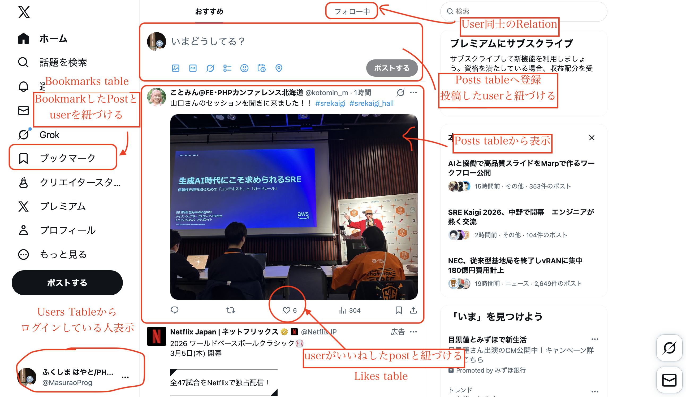
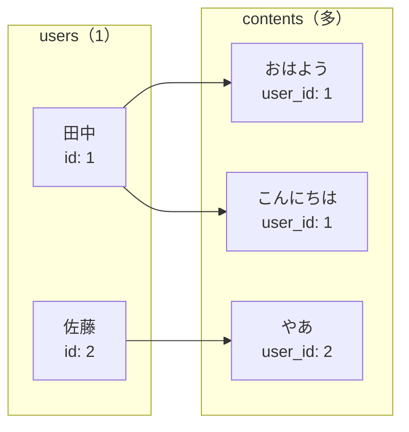
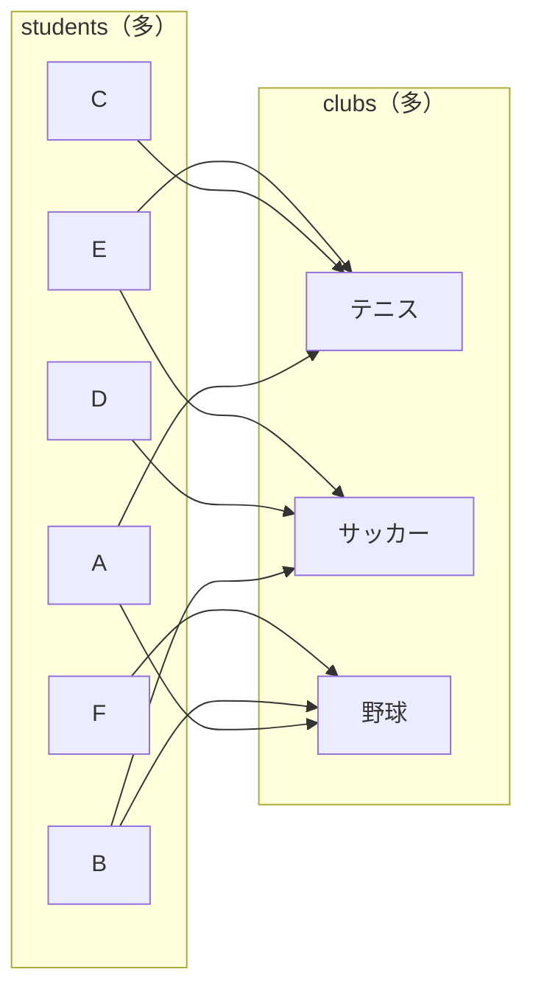

# 015\_gs\_php\_day5

## PHP授業 全5日間の概要

| Day | テーマ | 学ぶこと |
|---|---|---|
| Day1 | PHP基礎 | 変数・配列・関数・ループ、フォーム操作、ファイル保存 |
| Day2 | DB入門 | DB・テーブルの概念、SQL（INSERT/SELECT）、PHPからDB操作（PDO） |
| Day3 | CRUD | 詳細表示・更新（UPDATE）・削除（DELETE）、コードの関数化 |
| Day4 | ログイン機能 | セッション管理、権限による処理の分岐、パスワードのハッシュ化 |
| **Day5** | **DBリレーション** | **テーブルの設計・正規化、JOINで複数テーブルを扱う** |

### 授業資料 <a href="#shou-ye-zi-liao" id="shou-ye-zi-liao"></a>

[資料](https://gitlab.com/gs_hayato/gs-php-01/-/blob/master/PHP05.zip)

## 前回のおさらい

* SESSIONを使ってログイン機能を作った
* ログインチェック処理を関数化した
* パスワードをハッシュ化して保存した

## 今回やること

今日は、複数のテーブルを`JOIN`で結合する方法と、PHPでの画像登録の方法を学びます。

## 本日のタイムライン

| コマ | テーマ | 内容 |
|---|---|---|
| コマ1（50分） | DBリレーションとJOIN | テーブルを分ける理由・正規化 → JOINの書き方 |
| コマ2（50分） | アプリでのリレーション実装 | 現状のアプリを確認 → ログインユーザーidの記録 → 一覧にJOINで投稿者名を表示 |
| コマ3（50分） | 画像アップロード機能・まとめ | フォーム→保存→表示までの一連の実装 → 宿題説明 |

### AIに渡すコンテキスト定型文

AI に質問する前に、毎回以下をチャットに貼り付けてください。これを渡すことで、授業の内容に合ったコードを生成してくれます。

```
【このAIセッションのコンテキスト】
- PHPの授業でXAMPPを使っています
- フレームワークは使わず、素のPHPで書きます
- DBはMySQLで、接続にはPDOを使います（mysql_*やmysqliは使わないでください）
- DB名: gs_db_class5
- テーブル1: users（ログインユーザー）カラム: id(PK,AutoIncrement), lid(varchar), lpw(varchar), name(varchar), kanri_flg(int)
- テーブル2: contents（投稿）カラム: id(PK,AutoIncrement), user_id(int, usersへの外部キー), content(text), image(varchar), created_at(datetime)
- contents.user_id が users.id を参照する1対多の関係です
- コードはシンプルに。初学者向けで、変数名もわかりやすく
- DB接続などの共通処理は、funcs.phpにまとめる方針で進めています（db_conn(), sql_error($stmt), redirect($file_name), loginCheck() が既にある想定）
```

---

## コマ1：DBリレーションとJOIN

### Xampp（またはMAMP）の起動、DB準備

1. Xamppを起動
2. phpMyAdminから、あたらしいDBを作成

```
データベース名：gs_db_class5
```

3. 配布された`gs_db_class5.sql`ファイルをインポートしてデータを作成する
4. 授業用のDBと中身を確認


**重要**: 実際の授業では、具体的なSQLファイル名を確認してください。


### なぜテーブルを分けるのか


**リレーション（関係）とは？** データベースの複数のテーブル間の関係性のことです。例えば「ユーザー」と「投稿」のように、あるテーブルのデータが別のテーブルのデータと関連していることを指します。


RDBは通常複数のテーブルで構成されます。

無関係な情報を1つのテーブルにまとめてしまうと、同じ情報が複数の行に重複して保存されてしまいます（無駄が生じる）。

さらに、重複したデータのうち一部だけを更新してしまうと、行によって内容が食い違う「更新漏れ」が起き、データの不整合につながります。

このような無駄・不整合を避けるために、RDBでは意味のまとまりごとにテーブルを分割します。

**具体例**：ブログシステムの場合

* `users`テーブル: ユーザー情報（id, name など）
* `contents`テーブル: 投稿情報（id, content, user\_id など）

`contents`テーブルの`user_id`が`users`テーブルの`id`を参照することで、「どの投稿を誰が書いたか」を表現できます。


**外部キー（Foreign Key）** 他のテーブルの主キーを参照するカラムのことです。上記例では`contents.user_id`が外部キーとなります。


**テーブル命名の目安**：テーブル名はその中身の**複数形**にする（例：`users`, `students`, `departments`）。名前と関係ない内容は混ぜず、別テーブルに分離する。

<figure><figcaption></figcaption></figure>

### 正規化について触れる


**正規化とは？** データの重複を排除し、整合性を保つためにテーブルを適切に分割・整理する手法のことです。よく使われるのは第1〜第3正規形です。


#### 第１正規系は簡単

<figure><figcaption><p>ミック著 『SQL 第2版 ゼロからはじめるデータベース操作』より引用.</p></figcaption></figure>

**第1正規形のルール**：セルの中に2つ以上の値を入れない。

**悪い例**:

| 名前 | 趣味          |
| -- | ----------- |
| 田中 | 読書、映画鑑賞、ゲーム |

**良い例**:

| 名前 | 趣味   |
| -- | ---- |
| 田中 | 読書   |
| 田中 | 映画鑑賞 |
| 田中 | ゲーム  |

**第2・第3正規形のイメージ**：もし`contents`と`users`を分けずに1つのテーブルにまとめていたら、こうなります。

| id | content | user_id | user_name |
| -- | ------- | ------- | --------- |
| 1  | おはよう    | 1       | 田中        |
| 2  | こんにちは   | 1       | 田中        |
| 3  | やあ      | 2       | 佐藤        |

`user_name`は`user_id`が決まれば自動的に決まる項目（`id`本体には依存していない）なので、田中さんが投稿するたびに「田中」という文字列が重複します。もし田中さんが名前を変更したら、該当する全行を更新しなければなりません。

これを防ぐために`users`テーブルと`contents`テーブルに分割するのが、まさに今日のアプリのテーブル設計です。**今使っている`users`/`contents`の2テーブル構成自体が、正規化した結果の姿**だと捉えてください。


**【AI活用】正規化の考え方をAIに聞いてみよう**

出てきた回答を全体で共有します。

【サンプルプロンプト】
```
PHPの授業でDB設計・正規化を学び始めました。初学者向けにわかりやすく教えてください。

【質問】
以下のように、投稿(content)とユーザー情報(user_name)を1つのテーブルに
まとめてしまった場合、どんな問題が起きますか？
また、これをusersテーブルとcontentsテーブルに分割することは、
第1〜第3正規形のうちどの考え方に当てはまりますか？

id | content  | user_id | user_name
1  | おはよう   | 1       | 田中
2  | こんにちは | 1       | 田中
3  | やあ      | 2       | 佐藤
```



正規化参考サイト : https://oss-db.jp/dojo/dojo_info_04


***

### JOINを使ったテーブル結合

分けたテーブルは`JOIN`で結合して表示することが可能です。

`SELECT * FROM テーブル1 JOIN テーブル2 ON テーブル1のカラム = テーブル2のカラム`

まずは`phpMyAdmin`にて、`employees`テーブルと`departments`テーブルを見てみましょう。`employees`テーブルに部門のidが記載されており、`departments`テーブルにどの部門かが記載されています。この分割のメリットは、部門名が変わったときに`departments`テーブルだけ変えれば済むという点です。

```sql
SELECT
    *
FROM
    employees
JOIN
    departments
    ON employees.dept_id = departments.id;
```


ただの`join`と書いた場合、`inner join`となる。 `join`の違いはざっくりと、 左側のテーブルに必ずデータを含めたい場合 → `LEFT JOIN` 両方のテーブルに一致するデータだけが必要 →`INNER JOIN` 右側のテーブルを基準にデータを取得したい場合 → `RIGHT JOIN` 両方のテーブルのすべてのデータを取得したい場合 → `FULL OUTER JOIN`

※ この授業で使っているMySQL/MariaDBは`FULL OUTER JOIN`をネイティブサポートしていません。同じ結果が欲しい場合は`LEFT JOIN`の結果と`RIGHT JOIN`の結果を`UNION`で組み合わせて代用します。


特定のテーブルのカラムを指定する場合は、`テーブル.カラム`のように指定する。

```sql
SELECT
    employees.id, employees.name, departments.name
FROM
    employees
JOIN
    departments
    ON employees.dept_id = departments.id;
```


**【AI活用】JOINのSQLをAIに書かせてみよう**

【サンプルプロンプト】
```
【コンテキスト】
- MySQLを使っています
- employeesテーブル(id, name, dept_id)、departmentsテーブル(id, name)があります
- employees.dept_id が departments.id を参照しています

【依頼】
両方のテーブルのnameカラムを、それぞれ「社員名」「部署名」として
区別できる形でSELECTするJOIN文を書いてください。
```

生成されたSQLと、上の完成形を見比べてみましょう。（`AS`で別名をつける書き方が出てくるはずです）


`phpMyAdmin`で実行できたら、`contents`テーブルに`user_id int(10)`カラムが追加されていることを確認してください。`user_id`はどの書き込みがどのuserによって記載されたかを表します。

ここまでで、`JOIN`の書き方（`テーブル1 JOIN テーブル2 ON ...`）は`employees`/`departments`でひと通り確認できました。次のコマ2では、この書き方をそのまま`contents`と`users`に当てはめて、PHPの中で使っていきます。

***

## コマ2：アプリでのリレーション実装

### まずはアプリの中身をブラウザで見てみよう

実装に入る前に、配布された今のアプリがどんな状態になっているかを確認しておきましょう。

1. `localhost/gs_code/php05/login.php`をブラウザで開く
2. 以下のテストアカウントでログインする

```
// アカウント情報は、usersテーブルにあります。便宜上PWはハッシュ化していません。

ID: test1
PW: test1
```

3. `index.php`（投稿画面）を確認する。今はテキストを送信するだけのシンプルなフォームで、画像を送る欄はまだない
4. `select.php`（一覧画面）を確認する。今は`content`だけが並んでいて、**誰が投稿したか（投稿者名）も、画像も表示されていない**


`users`テーブルには他に`test2/test2`（一般ユーザー）、`test3/test3`もいます。ログインし直して、`kanri_flg`（管理者フラグ）によって`select.php`の削除ボタンの見え方が変わることも確認しておきましょう。


このあとコマ2・コマ3で、

* `select.php`に投稿者名を表示する（JOIN）
* `index.php`/`insert.php`に画像アップロードを追加する

の2つを実装していきます。今見た「まだできていない状態」がゴールに向かう出発点です。

### データ登録時のログインユーザーidを保存する処理を追加

まずは、`contents`テーブルに書き込みされる際に、どのuserが記載したかを記録するようにしましょう。

処理のイメージは、

1. ログインしたときに、ログインユーザーのIDをセッションに格納する（他のファイルに遷移してもidが使えるようにする）
2. `insert.php`にて、`contents`に`INSERT`するとき、userのidも記録するようにする

`login_act.php`

```php
if ($val !== false) {
    session_regenerate_id(true);
    $_SESSION['chk_ssid'] = session_id();
    $_SESSION['kanri_flg'] = $val['kanri_flg'];
    $_SESSION['user_id'] = $val['id']; // ← 追記
    redirect('select.php');
} else {
    redirect('login.php');
}
```


**【自分で書こう】insert.phpに2行追加してみよう**

既存の`insert.php`に、以下の2箇所を追加してください。

1. ログインユーザーのidをセッションから取得する（`login_act.php`で保存した`$_SESSION['user_id']`を使う）
2. `contents`へのINSERT文に`user_id`を含め、`bindValue`を1行追加する

書けたら、下の完成形と見比べてみましょう。


<details>

<summary>答え（insert.phpの完成形）</summary>

```php
<?php
session_start();
require_once 'funcs.php';
loginCheck();

//1. POSTデータ取得
$content = $_POST['content'];
//ログインユーザーidを取得
$user_id = $_SESSION['user_id']; // ← ⭐️追記

//2. DB接続します
$pdo = db_conn();

//３．データ登録SQL作成
$stmt = $pdo->prepare('INSERT INTO contents(user_id, content, created_at)VALUES(:user_id, :content, NOW());'); // ⭐️user_idへの記録を追加
$stmt->bindValue(':content', $content, PDO::PARAM_STR);
$stmt->bindValue(':user_id', $user_id, PDO::PARAM_INT);  // ⭐️bindValue追加
$status = $stmt->execute(); //実行

// 処理後のリダイレクト
if($status === false) {
    sql_error($stmt);
} else {
    redirect('select.php');
}
?>
```

</details>

上記処理を追加後、
一旦**ログアウト→ログイン**して、
`phpMyAdmin`にて`contents`テーブルの`user_id`カラムに意図したuser\_idが記録されているか確認してください。

### アンケート一覧で投稿者名を横に表示する（リレーション先のデータ取得）


**【AI活用】select.phpのJOINをAIに書かせてみよう**

【サンプルプロンプト】
```
【コンテキスト】
- PHPの授業でXAMPPを使っています
- DBはMySQLで、接続にはPDOを使います
- DB名: gs_db_class5
- contentsテーブル(id, user_id, content, created_at)、
  usersテーブル(id, name) があります
- contents.user_id が users.id を参照しています

【依頼】
contentsの全件を、投稿者名（usersのname）と一緒にJOINで取得したいです。
取得するカラムはcontents.id, contents.content, users.nameで、
それぞれ id, content, name という名前でエイリアスしてください。
$pdo->prepare()を使って、$stmtに代入するPHPのコードとして書いてください
（SQL文だけでなく、$stmt = $pdo->prepare('...'); の形でお願いします）。
```


`select.php`

```php
<?php
session_start();
require_once 'funcs.php';
loginCheck();

//２．データベース登録SQL作成
$pdo = db_conn();
$stmt = $pdo->prepare('SELECT
contents.id as id,
contents.content as content,
users.name as name
FROM contents JOIN users ON contents.user_id = users.id '); // ← JOIN を追加する。
$status = $stmt->execute();
```

`select.php`の表示処理（while文内）

```php
    while ($r = $stmt->fetch(PDO::FETCH_ASSOC)) {
        $view .= '<div class="record"><p>';
        $view .= '<a href="detail.php?id=' . $r["id"] . '">';
        $view .= h($r['id']) . " " . h($r['content']) . " @ " . $r['name']; //$r['name']; 追加
        $view .= '</a>';
        $view .= "　";

        if ($_SESSION['kanri_flg'] == 1) {
            $view .= '<a class="btn btn-danger" href="delete.php?id=' . $r['id'] . '">';
            $view .= '削除';
            $view .= '</a>';
        }
        $view .= '</p></div>';
    }
```

`select.php`をブラウザで開いて、動作を確認しよう！

### 1対多について

上記のように、ユーザ1に対して投稿が複数ある関係性を**1対多**という。


```mermaid
flowchart LR
    subgraph users["users（1）"]
        u1["田中<br>id: 1"]
        u2["佐藤<br>id: 2"]
    end
    subgraph contents["contents（多）"]
        c1["おはよう<br>user_id: 1"]
        c2["こんにちは<br>user_id: 1"]
        c3["やあ<br>user_id: 2"]
    end
    u1 --> c1
    u1 --> c2
    u2 --> c3
```

1人の`user`（田中）が複数の`content`（`user_id`が同じ投稿）を持てる一方、1件の`content`は必ず1人の`user`にしか属さない。この非対称な関係が「1対多」です。

もう一段レベルの高い関係として**多対多**もありますが、これはプラスアルファで扱います。

---

## コマ3：画像アップロード機能・まとめ

### 画像登録処理の方法を知る


**Macの場合の権限設定**

1. Finderで`img`フォルダを右クリック
2. 「情報を見る」を選択
3. 「共有とアクセス権」セクションで「everyone」に「読み/書き」権限を付与
4. 鍵マークをクリックして管理者パスワードを入力して変更を保存



**画像アップロードの仕組み**

1. HTMLフォームで`enctype="multipart/form-data"`を指定
2. PHPで`$_FILES`配列を使って画像データを受け取る
3. サーバー内の指定フォルダに画像ファイルを保存
4. データベースには画像のファイルパスのみを保存


配布ファイルには、

* imgフォルダがある
* DBテーブルにはimageカラムがある

ということを先に認識しておいてください。

### Formの修正

`index.php`の`<form>`に`enctype`追加と、`<input type="file">`の追加をしてください。

```html
<form method="POST" action="insert.php" enctype="multipart/form-data">
    <div class="jumbotron">
        <fieldset>
            <legend>フリーアンケート</legend>
            <div>
                <label for="content">内容：</label>
                <textarea id="content" name="content" rows="4" cols="40"></textarea>
            </div>

            <!-- 以下のdivタグ4行を追加 -->
            <div>
                <label for="image">画像：</label>
                <input type="file" id="image" name="image">
            </div>
            <div>
                <input type="submit" value="送信">
            </div>
        </fieldset>
    </div>
</form>
```

受け取り側の`insert.php`にて、以下`var_dump`して、`$_FILES`の中身を見てみましょう。

```php
echo '<pre>';
var_dump($_FILES);
echo '</pre>';
exit();
```

```
//※ 例
array(1) {
  ["image"]=>  // フォームのname属性の値
  array(6) {
    ["name"]=>      // 元のファイル名
    string(10) "dora_7.png"
    ["type"]=>      // MIMEタイプ
    string(9) "image/png"
    ["tmp_name"]=>  // 一時保存場所
    string(45) "/Applications/XAMPP/xamppfiles/temp/phpAS5lOl"
    ["error"]=>     // エラーコード（0=成功）
    int(0)
    ["size"]=>      // ファイルサイズ（バイト）
    int(102991)  // 約100KB
  }
}
```


**一時ファイルについて**

`$_FILES['image']['tmp_name']`には、サーバーの一時フォルダにアップロードされたファイルのパスが格納されます。この一時ファイルは**PHPスクリプト終了後に自動削除**されるため、`move_uploaded_file()`で永続的な場所に移動する必要があります。


### insert.phpの修正


**【AI活用】画像アップロード処理をAIに書かせてみよう**

【サンプルプロンプト】
```
【コンテキスト】
- PHPの授業でXAMPPを使っています
- これはinsert.phpに追加するコードです。すでに$content = $_POST['content'];と
  $user_id = $_SESSION['user_id'];を取得済みで、このあとDB接続・INSERT処理が続きます
- フォームに<input type="file" name="image">を追加し、
  enctype="multipart/form-data"を設定済みです
- $_FILES['image']でアップロードされたファイル情報を受け取れます

【依頼】
以下の条件で、アップロードされた画像を保存する処理を書いてください。
1. $_FILES['image']が正常にアップロードされているか確認する
2. 元のファイルの拡張子を取得する（pathinfo使用）
3. uniqid()とその拡張子を組み合わせたユニークなファイル名にする
4. 'img/'フォルダの中にmove_uploaded_file()で保存する
5. 保存できたら$imageという変数に'img/ファイル名'を、
   失敗したらエラーメッセージを表示して処理を止める
```

出てきたコードと、下の完成形を見比べてみましょう。


```php
session_start();
require_once 'funcs.php';
loginCheck();

//1. POSTデータ取得
$content = $_POST['content'];
$user_id = $_SESSION['user_id'];

// 画像アップロードの処理
$image = '';
if (isset($_FILES['image']) && $_FILES['image']['error'] === UPLOAD_ERR_OK) {
    // 拡張子確認
    $extension = pathinfo($_FILES['image']['name'], PATHINFO_EXTENSION);

    // ランダムな文字列 + 確認した拡張子を用意
    $new_name = uniqid() . '.' . $extension;

    // 保存する予定のimage_pathを用意
    $image_path = 'img/' . $new_name;

    // Formから送られてきた画像の一時保存先を確認
    $upload_file = $_FILES['image']['tmp_name'];

    // move_uploaded_file()で、一時的に保管されているファイルをimage_pathに移動させる。
    if (move_uploaded_file($upload_file, $image_path)) {
        $image = $image_path;
    } else {
        echo "画像のアップロードに失敗しました。";
        exit();
    }
}
```


**よりよいセキュリティ**

* アップロード可能なファイル形式を制限する（例: 拡張子を`png`のみに制限）
* ファイルサイズの上限を設定する（例: 5MBまで）
* ファイル名にユニークな名前を付けて、同名ファイルの上書きを防ぐ


併せて、SQL部分とバインドバリュー部分も変更しよう。

```php
$stmt = $pdo->prepare('INSERT INTO contents(user_id, content, image, created_at)VALUES(:user_id, :content, :image, NOW());');
$stmt->bindValue(':content', $content, PDO::PARAM_STR);
$stmt->bindValue(':image', $image, PDO::PARAM_STR);
$stmt->bindValue(':user_id', $user_id, PDO::PARAM_INT);
$status = $stmt->execute(); //実行

// 処理後のリダイレクト
if($status === false) {
    sql_error($stmt);
} else {
    redirect('select.php');
}
```

ここまでできたら、`index.php`のフォームから画像を送り、`img`フォルダに画像が格納されることを確認してください。

### 画像の表示

基本的には、DBの`image`カラムに画像の格納先があるので、これを``タグの`src`に記述するだけです。

`detail.php`のform内、`textarea`の`div`と送信ボタンの`div`の間に追加します。

```html
<form method="POST" action="update.php" enctype="multipart/form-data">
    <div class="jumbotron">
        <fieldset>
            <legend>[編集]</legend>
            <div>
                <label for="content">内容：</label>
                <textarea id="content" name="content" rows="4" cols="40"><?= h($row['content']) ?></textarea>
            </div>

            <!-- 以下のPHPブロックを追加 -->
            <?php
            if (!empty($row['image'])) {
                echo '';
            }
            ?>

            <div>
                <input type="submit" value="更新">
                <input type="hidden" name="id" value="<?= $id ?>">
            </div>
        </fieldset>
    </div>
</form>
```

`select.php`

```php
$pdo = db_conn();
$stmt = $pdo->prepare('SELECT
    contents.id as id,
    contents.content as content,
    contents.image as image, -- ← ⭐️追加
    users.name as name
FROM contents JOIN users ON contents.user_id = users.id ');
$status = $stmt->execute();

// 省略

if (!empty($r['image'])) {
    $view .= ''; // ←追加
}
$view .= '</p></div>';
```

これで一覧・詳細の両方で画像が表示できるようになりました。

***

## 【課題】 自由

自由にやっちゃってください。


AIをフル活用してOKです。ただし、生成されたコードの各部分が何をしているか説明できるようにしておいてください。


### Laravelに入門する前に

* MVC入門
  * https://symfony.com/doc/current/introduction/from\_flat\_php\_to\_symfony.html
* デザインを楽にするために：tailwind css

---

## プラスアルファ（早く終わった人向け）

### ① 多対多・中間テーブルを触ってみる

1対多とは別に、**多対多**という関係もあります。例えば「1人の学生が複数の部活に入り、1つの部活に複数の学生が所属する」ような関係です。多対多は、2つのテーブルを直接紐づけることができないため、間に**中間テーブル**を挟んで実現します。


```mermaid
flowchart LR
    subgraph students["students（多）"]
        A["A"]
        B["B"]
        C["C"]
        D["D"]
        E["E"]
        F["F"]
    end
    subgraph clubs["clubs（多）"]
        tennis["テニス"]
        soccer["サッカー"]
        baseball["野球"]
    end
    A --> tennis
    A --> baseball
    B --> soccer
    B --> baseball
    C --> tennis
    D --> soccer
    E --> tennis
    E --> soccer
    F --> baseball
```


**【AI活用】多対多と中間テーブルの必要性をAIに聞いてみよう**

【サンプルプロンプト】
```
PHPの授業でDBのリレーションを学んでいます。初学者向けにわかりやすく教えてください。

【質問】
1対多と多対多の違いを教えてください。
また、多対多の関係を実現するために「中間テーブル」がなぜ必要なのか、
「学生」と「部活動」を例に説明してください。
```


配布した以下のテーブルを`phpMyAdmin`で結合してみましょう。

* `clubs`（部活動）
* `clubs_students`（中間テーブル）
* `students`（学生）

```sql
SELECT
    *
FROM
    clubs
join clubs_students
on clubs.id = clubs_students.clubs_id;
```

```sql
SELECT 
    *
FROM `clubs`
join clubs_students on clubs.id = clubs_students.clubs_id
join students on clubs_students.students_id= students.id;
```

参考：https://techlib.circlearound.co.jp/entries/db-table-many-to-many/

### ② 既存の画像をアップデートする処理を作ってみる

ここまでで「新規登録時の画像アップロード」は実装できました。次は「登録済みデータの画像を更新する」処理にチャレンジしてみましょう。

**処理のイメージ**

* `detail.php`に画像用の`<input type="file">`を追加する
* `update.php`にて、もし更新用の画像が送られてきたら
  * 画像を保存する（insert.phpと同じ要領）
  * `contents`テーブルの`image`カラムを新しいパスに変更する
  * 古い画像ファイルを削除する（`unlink()`を使う）


**【AI活用】画像アップデート処理をAIに相談しながら実装しよう**

【サンプルプロンプト】
```
【コンテキスト】
- PHPの授業でinsert.php（新規登録時の画像アップロード）を作りました
- 今度はupdate.phpで、既存データの画像を更新できるようにしたいです
- contentsテーブルのimageカラムには、現在の画像パス（例: img/xxxx.png）が
  入っています
- 画像の保存方法はinsert.phpと同じです（拡張子取得→uniqid()でリネーム→
  move_uploaded_fileでimg/に保存）

【依頼】
1. フォームから新しい画像が送られてきた場合だけ画像を差し替え、
   送られてこなかった場合は既存のimageカラムの値をそのまま使う、
   というupdate.phpの書き方を教えてください
2. 差し替えが成功した後、古い画像ファイルをサーバーから削除する
   コード（unlink()を使う想定）も教えてください
```

出てきた案を試してみて、「新しい画像を送らなかったときに画像が消えてしまわないか」を必ず確認しましょう。


### ③ AIにコードレビューさせてみる

自分が書いた`insert.php`（画像アップロード部分）をAIに渡して「このコードの改善点を教えて」と聞いてみよう。「拡張子のチェックがない」「ファイルサイズの上限チェックがない」といった指摘が出るはずです。AIのレビューを読んで、採用するかどうか自分で判断してみてください。
