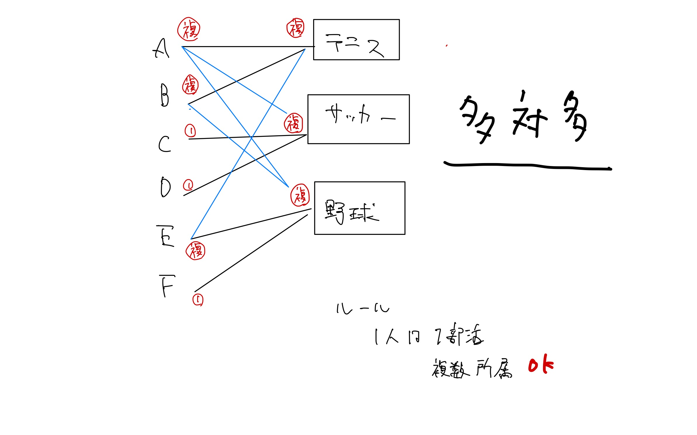

# 015\_gs\_php\_day5

## 目次

1. [資料・前回のおさらい](gs_php_day5.md#id-1-noosarai)
2. [環境準備](gs_php_day5.md#id-2.-huan-jing-zhun-bei)
3. [データベースのリレーション](gs_php_day5.md#id-3-dtabsunorirshon)
4. [JOINを使ったテーブル結合](gs_php_day5.md#id-4-joinwottatburu)
5. [アプリケーションでのリレーション実装](gs_php_day5.md#id-5-apurikshondenorirshon)
6. [画像アップロード機能](gs_php_day5.md#id-6-appurdo)
7. [課題とその他](gs_php_day5.md#id-7-tosono)

***

## 1. 資料・前回のおさらい

### 資料

[資料](https://gitlab.com/gs_hayato/gs-php-01/-/blob/master/PHP05.zip)

### 前回のおさらい

* sessionを学んで、ログインをした。

### 今回やること

もうphpで大体のことができるようになりました。 わからないことはググればわかると思います。

今日は、基礎部分に追加して少し発展的なことを学びます。

内容は、テーブルのJOINと画像登録についてです。

### 今日のゴール

* テーブルを結合する
* PHPにて、画像登録の方法を知る。

***

## 2. 環境準備

### Xampp（またはMAMP）の起動、DB準備

1. Xamppを起動
2. WebStartボタンから起動トップページを表示
3. ページの真ん中MySQLのタブからphpMyAdminのリンクをクリック
4. 起動した画面がMySQLを管理するphpMyAdminの画面が表示されます。
5. データベースタブをクリック
6. データベースを作成から以下の名前で作成

```
データベース名：gs_db_class5
```

1. 作成ボタンをクリック 左側に`gs_db_class5`というデータベースができていると思います。 現在は空っぽです。

### SQLファイルからインポート

配布された`gs_db_class5.sql`ファイルをインポートしてデータを作成します。


**重要**: 実際の授業では、具体的なSQLファイル名を確認してください。


1. 念の為、左側のメニューから`gs_db_class5`をクリック
2. `gs_db_class5`を選択した状態でインポートタブをクリック
3. 「ファイルを選択」から`gs_db_class5.sql`を選択
4. 「実行」ボタンをクリック
5. 授業用のDBと中身を確認

DBの中身も確認しておいてください。

### 今日のやることのイメージ

画像登録の方法を知る。 Laravel学習に向けて準備をする。

***

## 3. データベースのリレーション

### リレーションとは？


**リレーション（関係）とは？** リレーションとは、データベースの複数のテーブル間の関係性のことです。例えば、「ユーザー」と「投稿」のように、あるテーブルのデータが別のテーブルのデータと関連していることを指します。


RDBは通常複数のテーブルで構成されます。

**なぜテーブルを分ける必要があるのか？**

* テーブルが少ないと、とある情報が複数のテーブルに存在してしまい無駄が生じる（データの重複）
* テーブルが少ないと、データの不整合が起きる可能性あり

**具体例で理解しよう** 例：ブログシステムの場合

* `users`テーブル: ユーザー情報（id, name, email など）
* `posts`テーブル: 投稿情報（id, title, content, user\_id など）

`posts`テーブルの`user_id`が`users`テーブルの`id`を参照することで、「どのユーザーがどの投稿を書いたか」という関係性を表現できます。


**外部キー（Foreign Key）** 他のテーブルの主キーを参照するカラムのことです。上記例では`posts.user_id`が外部キーとなります。


### テーブルを作る時の超ざっくり目安

大きな項目のテーブルを作成、その内容を示すものを複数形にして命名する。

**命名例:**

* 例えば、学生についての塊を作りたいなら`students`テーブル
* 例えば、会社の社員が所属する部門の塊なら`departments`テーブル
* 例えば、駅の塊なら`stations`テーブル

**分離の原則:** このように名前をつけたら、名前とは関係ない内容はテーブルに格納せず分離する。

❌ **悪い例**: `students`テーブルに先生の情報も混ぜる ✅ **良い例**: 先生のデータは`teachers`テーブルを別途作成


**テーブル命名のルール** テーブルの名前は、その中身を示すものの複数形にする。これにより、そのテーブルが何のデータを格納しているかが明確になります。


### 正規化について触れる


**正規化とは？** データベースの設計において、データの重複を排除し、データの整合性を保つためにテーブルを適切に分割・整理する手法のことです。


**正規化のメリット:**

* 複数のテーブルに綺麗にデータがそろえば使いやすくなる
* データの重複が減り、ストレージ容量を節約できる
* データの更新時に一箇所を変更すれば済む

**正規化が不十分な場合:**

* テーブルがぐちゃぐちゃだと使いづらくなる
* 同じ情報が複数箇所に存在し、更新漏れが発生する可能性

こういったぐちゃぐちゃしたテーブルを綺麗にすることを正規化と呼ぶ。


**正規化のレベル** 正規化は、第１〜第５正規系がよく知られる。特に実務でよく利用するのは、第1〜第3正規系です。


#### 第１正規系は簡単

<figure><figcaption><p>ミック著 『SQL 第2版 ゼロからはじめるデータベース操作』より引用.</p></figcaption></figure>

**第1正規形のルール**: セルの中に２つ以上の値を入れない。

**悪い例**:

| 名前 | 趣味          |
| -- | ----------- |
| 田中 | 読書、映画鑑賞、ゲーム |

**良い例**:

| 名前 | 趣味   |
| -- | ---- |
| 田中 | 読書   |
| 田中 | 映画鑑賞 |
| 田中 | ゲーム  |

#### 正規化の実践例：学生管理システム

以下の段階的な例で、正規化のプロセスを理解しましょう。

**❌ 正規化前（非正規形）のテーブル**

| 学生ID | 学生名  | 住所      | 履修科目     | 科目担当者          | 科目担当者電話                                | 成績    |
| ---- | ---- | ------- | -------- | -------------- | -------------------------------------- | ----- |
| 001  | 田中太郎 | 東京都渋谷区  | 数学、英語、物理 | 山田先生、佐藤先生、鈴木先生 | 03-1234-5678、03-2345-6789、03-3456-7890 | A、B、C |
| 002  | 佐藤花子 | 神奈川県横浜市 | 数学、化学    | 山田先生、田中先生      | 03-1234-5678、03-4567-8901              | B、A   |

このテーブルには複数の問題があります：

* 1つのセルに複数の値が入っている
* データの重複（山田先生の情報が複数回出現）
* 部分関数従属性（科目担当者電話は科目担当者に依存）

**✅ 第1正規形：1つのセルに1つの値のみ**

| 学生ID | 学生名  | 住所      | 履修科目 | 科目担当者 | 科目担当者電話      | 成績 |
| ---- | ---- | ------- | ---- | ----- | ------------ | -- |
| 001  | 田中太郎 | 東京都渋谷区  | 数学   | 山田先生  | 03-1234-5678 | A  |
| 001  | 田中太郎 | 東京都渋谷区  | 英語   | 佐藤先生  | 03-2345-6789 | B  |
| 001  | 田中太郎 | 東京都渋谷区  | 物理   | 鈴木先生  | 03-3456-7890 | C  |
| 002  | 佐藤花子 | 神奈川県横浜市 | 数学   | 山田先生  | 03-1234-5678 | B  |
| 002  | 佐藤花子 | 神奈川県横浜市 | 化学   | 田中先生  | 03-4567-8901 | A  |

**✅ 第2正規形：部分関数従属性を排除**


**部分関数従属性とは？** 複合主キー（複数のカラムからなる主キー）の一部にのみ依存している属性のことです。

**例**: `(学生ID, 科目名)`が複合主キーの場合

* `学生名`は`学生ID`にのみ依存 → 部分関数従属性
* `成績`は`(学生ID, 科目名)`の両方に依存 → 完全関数従属性

**問題点**: 学生名が複数の行に重複して保存される


**studentsテーブル**（学生情報）

| 学生ID | 学生名  | 住所      |
| ---- | ---- | ------- |
| 001  | 田中太郎 | 東京都渋谷区  |
| 002  | 佐藤花子 | 神奈川県横浜市 |

**subjectsテーブル**（科目情報）

| 科目名 | 科目担当者 | 科目担当者電話      |
| --- | ----- | ------------ |
| 数学  | 山田先生  | 03-1234-5678 |
| 英語  | 佐藤先生  | 03-2345-6789 |
| 物理  | 鈴木先生  | 03-3456-7890 |
| 化学  | 田中先生  | 03-4567-8901 |

**enrollmentsテーブル**（履修情報）

| 学生ID | 科目名 | 成績 |
| ---- | --- | -- |
| 001  | 数学  | A  |
| 001  | 英語  | B  |
| 001  | 物理  | C  |
| 002  | 数学  | B  |
| 002  | 化学  | A  |

**✅ 第3正規形：推移関数従属性を排除**


**推移関数従属性とは？** 主キーではない属性（非キー属性）が、他の非キー属性に依存している状態のことです。

**例**: `科目担当者電話`は`科目担当者`に依存している

* `科目名` → `科目担当者` → `科目担当者電話`
* この間接的な依存関係が推移関数従属性

**問題点**:

* 担当者が変わると電話番号も変更が必要
* 同じ担当者の電話番号が複数箇所に重複


科目担当者電話は科目担当者に依存するため、さらに分割します。

**studentsテーブル**（学生情報）

| 学生ID | 学生名  | 住所      |
| ---- | ---- | ------- |
| 001  | 田中太郎 | 東京都渋谷区  |
| 002  | 佐藤花子 | 神奈川県横浜市 |

**teachersテーブル**（教師情報）

| 教師ID | 教師名  | 電話番号         |
| ---- | ---- | ------------ |
| T001 | 山田先生 | 03-1234-5678 |
| T002 | 佐藤先生 | 03-2345-6789 |
| T003 | 鈴木先生 | 03-3456-7890 |
| T004 | 田中先生 | 03-4567-8901 |

**subjectsテーブル**（科目情報）

| 科目名 | 教師ID |
| --- | ---- |
| 数学  | T001 |
| 英語  | T002 |
| 物理  | T003 |
| 化学  | T004 |

**enrollmentsテーブル**（履修情報）

| 学生ID | 科目名 | 成績 |
| ---- | --- | -- |
| 001  | 数学  | A  |
| 001  | 英語  | B  |
| 001  | 物理  | C  |
| 002  | 数学  | B  |
| 002  | 化学  | A  |


**正規化のメリット**

* **データの重複排除**: 同じ情報を複数箇所に保存する必要がない
* **データの整合性**: 教師の電話番号を変更する場合、teachersテーブルの1箇所だけ変更すれば済む
* **ストレージ効率**: 無駄なデータ重複がないため、容量を節約できる
* **保守性向上**: テーブル構造が明確で、データの管理が容易



**関数従属性のまとめ**

**完全関数従属性**: 主キー全体に依存する属性

* 例: `(学生ID, 科目名)` → `成績`

**部分関数従属性**: 複合主キーの一部にのみ依存する属性（第2正規形で排除）

* 例: `学生ID` → `学生名`

**推移関数従属性**: 非キー属性が他の非キー属性に依存（第3正規形で排除）

* 例: `科目担当者` → `科目担当者電話`



**正規化のまとめ** 正規化とは、後で利用しやすくするために中身を綺麗にして、テーブルも綺麗に分割する方法です。


正規化参考サイト : https://oss-db.jp/dojo/dojo\_info\_04

***

## 4. JOINを使ったテーブル結合

### 複数のテーブルを扱ってみる。

#### 複数に分けたテーブルを一つのものとして扱う。

RDBにおいて、分けたテーブルは結合して表示することが可能。

そのときに利用するのが `JOIN`

`SELECT * FROM テーブル1 JOIN テーブル2 ON テーブル1のカラム = テーブル2のカラム`

まずは、`phpmyadmin`にて、

* employeesテーブル
* departmentsテーブル を見てみよう。

employeesテーブルに、部門のidが記載されています。 departmentsテーブルに、どの部門かが記載されています。

この分割のメリットは、部門名が変わったときにdepartmentsテーブルを変えればそれで済むという点です。

さて、 employeesテーブルとdepartmentsを結合してみましょう。

sqlで以下のように実行してください。

sqlの内容としては、

* まずemployeesテーブルを取得して、
* そのemployeesテーブルに対して、departmentsテーブルを結合する ということをしています。

```sql
SELECT
    *
FROM
    employees
JOIN
    departments
    ON employees.dept_id = departments.id;
```


ただの`join`と書いた場合、`inner join`となる。 `join`の違いはざっくりと、 左側のテーブルに必ずデータを含めたい場合 → `LEFT JOIN` 両方のテーブルに一致するデータだけが必要 →`INNER JOIN` 右側のテーブルを基準にデータを取得したい場合 → `RIGHT JOIN` 両方のテーブルのすべてのデータを取得したい場合 → `FULL OUTER JOIN`


特定のテーブルのカラムを指定する場合は、`テーブル.カラム`のように指定する。

```sql
SELECT
    employees.id, employees.name, departments.name
FROM
    employees
JOIN
    departments
    ON employees.dept_id = departments.id;
```

#### アプリケーションで動きを知る。

contentsテーブルに `user_id int(10)`カラムを追加されているので確認してください。

※ 事前に登録済みのデータのuser\_idは任意の数字に変更してあります。

`user_id`はどのユーザかを表しています。 すなわち、どの書き込みがどのuserによって記載されたかがわかります。

***

## 5. アプリケーションでのリレーション実装

### データ登録時のログインユーザーidを保存する処理を追加

まずは、contentsテーブルに書き込みされる際に、どのuserが記載したかを記録するようにしましょう。


**セッションとは？** セッションは、ユーザーがWebサイトを訪問している間、サーバー側でユーザー情報を一時的に保存する仕組みです。ログイン状態を維持したり、ページ間でデータを共有したりするために使用します。


処理のイメージは、

1. ログインしたときに、ログインユーザーのIDをセッションに格納。(他のファイルに遷移してもidが使えるようにする。)
2. `insert.php`にて、`contents`に`INSERT`するとき、userのidも記録するようにする。

`login_act.php`

```php
if($val['id'] !== '') {
    $_SESSION['chk_ssid'] = session_id();
    $_SESSION['kanri_flg'] = $val['kanri_flg'];
    $_SESSION['user_name'] = $val['name'];
    $_SESSION['user_id'] = $val['id']; // ← 追記
    header('Location: select.php');
} else {
```

`insert.php`

```php
<?php
session_start();
require_once 'funcs.php';
loginCheck();

//1. POSTデータ取得
$content = $_POST['content'];
//ログインユーザーidを取得
$user_id = $_SESSION['user_id']; // ← 追記

//2. DB接続します
$pdo = db_conn();

//３．データ登録SQL作成
$stmt = $pdo->prepare('INSERT INTO contents(user_id, content, created_at)VALUES(:user_id, :content, NOW());'); // user_idへの記録を追加
$stmt->bindValue(':content', $content, PDO::PARAM_STR);
$stmt->bindValue(':user_id', $user_id, PDO::PARAM_INT);  // bindValue追加
$status = $stmt->execute(); //実行

// 処理後のリダイレクト
if($status === false) {
    sql_error($stmt);
} else {
    redirect('select.php');
}
?>
```

#### 実際に登録してみる

上記処理を追加後、一旦ログアウト → ログイン

※ `PHPMyAdmin`にてcontentsテーブルのレコードのuser\_idカラムに意図したuser\_idが記録されているか確認する。

### アンケート一覧で投稿者名を横に表示する（リレーション先のデータ取得）

`select.php`

```php
<?php
session_start();
require_once 'funcs.php';
loginCheck();

//２．データベース登録SQL作成
$pdo = db_conn();
$stmt = $pdo->prepare('SELECT
contents.id as id,
contents.content as content,
users.name as name
FROM contents JOIN users ON contents.user_id = users.id '); // ← JOIN を追加する。
$status = $stmt->execute();
```

#### select.phpに表示処理のwhile文内を編集

```php
    while ($r = $stmt->fetch(PDO::FETCH_ASSOC)) {
        $view .= '<div class="record"><p>';
        $view .= '<a href="detail.php?id=' . $r["id"] . '">';
        $view .= h($r['id']) . " " . h($r['content']) . " @ " . $r['name']; //$r['name']; 追加
        $view .= '</a>';
        $view .= "　";

        if ($_SESSION['kanri_flg'] === 1) {
            $view .= '<a class="btn btn-danger" href="delete.php?id=' . $r['id'] . '">';
            $view .= '削除';
            $view .= '</a>';
        }
        $view .= '</p></div>';
    }
```

`select.php`をブラウザで開いて、動作を確認しよう！

### 多対多について

上記のように、ユーザ1に対して、つぶやき複数のような関係性を1対多という。

<figure><figcaption><p>1対多</p></figcaption></figure>

<figure><figcaption><p>多対多</p></figcaption></figure>

https://techlib.circlearound.co.jp/entries/db-table-many-to-many/ https://techlib.circlearound.co.jp/entries/rdb

### 時間あれば実際に中間テーブルやってみよう

配布した以下のテーブルをphpMyAdminで結合してみる。 clubs clubs\_students students

```sql
SELECT
    *
FROM
    clubs
join clubs_students
on clubs.id = clubs_students.clubs_id;
```

```sql
SELECT 
    *
FROM `clubs`
join clubs_students on clubs.id = clubs_students.clubs_id
join students on clubs_students.students_id= students.id;
```

***

## 6. 画像アップロード機能

### 画像登録処理の方法を知る。


**Macの場合の権限設定**

1. Finderで`img`フォルダを右クリック
2. 「情報を見る」を選択
3. 「共有とアクセス権」セクションで「everyone」に「読み/書き」権限を付与
4. 鍵マークをクリックして管理者パスワードを入力して変更を保存



**画像アップロードの仕組み**

1. HTMLフォームで`enctype="multipart/form-data"`を指定
2. PHPで`$_FILES`配列を使って画像データを受け取る
3. サーバー内の指定フォルダに画像ファイルを保存
4. データベースには画像のファイルパスのみを保存


画像登録処理の流れは、

* formで画像を受け取る
* サーバー内のフォルダにその画像を保存
* DBには、保存先ディレクトリ名＋ファイル名を保存しておく。

配布ファイルには、

* imgファイルがある
* DBテーブルにはimageカラムがある ということを先に認識しておいてください。

### Formの修正

`index.php`の`<form>`に`enctype`追加と、`<input type="file">`の追加をしてください。

```html
<form method="POST" action="insert.php" enctype="multipart/form-data">
    <div class="jumbotron">
        <fieldset>
            <legend>フリーアンケート</legend>
            <div>
                <label for="content">内容：</label>
                <textarea id="content" name="content" rows="4" cols="40"></textarea>
            </div>

            <!-- 以下のdivタグ4行を追加 -->
            <div>
                <label for="image">画像：</label>
                <input type="file" id="image" name="image">
            </div>
            <div>
                <input type="submit" value="送信">
            </div>
        </fieldset>
    </div>
</form>
```

### `insert.php`の修正

`form`を受け取る`insert.php`も修正します。

画像は、`$_FILES`という特別な配列で受け取れます。

以下のような処理を記載して、画像を保存しましょう。

```php
session_start();
require_once 'funcs.php';
loginCheck();

//1. POSTデータ取得
$content = $_POST['content'];
$user_id = $_SESSION['user_id']; 

// 画像アップロードの処理をここら辺に追加
$image = '';
if (isset($_FILES['image']) && $_FILES['image']['error'] === UPLOAD_ERR_OK) {
    // アップロードする画像をリネームする準備
    $upload_file = $_FILES['image']['tmp_name'];
    $extension = pathinfo($_FILES['image']['name'], PATHINFO_EXTENSION);
    $new_name = uniqid() . '.' . $extension;

    // image_pathを確認
    $image_path = 'img/' . $new_name;

    // move_uploaded_file()で、一時的に保管されているファイルをimage_pathに移動させる。
    if (move_uploaded_file($upload_file, $image_path)) {
        $image = $image_path;
    } else {
        // ファイル移動に失敗した場合のエラーハンドリング
        echo "画像のアップロードに失敗しました。";
        exit();
    }
}
```


**セキュリティ注意点**

* アップロード可能なファイル形式を制限する
* ファイルサイズの上限を設定する
* ファイル名にユニークな名前を付けることで、同名ファイルの上書きを防ぐ


\`\`\`

併せて、SQL部分とバインドバリュー部分も変更しよう。

```php
$stmt = $pdo->prepare('INSERT INTO contents(user_id, content, image, created_at)VALUES(:user_id, :content, :image, NOW());');
$stmt->bindValue(':content', $content, PDO::PARAM_STR);
$stmt->bindValue(':image', $image, PDO::PARAM_STR);
$stmt->bindValue(':user_id', $user_id, PDO::PARAM_INT);
$status = $stmt->execute(); //実行

// 処理後のリダイレクト
if($status === false) {
    sql_error($stmt);
} else {
    redirect('select.php');
}
```

ここまでできたら、一旦`index.php`のフォームから画像を送り、imgフォルダに画像が格納されることを確認してください。

### 画像の表示01

`detail.php`にて登録した画像を表示してみましょう。

\{% hint style="info" %\}

**画像表示の仕組み**

1. データベースから画像のファイルパスを取得
2. HTMLの``タグの`src`属性にファイルパスを設定
3. ブラウザが指定されたパスから画像を読み込んで表示

\{% endhint %\}

基本的には、DBのimageカラムに画像の格納先があるので、これを``タグのsrcに記述するだけです。

```html
<form method="POST" action="update.php" enctype="multipart/form-data">

    <!-- 省略 -->

            <div>
                <label for="content">内容：</label>
                <textarea id="content" name="content" rows="4" cols="40"><?= h($row['content']) ?></textarea>
            </div>

            <!-- 以下追記 -->
            <?php
            if (!empty($row['image'])) {
                echo '';
            }
            ?>
            <div>
                <input type="submit" value="更新">
                <input type="hidden" name="id" value="<?= $id ?>">
            </div>
        </fieldset>
    </div>
</form>
```

これで画像が表示できた。

### 画像の表示02

`select.php`にも表示させる。

```php
$pdo = db_conn();
$stmt = $pdo->prepare('SELECT
    contents.id as id,
    contents.content as content,
    contents.image as image, // ←追加
    users.name as name
FROM contents JOIN users ON contents.user_id = users.id ');
$status = $stmt->execute();

// 省略

if (!empty($r['image'])) {
    $view .= ''; // ←追加
}
$view .= '</p></div>';
```

これで画像が表示できた。

#### 発展

ここまでできたら既存の画像をアップデートする処理も必要です。 チャレンジしてみましょう。

***

## 7. 課題とその他

### その他

#### デザインを楽にするために

* tailwind css

#### Laravelに入門する前に

* MVC入門
  * https://symfony.com/doc/current/introduction/from\_flat\_php\_to\_symfony.html

### 【課題】 自由

自由にやっちゃってください。
