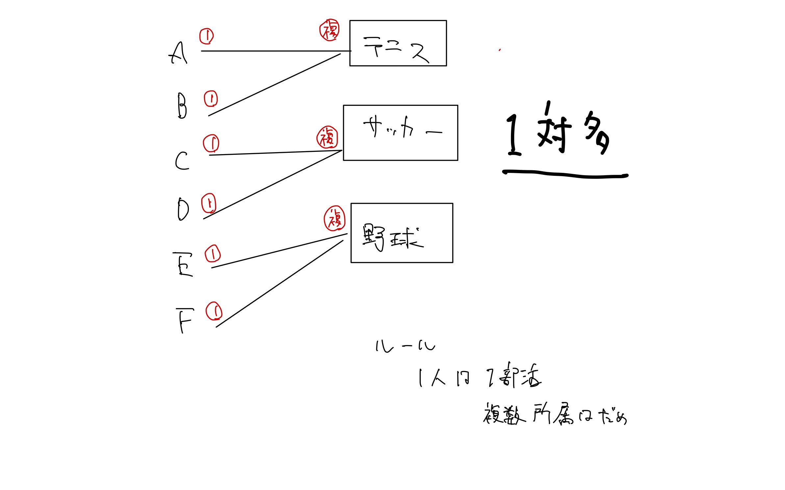

# 🤡 015\_gs\_php\_day5

## 資料

[資料](https://gitlab.com/gs\_hayato/gs-php-01/-/blob/master/PHP05.zip)

## 前回のおさらい

* sessionを学んで、ログインをした。

## 今回やること

もうphpで大体のことができるようになりました。 わからないことはググればわかると思います。

今日は、基礎部分に追加して少し発展的なことを学びます。

内容は、テーブルのJOINと画像登録についてです。

## MAMPの起動、DB準備

1. MAMPを起動
2. WebStartボタンから起動トップページを表示
3. ページの真ん中MySQLのタブからphpMyAdminのリンクをクリック
4. 起動した画面がMySQLを管理するphpMyAdminの画面が表示されます。
5. データベースタブをクリック
6. データベースを作成から以下の名前で作成

```
データベース名：gs_db_class5
```

1. 作成ボタンをクリック 左側に`gs_db_class5`というデータベースができていると思います。 現在は空っぽです。

## SQLファイルからインポート

〇〇.sqlというSQLファイルをインポートしてデータを作成します。

1. 念の為、左側のメニューから`gs_db_class5`をクリック
2. `gs_db_class5`を選択した状態でインポートタブをクリック
3. sqlファイルをインポート
4. 実行してみる
5. 授業用のDBと中身を確認

DBの中身も確認しておいてください。

## 今日のやることのイメージ

画像登録の方法を知る。 Laravel学習に向けて準備をする。

## 今日のゴール

* テーブルを結合する
* PHPにて、画像登録の方法を知る。

### リレーションとは？

RDBは通常複数のテーブルで構成されます。

* テーブルが少ないと、とある情報が複数のテーブルに存在してしまい無駄が生じる
* テーブルが少ないと、データの不整合が起きる可能性あり

### テーブルを作る時の超ざっくり目安

大きな項目のテーブルを作成、その内容を示すものを複数形にして命名する。

例.
- 例えば、学生についての塊を作りないなら`students`テーブル
- 例えば、会社の社員が所属する部門の塊なら`dept`テーブル
- 例えば、駅の塊なら`stations`テーブル

※ このように名前をつけたら、名前とは関係ない内容はテーブルに格納せず分離する。
例えば、先生の名前のデータを`students`テーブルに入れない。先生のデータを入れるのであれば`teachers`テーブルを作る。


テーブルの名前は、その中身を示すものの複数形にする。


### 正規化について触れる

* 複数のテーブルに綺麗にデータがそろえば使いやすくなる。
* 一方でテーブルがぐちゃぐちゃだと使いづらくなる。
* こういったぐちゃぐちゃしたテーブルを綺麗にすることを正規化と呼ぶ。


正規化は、第１〜第５正規系がよく知られる。 特に利用するのは、第１〜第3正規系


#### 第１正規系は簡単

<figure><figcaption><p>ミック著 『SQL 第2版 ゼロからはじめるデータベース操作』より引用.</p></figcaption></figure>

セルの中に２つ以上入れない。


正規化について超ざっくり言うと、
- 後で利用しやすくするために中身を綺麗にして、
- テーブルも綺麗に分割する方法
である。

ただし、正規化について扱うと死ぬほど時間が必要なので割愛。
参考サイト : https://oss-db.jp/dojo/dojo_info_04

### 複数のテーブルを扱ってみる。

#### 複数に分けたテーブルを一つのものとして扱う。

RDBにおいて、分けたテーブルは結合して表示することが可能。

そのときに利用するのが `JOIN`

`SELECT * FROM テーブル1 JOIN テーブル2 ON テーブル1のカラム = テーブル2のカラム`

まずは、`phpmyadmin`にて、
- employeesテーブル
- departmentsテーブル
を見てみよう。

employeesテーブルに、部門のidが記載されています。
departmentsテーブルに、どの部門かが記載されています。

この分割のメリットは、部門名が変わったときにdepartmentsテーブルを変えればそれで住むという点です。


さて、
employeesテーブルとdepartmentsを結合してみましょう。


sqlで以下のように実行してください。

sqlの内容としては、
- まずemployeesテーブルを取得して、
- そのemployeesテーブルに対して、departmentsテーブルを結合する
ということをしています。

```sql
SELECT
    *
FROM
    employees
join
    departments
    on employees.dept_id = departments.id;
```


ただの`join`と書いた場合、`innner join`となる。
`join`の違いはざっくりと、
左側のテーブルに必ずデータを含めたい場合 → `LEFT JOIN`
両方のテーブルに一致するデータだけが必要 →`INNER JOIN`
右側のテーブルを基準にデータを取得したい場合 → `RIGHT JOIN`
両方のテーブルのすべてのデータを取得したい場合 → `FULL OUTER JOIN`



特定のテーブルのカラムを提示する場合は、`テーブル.カラム`のように指定する。

```
SELECT
    employees.id, employees.name, departments.name
FROM
    employees
join
    departments
    on employees.dept_id = departments.id;
```

#### アプリケーションで動きを知る。

contentsテーブルに `user_id int(10)`カラムを追加されているので確認してください。

※ 事前に登録済みのデータのuser\_idは任意の数字に変更してあります。

`user_id`はどのユーザかを表しています。
すなわち、どの書き込みがどのuserによって記載されたかがわかります。

#### データ登録時のログインユーザーidを保存する処理を追加

まずは、contentsテーブルに書き込みされる際に、どのuserが記載したかを記録するようにしましょう。

処理のイメージは、
1. ログインしたときに、ログインユーザーのIDをセッションに格納。(他のファイルに遷移してもidが使えるようにする。)
2. `insert.php`にて、`contents`に`INSERT`するとき、userのidも記録するようにする。

`login_act.php`

```php
if($val['id'] !== '') {
    $_SESSION['chk_ssid'] = session_id();
    $_SESSION['kanri_flg'] = $val['kanri_flg'];
    $_SESSION['user_name'] = $val['name'];
    $_SESSION['user_id'] = $val['id']; // ← 追記
    header('Location: select.php');
} else {
```

`insert.php`

```php
<?php

//1. POSTデータ取得
$content = $_POST['content'];
//ログインユーザーidを取得
$user_id = $_SESSION['user_id']; // ← 追記

//2. DB接続します
$pdo = db_conn();

//３．つぶやき登録SQL作成
$stmt = $pdo->prepare('INSERT INTO contents(user_id, content, created_at)VALUES(:user_id, :content, NOW());'); // user_idへの記録を追加
$stmt->bindValue(':content', $content, PDO::PARAM_STR);
$stmt->bindValue(':user_id', $user_id, PDO::PARAM_INT);  // bindValue追加
```

#### 実際に登録してみる

上記処理を追加後、一旦ログアウト → ログイン

※ `PHPMyAdmin`にてuser1,2,3それぞれにログインして、2〜3個データを登録する。

### アンケート一覧で投稿者名を横に表示する（リレーション先のデータ取得）

`select.php`

```php
<?php
session_start();
require_once 'funcs.php';
loginCheck();

//２．つぶやき登録SQL作成
$pdo = db_conn();
$stmt = $pdo->prepare('SELECT
contents.id as id,
contents.content as content,
users.name as name
FROM contents JOIN users ON contents.user_id = users.id '); // ← JOIN を追加する。
$status = $stmt->execute();
```

#### select.phpに表示処理のwhile文内を編集

```php
    while ($r = $stmt->fetch(PDO::FETCH_ASSOC)) {
        $view .= '<div class="record"><p>';
        $view .= '<a href="detail.php?id=' . $r["id"] . '">';
        $view .= h($r['id']) . " " . h($r['content']) . " @ " . $r['name']; //$r['name']; 追加
        $view .= '</a>';
        $view .= "　";

        if ($_SESSION['kanri_flg'] === 1) {
            $view .= '<a class="btn btn-danger" href="delete.php?id=' . $r['id'] . '">';
            $view .= '削除';
            $view .= '</a>';
        }
        $view .= '</p></div>';
    }
```


`select.php`をブラウザで開いて、動作を確認しよう！

---

#### 多対多について

上記のように、ユーザ1に対して、つぶやき複数のような関係性を1対多という。
<figure><figcaption><p>1対多</p></figcaption></figure>

<figure><figcaption><p>多対多</p></figcaption></figure>

https://techlib.circlearound.co.jp/entries/db-table-many-to-many/ https://techlib.circlearound.co.jp/entries/rdb

#### 時間あれば実際に中間テーブルやってみよう

配布した以下のテーブルをphpMyAdminで結合してみる。 clubs clubs\_students students

```sql
SELECT * FROM clubs join clubs_students on clubs.id = clubs_students.clubs_id;
```

```sql
SELECT * FROM `clubs` join clubs_students on clubs.id = clubs_students.clubs_id join students on clubs_students.students_id= students.id;
```

### 画像登録処理の方法を知る。


Macの人は、共有資料内のimgフォルダに対して、共有とアクセス権の付与をしてください。


画像登録処理の流れは、

* formで画像を受け取る
* サーバー内のフォルダにその画像を保存
* DBには、保存先ディレクトリ名＋ファイル名を保存しておく。

配布ファイルには、

* imgファイルがある
* DBテーブルにはimageカラムがある ということを先に認識しておいてください。

## Formの修正

`index.php`の`<form>`に`enctype`追加と、`<input type="file">`の追加をしてください。

```html
<form method="POST" action="insert.php" enctype="multipart/form-data">
    <div class="jumbotron">
        <fieldset>
            <legend>フリーアンケート</legend>
            <div>
                <label for="content">内容：</label>
                <textarea id="content" name="content" rows="4" cols="40"></textarea>
            </div>

            <!-- 以下のdivタグ4行を追加 -->
            <div>
                <label for="image">画像：</label>
                <input type="file" id="image" name="image">
            </div>
            <div>
                <input type="submit" value="送信">
            </div>
        </fieldset>
    </div>
</form>
```

### `insert.php`の修正

`form`を受け取る`insert.php`も修正します。

画像は、`$_FILES`という特別な配列で受け取れます。

以下のような処理を記載して、画像を保存しましょう。

```php
session_start();
require_once 'funcs.php';
loginCheck();

//1. POSTつぶやき取得
$content = $_POST['content'];
$user_id = $_SESSION['user_id']; 

// 画像アップロードの処理をここら辺に追加
$image = '';
if (isset($_FILES['image'])) {
    // アップロードする画像をリネームする準備
    $upload_file = $_FILES['image']['tmp_name'];
    $extension = pathinfo($_FILES['image']['name'], PATHINFO_EXTENSION);
    $new_name = uniqid() . '.' . $extension;

    // image_pathを確認
    $image_path = 'img/' . $new_name;

    // move_uploaded_file()で、一時的に保管されているファイルをimage_pathに移動させる。
    if (move_uploaded_file($upload_file, $image_path)) {
        $image = $image_path;
    }
}
```

併せて、SQL部分とバインドバリュー部分も変更しよう。

```php
$stmt = $pdo->prepare('INSERT INTO contents(user_id, content, image, created_at)VALUES(:user_id, :content, :image, NOW());'); // user_idへの記録を追加
$stmt->bindValue(':content', $content, PDO::PARAM_STR);
$stmt->bindValue(':image', $image, PDO::PARAM_STR);
$stmt->bindValue(':user_id', $user_id, PDO::PARAM_INT);
$status = $stmt->execute(); //実行
```

ここまでできたら、一旦`index.php`のフォームから画像を送り、imgフォルダに画像が格納されることを確認してください。

### 画像の表示01

`detail.php`にて登録した画像を表示してみましょう。 基本的には、DBのimageカラムに画像の格納先があるので、これをのsrcに記述するだけです。

```html
<form method="POST" action="update.php" enctype="multipart/form-data">

    <!-- # 省略 -->

            <div>
                <label for="content">内容：</label>
                <textarea id="content" name="content" rows="4" cols="40"><?= h($row['content']) ?></textarea>
            </div>

            <!-- 以下追記 -->
            <?php
            if (!empty($row['image'])) {
                echo '';
            }
            ?>
            <div>
                <label for="new_image">新しい画像を追加する場合は以下から登録：</label>
                <input type="file" id="new_image" name="new_image">
            </div>
            <div>
                <input type="submit" value="更新">
                <input type="hidden" name="id" value="<?= $id ?>">
            </div>
        </fieldset>
    </div>
</form>
```

### 画像の表示01

`select.php`にも表示させる。

```php
$pdo = db_conn();
$stmt = $pdo->prepare('SELECT
contents.id as id,
contents.content as content,
contents.image as image, // ←追加
users.name as name
FROM contents JOIN users ON contents.user_id = users.id '); // ← sqlを変更する。
$status = $stmt->execute();

// 省略

$view .= ''; ←追加
$view .= '</p></div>';

```

これで画像が表示できた。

#### 発展

ここまでできたら既存の画像をアップデートする処理も必要です。 チャレンジしてみましょう。

### その他

#### デザインを楽にするために

* tailwind css

#### Laravelに入門する前に

* MVC入門
  * https://symfony.com/doc/current/introduction/from\_flat\_php\_to\_symfony.html

#### 【課題】 自由

自由にやっちゃってください。
