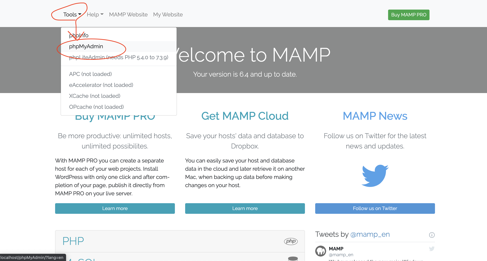
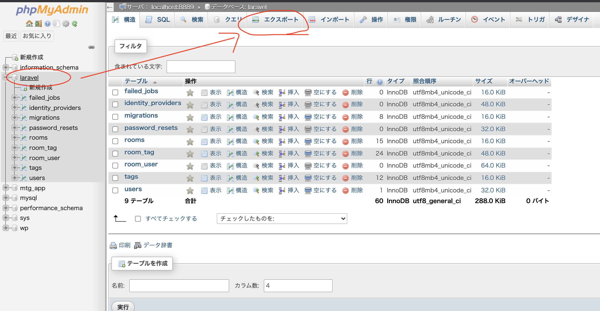
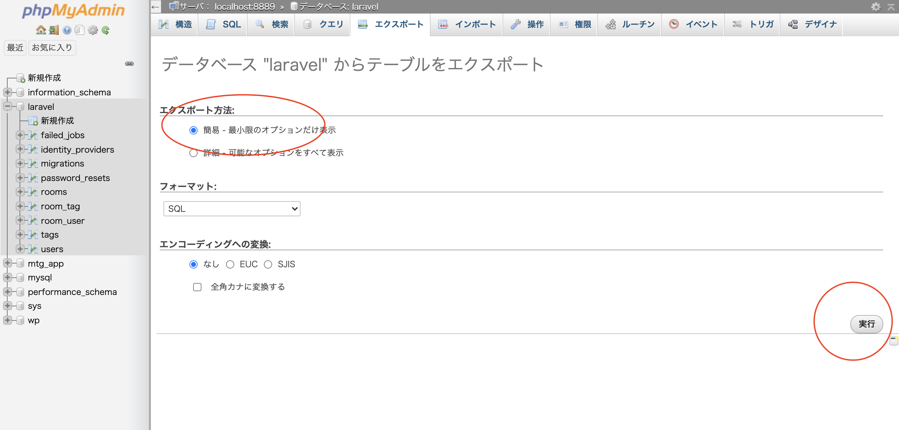
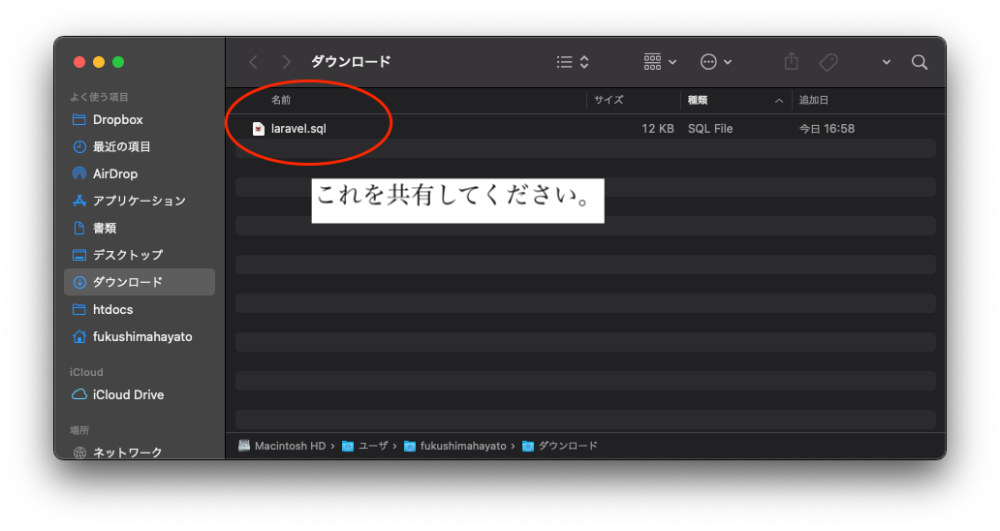

# PhpMyAdmin関連

_**もし、個人情報がDB内にある場合はGitHubにUpしないでください！**_

_GitHubにUpしたい場合は、一旦個人情報削除するか、Tutor・先生に相談してね_

## PHPMyAdminへ移動

## 作成 / 利用したDBを選択して、エクスポート

## エクスポート方法　>　簡易で、特にいじらずにそのまま実行

## 出来たファイルを共有してください。中身はいじらないでください。

このファイルを、課題と一緒に提出してください。
