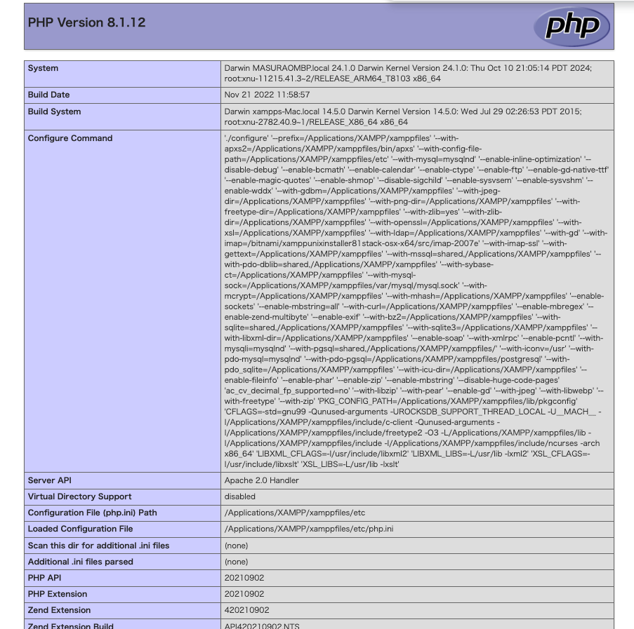
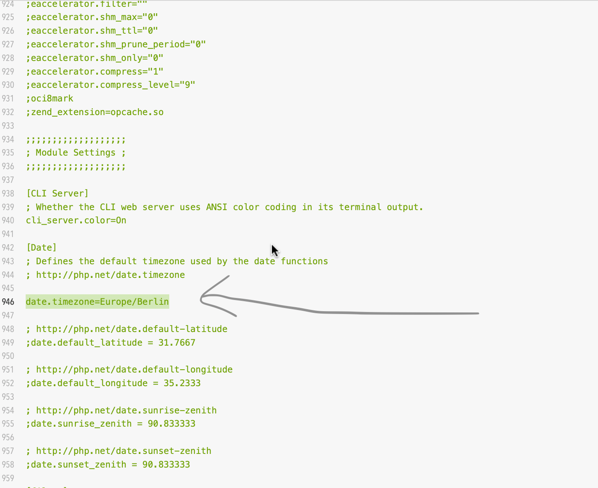
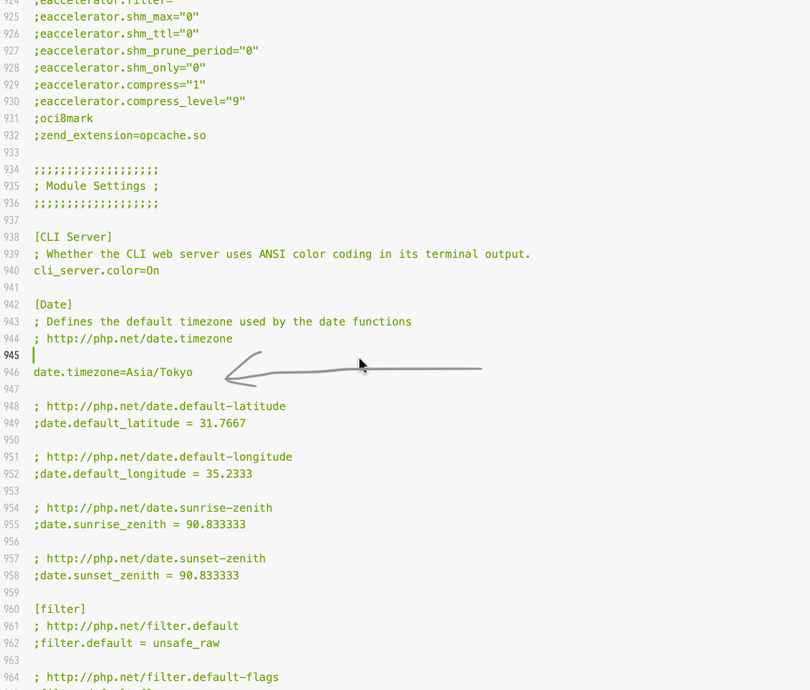

# その他情報情報

## Xamppのタイムゾーン変更方法

### php.infoの確認

適当なphpファイルを作成して、以下を記述してください。

その後、そのファイルをブラウザで表示してください。

&#x20;Xamppで利用しているphpファイルの詳細が出てきます。

```php
<?php
phpinfo();
?>
```

このような画面が出てきます。

<figure><figcaption></figcaption></figure>


### `php.ini`の場所を確認

ブラウザで表示しているphp情報の中から、 `Loaded Configuration File`の項目を確認してください。&#x20;

そこに、`php.ini`の場所が記載しているので、適当はテキストエディタ等で`php.ini`を開いてください。


`php.ini`の編集を少しでも間違えるとphpが起動しなくなる可能性が大です。

&#x20;少しでも不安な方は、慣れている人と一緒に編集してください。


<figure><figcaption></figcaption></figure>


なお iniファイルでコメントアウトしたい場合は、`;` を利用すればコメントアウトできます。


### `php.ini`の編集

`php.ini`ファイルの中から`date.timezone`の記載がある箇所を探してください。

おそらく、

```bash
date.timezone=Europe/Berlin
```

と記載されているかと思います。ここを

```bash
date.timezone=Asia/Tokyo
```


<figure><figcaption></figcaption></figure>

と書き換えてください。

xamppを再起動すれば、タイムゾーンが変わります。
